# 介绍
kafaka是一个分布式的事件流平台，常用于高性能数据管道、流式分析、数据聚合等。

如果两个服务之间直接调用时，耦合性较高，加入消息中间件后可以实现服务解耦
消息中间件一般要求分布式、可靠的、可拓展、高性能。

## Scale Cube
由`Abbott`、`Keeven`和`Fisher`提出。
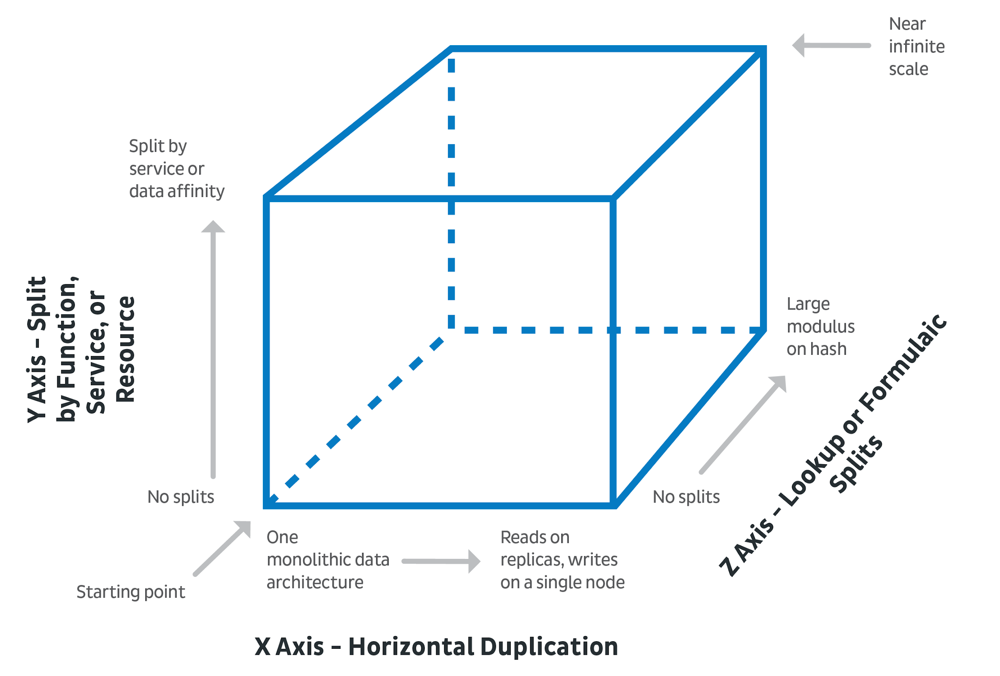
x轴：解决高可用问题
y轴：解决业务划分问题
z轴：解决分片分治问题

## kafka的AKF
把数据按业务拆分为不同的topic，y轴拓展。
在topic内划分出不同的partition，z轴拓展；大数据必然分治，把无关的信息分散到不同的partition中，追求并发，有关联的数据，一定要按原有顺序放到同一个分区中。
可靠性、副本，x轴拓展。对于内存数据库来说，比如redis，会把磁盘视为可靠性来源，但是拓展到集群时，还会有节点丢失问题，这是还会引入主从备份。
引入x轴拓展，做数据副本，副本是为了安全，所以一般是要出主机的。副本模式必然会导致一致性问题，Kafka的解决方案是只允许在主节点的partition上都读写，只有主节点丢失时，才允许使用从节点。
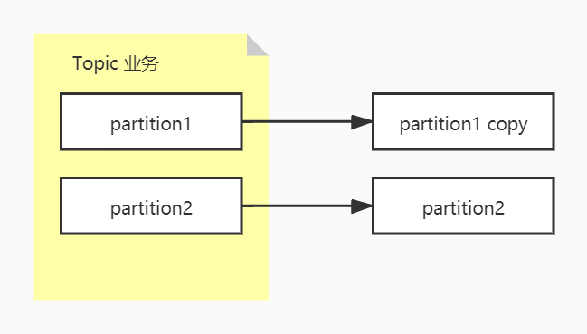

做轴拓展时，把数据分治到不同的区域，必然会导致顺序打乱，所以分治时需要，把相关的数据聚合在一起保证顺序，把无关的数据分发到不同分区，追求并行。如果分区间数据有关，则要引入分布式锁或根据id判断顺序，导致效率降低。

分区内不是有序的，分区外部是无序的

分区内部的顺序维护：偏移量/offset

## 角色
* ZooKeeper：管理Kafka生命周期中的一些协调工作，比如选举主节点ka中的角色，一块物理存储区域，存放数据

* topic: Kafka中的角色，一个虚拟概念，用于按业务划分数据，一个topic中的数据分散在不同的partition中

* broker: kafka中自有角色，是一个一个jvm进程。不同的`partition`由不同的`broker`管理。kafka中topic是一个虚拟的抽象的概念，但是`topic`中的`partition`是物理存在的，`broker`也是物理存在的，`partition`由`broker`管理。`broker`是有角色的，`broker`中有一个**controller**，**controller**的选举依赖`zookeeper`。由于主节点**controller**可能会因为异常重新选举，所以kafka的adminAPI连接的是zookeeper服务，从中取到当前controller的地址。

* Controller: kafka中的角色，分配给某一个broker,选取controller的过程会依赖zookeeper
admin-api: 用于创建topic等管理操作，需要和controller通信，所以通过zookeeper访问。**controller**会生成集群的`metadata`存入zookeeper。

* producer: 向partition发送数据，按规律把数据发到不同的partition中，旧版本的producer也要和zookeeper通信获取元数据，会导致zookeeper压力过大；新版本的producer可以根据broker的ip池访问任意broker获取到Kafka集群的元信息。controller会创建集群的metadata并同步到集群中的每一个broker。这种设计使得业务操作和zookeeper解耦。

* consumer: 消费partition中的数据。不允许partition和consumer之间1：N的分区，会导致业务执行的乱序。

* group: kafka的broker的partition保存了producer发送来的数据，在单一场景下，即使追求性能，也不能一个分区中的数据由多个consumer消费，只可以一个分区对应一个consumer或多个分区对应一个consumer。
当数据需要重复利用时，可以把分区的数据分发给不同的group，但是group内要保证分区和consumer不能1：N对应。

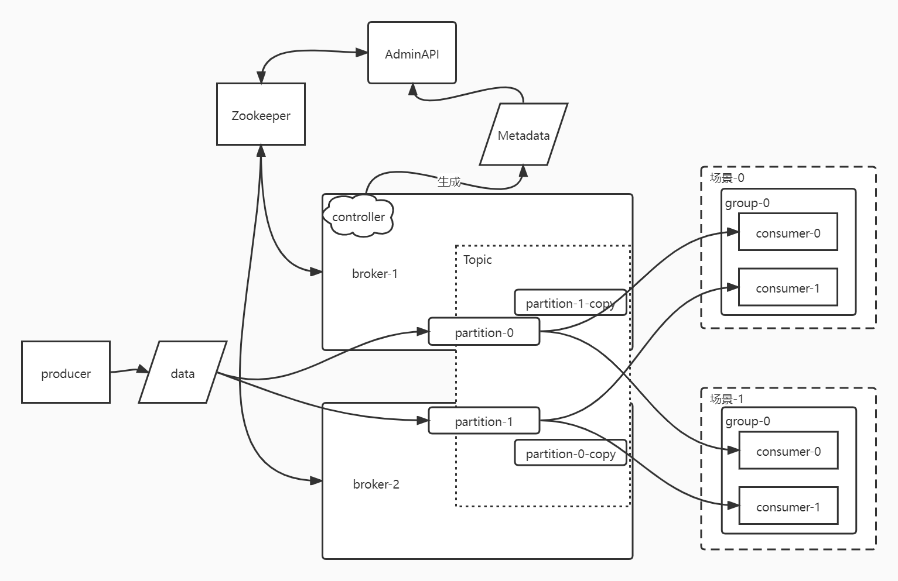

consumer消费中存在的问题：
1. 消息丢失：业务没有操作成功，但是offset更新
2. 重复消费：业务操作完成，但是offset没有同步更新

这些问题都围绕offset发生，也就是消费的进度、节奏、频率、先后等。
runtime在内存中维护了自己的offset(偏移量的进度)
老版本的kafka默认会把offset维护到ZooKeeper中，但是使用zookeeper是一个分布式协调服务，业务场景的数据存储，频繁的业务调用会挤兑zookeeper的网卡资源，导致选主等操作的延迟增加。所以新版本的kafaka在broker中维护一个默认的topic，里面有50个partition，offset数据维护到kafaka自己的topic中。也可以存储在redis、mysql等第三方服务中。
offset处理方案：
1. 异步方案，每5秒持久化一次，5秒内先处理业务，如果服务出现问题，会发生重复消费
2. 同步方案，同步执行业务操作和offset持久化，如果offset持久成功，但是业务写失败，会导致消息丢失。

通过幂等的方案可以解决重复消费，但是不能解决消息丢失。

# KAFKA安装与配置
|主机|node01|node02|node03|node04|
|--|--|--|--|--|
|kafka| * | * | * |  |
|zookeeper|  | * | * | * |
## 下载并解压
`wget https://dlcdn.apache.org/kafka/3.1.0/kafka_2.12-3.1.0.tgz`
## 配置：
`vi /opt/kafka_2.12-3.1.0/config/server.properties`
`broker.id=0`每台服务不一样
`listeners=PLAINTEXT://node01:9092`每台服务的监听端口
`log.dirs=/var/kafka/data`日志路径
`zookeeper.connect=spark01:22181,spark02:22182.spark03:22181/kafka`zookeeper连接地址，注意根据业务添加路径，不要直接在根目录创建路径！！

## 启动
`kafka-server-start.sh /opt/kafka_${version}/config/server.properties`

## topics
topic和数据库中的database一样，必须在生产者和消费者启动前创建好，设置好分区和副本。
`kafka-topics.sh` 必须指定一到多个zookeeper的地址
创建两个分区，两个副本的topic。即使创建了两个分区，也只能在controller上读写，所以分区只能增加可靠性，不能提高响应速度。
```bash
[root@node01 opt]# kafka-topics.sh --bootstrap-server node01:9092 --create --topic first-topic --partitions 2 --replication-factor 2 --config max.message.bytes=64000 --config flush.messages=1
Created topic first-topic.
```
列出服务中已经创建的topic：
```bash
[root@node01 opt]# kafka-topics.sh --bootstrap-server node01:9092 --list
first-topic
```

查看topic的信息：
```bash
[root@node01 opt]# kafka-topics.sh --bootstrap-server node01:9092 --describe --topic first-topic
Topic: first-topic      TopicId: RdO2r1kVQDmy-UECXbG-fw PartitionCount: 2       ReplicationFactor: 2Configs: segment.bytes=1073741824,flush.messages=1,max.message.bytes=64000
        Topic: first-topic      Partition: 0    Leader: 2       Replicas: 2,1   Isr: 2,1
        Topic: first-topic      Partition: 1    Leader: 1       Replicas: 1,0   Isr: 1,0
```
可以看到leader在id为1的节点上。
在zookeeper中查看：
```bash
[zk: localhost:2181(CONNECTED) 17] ls /kafka/brokers/topics 
[__consumer_offsets, first-topic]
```


## producer
```
[root@node01 opt]# kafka-console-producer.sh --bootstrap-server node01:9092,node02:9092 --topic first-topic
>hello
>     
```

## consumer
启动一个消费者，接受`first-topic`的消息，并加入分组`group_01`
```
[root@node02 ~]# kafka-console-consumer.sh --bootstrap-server node01:9092,node02:9092 --topic first-topic --group group_01
[2021-07-16 19:37:12,833] WARN [Consumer clientId=consumer-backend-1, groupId=backend] Error while fetching metadata with correlation id 2 : {firstTopic=LEADER_NOT_AVAILABLE} (org.apache.kafka.clients.NetworkClient)
hello
```
如果有新的消费者加入到同一个组中，则两个消费者交替收到消息。如果加入第三个消费者，则第三个消费者收不到消息。

```bash
[zk: localhost:22181(CONNECTED) 5] ls /kafka/brokers/topics
[__consumer_offsets, firstTopic, firstToppic]
[zk: localhost:22181(CONNECTED) 7] get /kafka/brokers/topics/__consumer_offsets -s
{"removing_replicas":{},"partitions":{"30":[1],"39":[0],"45":[0],"2":[1],"5":[0],"48":[1],"33":[0],"27":[0],"12":[1],"8":[1],"15":[0],"42":[1],"36":[1],"21":[0],"18":[1],"24":[1],"35":[0],"41":[0],"7":[0],"17":[0],"1":[0],"44":[1],"23":[0],"38":[1],"47":[0],"4":[1],"26":[1],"11":[0],"32":[1],"14":[1],"20":[1],"29":[0],"46":[1],"34":[1],"28":[1],"6":[1],"40":[1],"49":[0],"9":[0],"43":[0],"0":[1],"22":[1],"16":[1],"37":[0],"19":[0],"3":[0],"10":[1],"31":[0],"25":[0],"13":[0]},"topic_id":"5Yu9oFhVRI6IUtNYNxoJ8w","adding_replicas":{},"version":3}
cZxid = 0x90000003b
ctime = Fri Jul 16 12:55:38 CST 2021
mZxid = 0x90000003b
mtime = Fri Jul 16 12:55:38 CST 2021
pZxid = 0x90000003c
cversion = 1
dataVersion = 0
aclVersion = 0
ephemeralOwner = 0x0
dataLength = 548
numChildren = 1
```
可以在zookeeper中看到，kafka自己维护的偏移量，并且可以看到里面有50个分区

查看某个组的信息
```bash
[root@spark01 ~]# kafka-consumer-groups.sh --bootstrap-server hadoop01:9092 --describe --group backend
GROUP           TOPIC           PARTITION  CURRENT-OFFSET  LOG-END-OFFSET  LAG             CONSUMER-ID                                             HOST            CLIENT-ID
backend         firstTopic      0          1               1               0               consumer-backend-1-cac5c1b2-e35b-49d9-ae13-1fecdc0e1fdb /192.168.11.177 consumer-backend-1
backend         firstTopic      1          0               0               0               consumer-backend-1-cac5c1b2-e35b-49d9-ae13-1fecdc0e1fdb /192.168.11.177 consumer-backend-1
```

# 有序性和性能
分区：类似于桶的概念。
如果消息没有顺序的约束，那么只需要水平拓展生产者和消费者，提高并行数量就可以提高性能。
如果某一类消息需要顺序约束，相同key的消息一定需要去到同一个分区，broker会保证producer发送的消息顺序。那么就不能利用分区提高性能优势。
一个分区可能会有不同的key。不同的key在同一分区中交叉排列。
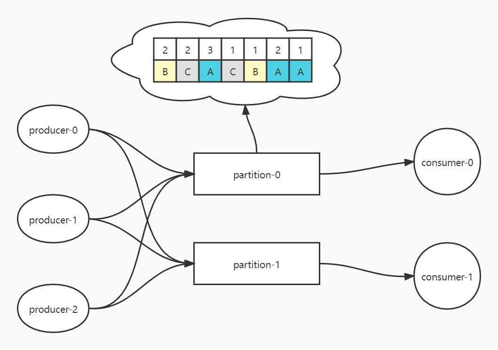
假如有两个生产者同时生成A类型的消息。那么kafka是没法保证两个生产者内的A类型消息的生成顺序的。假如`producer-0`和`producer-1`同时生产A类型的消息，那么有可能`producer-0`先生成消息，但是由于计算速度、网络等原因，`producer-1`的消息先到达kafka，那么kafka中`producer-1`的消息在前。
所以生产侧的消息有序性最简单的保证方式就是每个类型的消息只有一个生产者。

## 拉取或推送
kafka和RocketMQ中，consumer拉取数据。ActiveMQ中，数据会推送给consumer。
推送是直指server主动推送，本来是为了达到实时性。但是如果consumer消费不及时，会造成consumer网卡撑满，如果允许consumer告知服务暂时不能处理，那么服务需要记录数据的状态，所以最终可能达不到推送期望的效率。
拉取的模式是consumer按需拉取数据。拉取有两种粒度，一是每次拉取一条，二是批量拉取多条。Consumer是批量拉取数据的，又因为数据是交错的，所以拉取到的一批数据中，会有不同k对应的数据。

## 维护offset
消费者需要维护`Topic:Partition:Offset`数据，确保下一批次从正确的位置获取数据。
关键：consumer以什么粒度更新/持久化offset。
假设consumer一次性取到A1、B1、A2三条数据
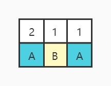
1. 单线程：
假如consumer使用单线程把数据写入数据库。那么consumer需要以每条记录为单位更新offset。缺点：速度慢。比如，consumer需要依次操作redis，数据库和更新offset，如果数据库响应较慢，那么线程阻塞，网卡闲置，会造成资源浪费。

2. 多线程：
假如consumer使用多线程处理一批数据，使用多线程除了可以提高性能，还可以把多条可合并的数据规约到同一事务中处理，降低数据库压力。
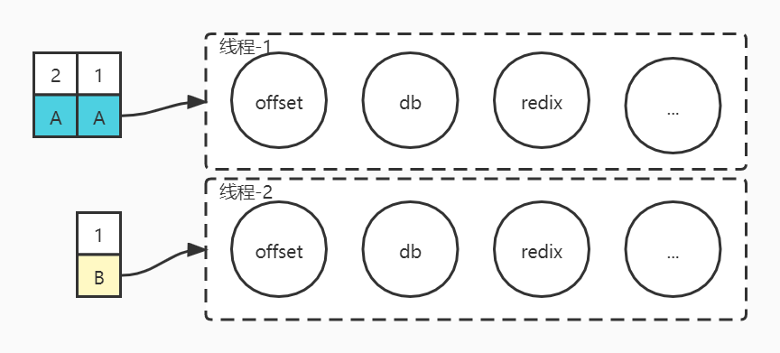
会存在同一批次中的部分数据条目处理事务失败的问题，那么按处理的数据条目更新offset还是按批次更新offset。
设A1、A2处理失败，B1处理成功。如果按批次更新数据，会丢失A1、A2的数据；如果按事务失败的最小序号数据的前一的条目更新offset，会造成B1数据重复；如果按事务成功的最大序号更新，会导致A1丢失。

***多线程性能最大化：线程间具备隔离性。***

**解决方案**：1.多线程，2.大数据 & spark, 3.流式计算编程
流式的多线程，能多线程的操作使用多线程，最终一个批次的数据放到一个事务中处理，以批为单位更新offset，到达整个批次的成功或失败。
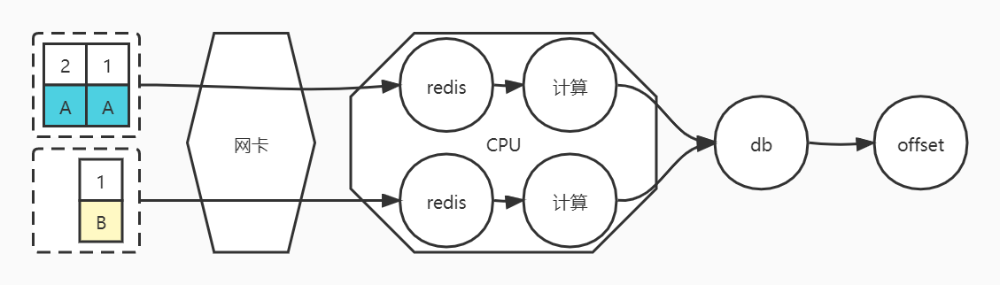
可以减少DB的压力和更新offset的频率，更多的利用CPU。
更新offset也会消耗资源，所以不以条为单位更新offset。
* 结合spark的流式计算方案
kafka中的一个批次的数据对应spark中一个RDD，在spark中要么整个RDD计算成功，要么整个RDD计算失败。
在分区数据计算完成后，触发一次shuffle，要么合并成一个新的RDD，要么collect到driver上。合并后把一个批次的数据作为整体提交事务。
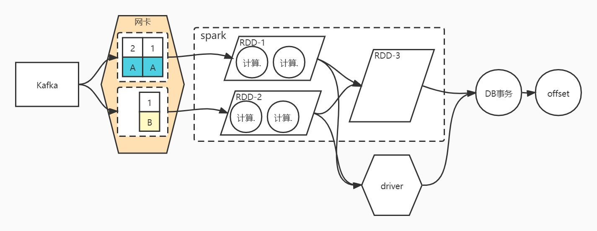

可能存在的问题：事务提交后，更新offset失败，解决方案：缓存一个兜底的offset，事务操作保证幂等，抵消重复数据的影响。

# API调用示例
## Producer
```maven
  <dependencies>
    ...
    <dependency>
        <groupId>org.apache.kafka</groupId>
        <artifactId>kafka_2.13</artifactId>
        <version>3.1.0</version>
    </dependency>
  </dependencies>
```
```java
package com.zzp;

import java.util.Properties;
import java.util.concurrent.ExecutionException;
import java.util.concurrent.Future;

import org.apache.kafka.clients.producer.KafkaProducer;
import org.apache.kafka.clients.producer.ProducerConfig;
import org.apache.kafka.clients.producer.ProducerRecord;
import org.apache.kafka.clients.producer.RecordMetadata;
import org.apache.kafka.common.serialization.StringSerializer;

public class Example01 {
    public void producer() throws InterruptedException, ExecutionException {
        // 生产环境中properties应该写入配置文件，这里演示需要的配置
        Properties p = new Properties();
        p.setProperty(ProducerConfig.BOOTSTRAP_SERVERS_CONFIG, "node01:9092,node02:9092,node03:9092");
        p.setProperty(ProducerConfig.KEY_SERIALIZER_CLASS_CONFIG, StringSerializer.class.getName());
        p.setProperty(ProducerConfig.VALUE_SERIALIZER_CLASS_CONFIG, StringSerializer.class.getName());

        KafkaProducer<String, String> producer = new KafkaProducer<String, String>(p);

        // producer需要把数据写入topic
        // 写入三种商品的消息，每种商品有三个id，相同的商品信息需要进入同一个分区
        for (int prodItem = 0; prodItem < 3; prodItem++) {
            for(int msgIdx = 0; msgIdx < 3; msgIdx++) {
                ProducerRecord<String, String> record = new ProducerRecord<String,String>("first-topic", "item_"+msgIdx, "val_"+prodItem);
                Future<RecordMetadata> sendRecord = producer.send(record);
                RecordMetadata recordMetadata = sendRecord.get();
                long offset = recordMetadata.offset();
                int partition = recordMetadata.partition();
                System.out.println("key: " + record.key() + ", val: " + record.value() + ", partition: " + partition + ", offset: " + offset);
            }
        }

        producer.close();
    }
}
```
```bash
key: item_0, val: val_0, partition: 1, offset: 12
key: item_1, val: val_0, partition: 1, offset: 13
key: item_2, val: val_0, partition: 0, offset: 9
key: item_0, val: val_1, partition: 1, offset: 14
key: item_1, val: val_1, partition: 1, offset: 15
key: item_2, val: val_1, partition: 0, offset: 10
key: item_0, val: val_2, partition: 1, offset: 16
key: item_1, val: val_2, partition: 1, offset: 17
key: item_2, val: val_2, partition: 0, offset: 11
```
可以看到相同key的数据被放入了相同的分区。
Kafka默认使用hash分区器，相同的key会被传送到固定的分区中

## Consumer
```java
package com.zzp.kafka;

import java.time.Duration;
import java.util.Arrays;
import java.util.Iterator;
import java.util.Properties;

import org.apache.kafka.clients.consumer.ConsumerConfig;
import org.apache.kafka.clients.consumer.ConsumerRecord;
import org.apache.kafka.clients.consumer.ConsumerRecords;
import org.apache.kafka.clients.consumer.KafkaConsumer;
import org.apache.kafka.common.serialization.StringDeserializer;

public class Example02 {
    public void Consumer() {
        // 生产环境中properties应该写入配置文件，这里演示需要的配置
        Properties p = new Properties();
        p.setProperty(ConsumerConfig.BOOTSTRAP_SERVERS_CONFIG, "node01:9092,node02:9092,node03:9092");
        p.setProperty(ConsumerConfig.KEY_DESERIALIZER_CLASS_CONFIG, StringDeserializer.class.getName());
        p.setProperty(ConsumerConfig.VALUE_DESERIALIZER_CLASS_CONFIG, StringDeserializer.class.getName());

        // 消费者需要从属于一个group
        p.setProperty(ConsumerConfig.GROUP_ID_CONFIG, "group01");
        // kafka是一个存储服务，消费者需要知晓读取数据的信息
        // // 定义读取位置。当没有初始化的offset时，根据参数读取：
        // // earliest：automatically reset the offset to the earlist offset；
        // // latest：automatically reset the offset to the latest offset；
        // // none：throw exception to the consumer if no previous offset is found for the consumer；
        // // 默认是latest，即只能获取consumer第一次启动后生产者生成的新数据
        p.setProperty(ConsumerConfig.AUTO_OFFSET_RESET_CONFIG, "latest");
        // // 定义消费者是否自动提交，自动提交是异步的
        p.setProperty(ConsumerConfig.ENABLE_AUTO_COMMIT_CONFIG, "true");
        // // 定义自动异步提交的时间间隔，默认是5s
        // p.setProperty(ConsumerConfig.AUTO_COMMIT_INTERVAL_MS_CONFIG, "5");
        // // 定义自动异步提交的数据量。Kafka是根据poll的设置弹性拉取数据，
        // p.setProperty(ConsumerConfig.MAX_POLL_RECORDS_CONFIG, "10");

        KafkaConsumer<String, String> consumer = new KafkaConsumer<String, String>(p);

        // 订阅
        consumer.subscribe(Arrays.asList("first-topic"));
        while (true) {
            // 指定拉取数据的时间间隔，0表示有数据就拉取。虽然有数据就拉取，但依然可能会拉取到多条数据
            // 是一种微批计算的模式
            ConsumerRecords<String, String> records = consumer.poll(Duration.ofMillis(0));
            if (!records.isEmpty()) {
                System.out.println("------------" + records.count() + "-----------------");
                // 下面的数据处理代码会影响整个集群的效率，所以优化很重要
                Iterator<ConsumerRecord<String, String>> iter = records.iterator();
                while(iter.hasNext()) {
                    // 一个消费者可以消费多个分区的数据，所以会拉取到不同的数据
                    ConsumerRecord<String, String> record = iter.next();
                    int partition = record.partition();
                    long offset = record.offset();
                    System.out.println("key: " + record.key() + ", val: " + record.value() + ", partition: " + partition + ", offset: " + offset);
                }
            }
        }

        // consumer.close();
    }
}
```
上面的代码在生产者没有产生新的数据之前不会有输出，因为默认的offset被设置到了数据的尾部，通过命令行可以看到：
```bash
[root@node01 opt]# kafka-consumer-groups.sh --bootstrap-server node01:9092 --describe --group group01

Consumer group 'group01' has no active members.

GROUP           TOPIC           PARTITION  CURRENT-OFFSET  LOG-END-OFFSET  LAG             CONSUMER-ID     HOST            CLIENT-ID
group01         first-topic     0          12              12              0               -               -               -
group01         first-topic     1          18              18              0               -               -               -
```
换一个新的group，把offset设置提前：
```java
package com.zzp.kafka;

import java.time.Duration;
import java.util.Arrays;
import java.util.Iterator;
import java.util.Properties;

import org.apache.kafka.clients.consumer.ConsumerConfig;
import org.apache.kafka.clients.consumer.ConsumerRecord;
import org.apache.kafka.clients.consumer.ConsumerRecords;
import org.apache.kafka.clients.consumer.KafkaConsumer;
import org.apache.kafka.common.serialization.StringDeserializer;

public class Example02 {
    public void Consumer() {
        // 生产环境中properties应该写入配置文件，这里演示需要的配置
        Properties p = new Properties();
        p.setProperty(ConsumerConfig.BOOTSTRAP_SERVERS_CONFIG, "node01:9092,node02:9092,node03:9092");
        p.setProperty(ConsumerConfig.KEY_DESERIALIZER_CLASS_CONFIG, StringDeserializer.class.getName());
        p.setProperty(ConsumerConfig.VALUE_DESERIALIZER_CLASS_CONFIG, StringDeserializer.class.getName());

        // 消费者需要从属于一个group
        p.setProperty(ConsumerConfig.GROUP_ID_CONFIG, "group-1");
        // kafka是一个存储服务，消费者需要知晓读取数据的信息
        // // 定义读取位置。当没有初始化的offset时，根据参数读取：
        // // earliest：automatically reset the offset to the earlist offset；
        // // latest：automatically reset the offset to the latest offset；
        // // none：throw exception to the consumer if no previous offset is found for the consumer；
        // // 默认是latest，即只能获取consumer第一次启动后生产者生成的新数据
        p.setProperty(ConsumerConfig.AUTO_OFFSET_RESET_CONFIG, "earliest");
        // // 定义消费者是否自动提交，自动提交是异步的
        p.setProperty(ConsumerConfig.ENABLE_AUTO_COMMIT_CONFIG, "true");
        // // 定义自动异步提交的时间间隔，默认是5s
        // p.setProperty(ConsumerConfig.AUTO_COMMIT_INTERVAL_MS_CONFIG, "5");
        // // 定义自动异步提交的数据量。Kafka是根据poll的设置弹性拉取数据，
        // p.setProperty(ConsumerConfig.MAX_POLL_RECORDS_CONFIG, "10");

        KafkaConsumer<String, String> consumer = new KafkaConsumer<String, String>(p);

        // 订阅
        consumer.subscribe(Arrays.asList("first-topic"));
        while (true) {
            // 指定拉取数据的时间间隔，0表示有数据就拉取。虽然有数据就拉取，但依然可能会拉取到多条数据
            // 是一种微批计算的模式
            ConsumerRecords<String, String> records = consumer.poll(Duration.ofMillis(0));
            if (!records.isEmpty()) {
                System.out.println("------------" + records.count() + "-----------------");
                // 下面的数据处理代码会影响整个集群的效率，所以优化很重要
                Iterator<ConsumerRecord<String, String>> iter = records.iterator();
                while(iter.hasNext()) {
                    // 一个消费者可以消费多个分区的数据，所以会拉取到不同的数据
                    ConsumerRecord<String, String> record = iter.next();
                    int partition = record.partition();
                    long offset = record.offset();
                    System.out.println("key: " + record.key() + ", val: " + record.value() + ", partition: " + partition + ", offset: " + offset);
                }
            }
        }

        // consumer.close();
    }
}
```
可以看到以下输出：
```bash
------------30-----------------
key: null, val: hello world, partition: 1, offset: 0
key: null, val: hw2, partition: 1, offset: 1
key: null, val: hw4, partition: 1, offset: 2
key: null, val: hw6, partition: 1, offset: 3
key: null, val: hw8, partition: 1, offset: 4
key: null, val: hw9, partition: 1, offset: 5
key: null, val: h1, partition: 1, offset: 6
key: null, val: h3, partition: 1, offset: 7
key: null, val: h4, partition: 1, offset: 8
key: null, val: h6, partition: 1, offset: 9
key: null, val: h7, partition: 1, offset: 10
key: null, val: h9, partition: 1, offset: 11
key: item_0, val: val_0, partition: 1, offset: 12
key: item_1, val: val_0, partition: 1, offset: 13
key: item_0, val: val_1, partition: 1, offset: 14
key: item_1, val: val_1, partition: 1, offset: 15
key: item_0, val: val_2, partition: 1, offset: 16
```
### 自动提交的异常情况
在上面的消费者设置中，设置了自动提交：
```java
p.setProperty(ConsumerConfig.AUTO_OFFSET_RESET_CONFIG, "earliest");
        // // 定义消费者是否自动提交，自动提交是异步的
```
自动提交即消费者进程自己维护`offset`。自动提交存在两种异常情况：
1. 数据消费后，还没到自动提交的节点，进程异常终止。这时重启消费者进程，参照kafka中存储的offset，会导致重复消费；
2. 数据还没有消费成功，但是到了offset自动提交的节点，offset提交后，进程意外终止。这是重启消费者进程，会丢失数据。

### 消费者负载均衡--`ConsumerRebalanceListener`
在订阅`topic`时，可以传入一个`ConsumerRebalanceListencer`类，在这个类中定义当前消费者收到需要负载的分区或减少需要负载的分区时的行为。
```java
package com.zzp.kafka;

import java.time.Duration;
import java.util.Arrays;
import java.util.Collection;
import java.util.Iterator;
import java.util.Properties;

import org.apache.kafka.clients.consumer.ConsumerConfig;
import org.apache.kafka.clients.consumer.ConsumerRebalanceListener;
import org.apache.kafka.clients.consumer.ConsumerRecord;
import org.apache.kafka.clients.consumer.ConsumerRecords;
import org.apache.kafka.clients.consumer.KafkaConsumer;
import org.apache.kafka.common.TopicPartition;
import org.apache.kafka.common.serialization.StringDeserializer;

public class Example02 {
    public void Consumer() {
        // 生产环境中properties应该写入配置文件，这里演示需要的配置
        Properties p = new Properties();
        p.setProperty(ConsumerConfig.BOOTSTRAP_SERVERS_CONFIG, "node01:9092,node02:9092,node03:9092");
        p.setProperty(ConsumerConfig.KEY_DESERIALIZER_CLASS_CONFIG, StringDeserializer.class.getName());
        p.setProperty(ConsumerConfig.VALUE_DESERIALIZER_CLASS_CONFIG, StringDeserializer.class.getName());

        // 消费者需要从属于一个group
        p.setProperty(ConsumerConfig.GROUP_ID_CONFIG, "group-2");
        // kafka是一个存储服务，消费者需要知晓读取数据的信息
        // // 定义读取位置。当没有初始化的offset时，根据参数读取：
        // // earliest：automatically reset the offset to the earlist offset；
        // // latest：automatically reset the offset to the latest offset；
        // // none：throw exception to the consumer if no previous offset is found for the consumer；
        // // 默认是latest，即只能获取consumer第一次启动后生产者生成的新数据
        p.setProperty(ConsumerConfig.AUTO_OFFSET_RESET_CONFIG, "earliest");
        // // 定义消费者是否自动提交，自动提交是异步的
        p.setProperty(ConsumerConfig.ENABLE_AUTO_COMMIT_CONFIG, "true");
        // // 定义自动异步提交的时间间隔，默认是5s
        // p.setProperty(ConsumerConfig.AUTO_COMMIT_INTERVAL_MS_CONFIG, "5000");
        // // 定义自动异步提交的数据量。Kafka是根据poll的设置弹性拉取数据，
        // p.setProperty(ConsumerConfig.MAX_POLL_RECORDS_CONFIG, "10");

        KafkaConsumer<String, String> consumer = new KafkaConsumer<String, String>(p);

        // 订阅
        consumer.subscribe(Arrays.asList("first-topic"), new ConsumerRebalanceListener() {

            // 减少要处理的分区
            @Override
            public void onPartitionsRevoked(Collection<TopicPartition> partitions) {
                System.out.println("-----------on patitions revoked-----------");
                Iterator<TopicPartition> iter = partitions.iterator();
                while(iter.hasNext()){
                    System.out.println(iter.next().partition());
                }
            }

            // 增加要处理的分区
            @Override
            public void onPartitionsAssigned(Collection<TopicPartition> partitions) {
                System.out.println("----------on partitions assigned-----------");
                Iterator<TopicPartition> iter = partitions.iterator();
                while(iter.hasNext()){
                    System.out.println(iter.next().partition());
                }
            }
            
        });

        while (true) {
            // 指定拉取数据的时间间隔，0表示有数据就拉取。虽然有数据就拉取，但依然可能会拉取到多条数据
            // 是一种微批计算的模式
            ConsumerRecords<String, String> records = consumer.poll(Duration.ofMillis(0));
            if (!records.isEmpty()) {
                System.out.println("------------" + records.count() + "-----------------");
                // 下面的数据处理代码会影响整个集群的效率，所以优化很重要
                Iterator<ConsumerRecord<String, String>> iter = records.iterator();
                while(iter.hasNext()) {
                    // 一个消费者可以消费多个分区的数据，所以会拉取到不同的数据
                    ConsumerRecord<String, String> record = iter.next();
                    int partition = record.partition();
                    long offset = record.offset();
                    System.out.println("key: " + record.key() + ", val: " + record.value() + ", partition: " + partition + ", offset: " + offset);
                }
            }
        }

        // consumer.close();
    }
}
```
```bash
----------on partitions assigned-----------
1
0
------------12-----------------
key: null, val: hw1, partition: 0, offset: 0
key: null, val: hw3, partition: 0, offset: 1
key: null, val: hw5, partition: 0, offset: 2
key: null, val: hw7, partition: 0, offset: 3
key: null, val: hw0, partition: 0, offset: 4
key: null, val: h2, partition: 0, offset: 5
key: null, val: h5, partition: 0, offset: 6
key: null, val: h8, partition: 0, offset: 7
```
一个consumer进程可以监听多个topic；每个topic会有多个分区，如果有并行的consumer，那么不同分区的消息可以负载均衡给不同的consumer处理，每个consumer处理固定分区的数据
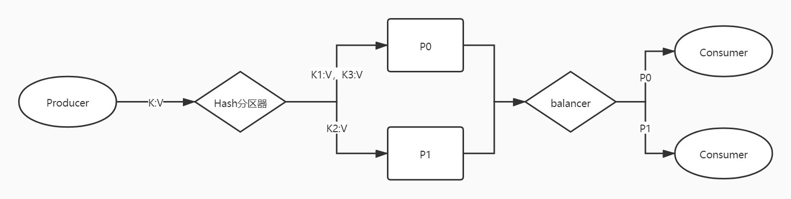

### 在一个consumer内按分区处理数据
因为一个consumer可能poll到多个分区的数据，所以可以按分区筛选数据，并行处理不同分区的数据：
```java
    public void consumer() {
        Properties p = new Properties();

        p.setProperty(ConsumerConfig.BOOTSTRAP_SERVERS_CONFIG, "hadoop01:9092,hadoop02:9092,hadoop03:9092");

        // kafka不对对数据干预，所以双方需要约定编解码
        // kafka是一个app, 使用零拷贝，sendfile 系统调用实现快速数据消费
        p.setProperty(ConsumerConfig.KEY_DESERIALIZER_CLASS_CONFIG, StringDeserializer.class.getName());
        p.setProperty(ConsumerConfig.VALUE_DESERIALIZER_CLASS_CONFIG, StringDeserializer.class.getName());

        // 消费组需要归属于一个组
        p.setProperty(ConsumerConfig.GROUP_ID_CONFIG, "bussiness01");

        // KafKa既是消息队列，也是存储
        // earliest: automatically reset the offset to the earliest offset
        // latest: automatically reset the offset to the latest offset,如果消费者没有offset，那么设置offset为消息最尾端，即取不到旧的消息
        // none: throw exception to the consumer if no previous offset is found for the consumer's group
        // anything else: throw exception to the consumer
        p.setProperty(ConsumerConfig.AUTO_OFFSET_RESET_CONFIG, "latest");

        // kafka的自动提交是异步提交，默认每5秒提交一次
        // 自动提交可能会导致数据丢失或重复消费
        // 1.没到提交时间，进程中断，重起的consumer参照offset会重复消费
        // 2.数据还没有写入数据库，offset异步提交了，此时进程中断，重启，会导致数据丢失
        p.setProperty(ConsumerConfig.ENABLE_AUTO_COMMIT_CONFIG, "true");
        // p.setProperty(ConsumerConfig.AUTO_COMMIT_INTERVAL_MS_CONFIG, "");

        // 每次拉取多少条
        // p.setProperty(ConsumerConfig.MAX_POLL_RECORDS_CONFIG, "");

        KafkaConsumer<String, String> consumer = new KafkaConsumer<>(p);

        // 订阅一系列topic
        // consumer.subscribe(Arrays.asList("items"));

        // 订阅时可以传入一个负载均衡，因为consumer订阅的topic中有多个分区
        // 可以把不同的分区传递给不同的consumer处理
        consumer.subscribe(Arrays.asList("items"), new ConsumerRebalanceListener(){

            @Override
            public void onPartitionsRevoked(Collection<TopicPartition> partitions) {
                System.out.println("call onPartitionsRevoked");
                Iterator<TopicPartition> iter = partitions.iterator();
                while(iter.hasNext()) {
                    System.out.println(iter.next().partition());
                }
            }

            @Override
            public void onPartitionsAssigned(Collection<TopicPartition> partitions) {
                System.out.println("call onPartitionsAssigned");
                Iterator<TopicPartition> iter = partitions.iterator();
                while(iter.hasNext()) {
                    System.out.println(iter.next().partition());
                }
            }
            
        });

        while (true) {
            // 拉取,并设置超时时间
            ConsumerRecords<String, String> records = consumer.poll(Duration.ofMillis(0));

            if(!records.isEmpty()) {
                System.out.println("=========" + records.count() + "==========");

                // 按分区筛选数据
                Set<TopicPartition> partitions = records.partitions();
                for (TopicPartition partition:partitions) {
                    List<ConsumerRecord<String, String>> pRecords = records.records(partition);
                    // 可以按分区并行处理数据
                    Iterator<ConsumerRecord<String, String>> pIter = pRecords.iterator();
                    while(pIter.hasNext()){
                        ConsumerRecord<String, String> next = pIter.next();
                        int partision = next.partition();
                        long offset = next.offset();
                        String key = next.key();
                        String value = next.value();
                        System.out.println("key: " + key + ", value: " + value +
                                            ", partition: " + partision + ", offset: " + offset);
                    }
                }
            }
        }
    }
```

### 手动维护offset
基于消费者可以划分数据的粒度，有三种手动提交offset的策略：
1. 每条数据处理后提交一次
2. 每个分区的数据处理后，一次性提交
3. 每次poll的数据全部处理完成后，一次性提交

策略1最可靠，但是服务压力大
```java
    public void consumer() {
        Properties p = new Properties();

        p.setProperty(ConsumerConfig.BOOTSTRAP_SERVERS_CONFIG, "hadoop01:9092,hadoop02:9092,hadoop03:9092");
        p.setProperty(ConsumerConfig.KEY_DESERIALIZER_CLASS_CONFIG, StringDeserializer.class.getName());
        p.setProperty(ConsumerConfig.VALUE_DESERIALIZER_CLASS_CONFIG, StringDeserializer.class.getName());

        // 消费组需要归属于一个组
        p.setProperty(ConsumerConfig.GROUP_ID_CONFIG, "bussiness01");

        p.setProperty(ConsumerConfig.AUTO_OFFSET_RESET_CONFIG, "latest");

        // 取消自动提交
        p.setProperty(ConsumerConfig.ENABLE_AUTO_COMMIT_CONFIG, "false");

        KafkaConsumer<String, String> consumer = new KafkaConsumer<>(p);

        consumer.subscribe(Arrays.asList("items"), new ConsumerRebalanceListener(){

            @Override
            public void onPartitionsRevoked(Collection<TopicPartition> partitions) {
                System.out.println("call onPartitionsRevoked");
                Iterator<TopicPartition> iter = partitions.iterator();
                while(iter.hasNext()) {
                    System.out.println(iter.next().partition());
                }
            }

            @Override
            public void onPartitionsAssigned(Collection<TopicPartition> partitions) {
                System.out.println("call onPartitionsAssigned");
                Iterator<TopicPartition> iter = partitions.iterator();
                while(iter.hasNext()) {
                    System.out.println(iter.next().partition());
                }
            }
            
        });

        while (true) {
            ConsumerRecords<String, String> records = consumer.poll(Duration.ofMillis(0));

            if(!records.isEmpty()) {
                System.out.println("=========" + records.count() + "==========");

                // 按分区筛选数据
                Set<TopicPartition> partitions = records.partitions();

                for (TopicPartition partition:partitions) {
                    List<ConsumerRecord<String, String>> pRecords = records.records(partition);
                    // 可以按分区并行处理数据
                    Iterator<ConsumerRecord<String, String>> pIter = pRecords.iterator();
                    while(pIter.hasNext()){
                        ConsumerRecord<String, String> next = pIter.next();
                        int partision = next.partition();
                        long offset = next.offset();
                        String key = next.key();
                        String value = next.value();
                        System.out.println("key: " + key + ", value: " + value +
                                            ", partition: " + partision + ", offset: " + offset);

                        // 策略1： 逐条提交
                        TopicPartition tp = new TopicPartition("items", par);
                        OffsetAndMetadata om = new OffsetAndMetadata(offset);
                        HashMap<TopicPartition, OffsetAndMetadata> hm = new HashMap<>();
                        hm.put(tp, om)
                        consumer.commitSync(map);
                    }
                }
            }
        }
    }
```

策略2在多线程处理多分区场景下最常用，**因为kafka按分区维护ossfet**，所以即使有部分分区的处理线程失败，也不会影响下一次poll拉取到每个分区的正确数据。
如果想多线程处理多分区数据，那么可以定义一个语义：`job`。每poll一次数据，就启动一个job，由job使用多线程并行处理分区，且job是串行的。这里的job和spark中的job类似，在spark中，前一个job没有结束时，后序的job会堆积。
```java
public void consumer() {
        Properties p = new Properties();

        p.setProperty(ConsumerConfig.BOOTSTRAP_SERVERS_CONFIG, "hadoop01:9092,hadoop02:9092,hadoop03:9092");
        p.setProperty(ConsumerConfig.KEY_DESERIALIZER_CLASS_CONFIG, StringDeserializer.class.getName());
        p.setProperty(ConsumerConfig.VALUE_DESERIALIZER_CLASS_CONFIG, StringDeserializer.class.getName());

        p.setProperty(ConsumerConfig.GROUP_ID_CONFIG, "bussiness01");
        p.setProperty(ConsumerConfig.AUTO_OFFSET_RESET_CONFIG, "latest");

        p.setProperty(ConsumerConfig.ENABLE_AUTO_COMMIT_CONFIG, "false");

        KafkaConsumer<String, String> consumer = new KafkaConsumer<>(p);

        // 订阅一系列topic
        consumer.subscribe(Arrays.asList("items"), new ConsumerRebalanceListener(){

            @Override
            public void onPartitionsRevoked(Collection<TopicPartition> partitions) {
                System.out.println("call onPartitionsRevoked");
                Iterator<TopicPartition> iter = partitions.iterator();
                while(iter.hasNext()) {
                    System.out.println(iter.next().partition());
                }
            }

            @Override
            public void onPartitionsAssigned(Collection<TopicPartition> partitions) {
                System.out.println("call onPartitionsAssigned");
                Iterator<TopicPartition> iter = partitions.iterator();
                while(iter.hasNext()) {
                    System.out.println(iter.next().partition());
                }
            }
            
        });

        while (true) {
            ConsumerRecords<String, String> records = consumer.poll(Duration.ofMillis(0));

            if(!records.isEmpty()) {
                System.out.println("=========" + records.count() + "==========");

                // 按分区筛选数据
                Set<TopicPartition> partitions = records.partitions();

                for (TopicPartition partition:partitions) {
                    List<ConsumerRecord<String, String>> pRecords = records.records(partition);
                    // 可以按分区并行处理数据
                    Iterator<ConsumerRecord<String, String>> pIter = pRecords.iterator();
                    while(pIter.hasNext()){
                        ConsumerRecord<String, String> next = pIter.next();
                        int partision = next.partition();
                        long offset = next.offset();
                        String key = next.key();
                        String value = next.value();
                        System.out.println("key: " + key + ", value: " + value +
                                            ", partition: " + partision + ", offset: " + offset);
                    }
                    // 策略2：分区提交offset
                    // 分区处理时，因为拿到了分区的全部数据，所有可能会对整体数据做加工，再提交。
                    // 问题：提交时怎么知道最后一条数据的offset?
                    long offset = pRecords.get(pRecords.size() - 1).offset();
                    OffsetAndMetadata om = new OffsetAndMetadata(offset);
                    HashMap<TopicPartition, OffsetAndMetadata> hm = new HashMap<>();
                    hm.put(partition, om);
                    consumer.commitSync(hm);
                }
            }
        }
    }
```

策略3容易造成数据重复或丢失
```java
public void consumer() {
        Properties p = new Properties();

        p.setProperty(ConsumerConfig.BOOTSTRAP_SERVERS_CONFIG, "hadoop01:9092,hadoop02:9092,hadoop03:9092");
        p.setProperty(ConsumerConfig.KEY_DESERIALIZER_CLASS_CONFIG, StringDeserializer.class.getName());
        p.setProperty(ConsumerConfig.VALUE_DESERIALIZER_CLASS_CONFIG, StringDeserializer.class.getName());
        p.setProperty(ConsumerConfig.GROUP_ID_CONFIG, "bussiness01");
        p.setProperty(ConsumerConfig.AUTO_OFFSET_RESET_CONFIG, "latest");

        p.setProperty(ConsumerConfig.ENABLE_AUTO_COMMIT_CONFIG, "false");
        KafkaConsumer<String, String> consumer = new KafkaConsumer<>(p);

        consumer.subscribe(Arrays.asList("items"), new ConsumerRebalanceListener(){

            @Override
            public void onPartitionsRevoked(Collection<TopicPartition> partitions) {
                System.out.println("call onPartitionsRevoked");
                Iterator<TopicPartition> iter = partitions.iterator();
                while(iter.hasNext()) {
                    System.out.println(iter.next().partition());
                }
            }

            @Override
            public void onPartitionsAssigned(Collection<TopicPartition> partitions) {
                System.out.println("call onPartitionsAssigned");
                Iterator<TopicPartition> iter = partitions.iterator();
                while(iter.hasNext()) {
                    System.out.println(iter.next().partition());
                }
            }
            
        });

        while (true) {
            ConsumerRecords<String, String> records = consumer.poll(Duration.ofMillis(0));

            if(!records.isEmpty()) {
                System.out.println("=========" + records.count() + "==========");

                // 按分区筛选数据
                Set<TopicPartition> partitions = records.partitions();

                for (TopicPartition partition:partitions) {
                    List<ConsumerRecord<String, String>> pRecords = records.records(partition);
                    // 可以按分区并行处理数据
                    Iterator<ConsumerRecord<String, String>> pIter = pRecords.iterator();
                    while(pIter.hasNext()){
                        ConsumerRecord<String, String> next = pIter.next();
                        int partision = next.partition();
                        long offset = next.offset();
                        String key = next.key();
                        String value = next.value();
                        System.out.println("key: " + key + ", value: " + value +
                                            ", partition: " + partision + ", offset: " + offset);
                    }
                }
                // 策略3：整批次提交offset
                consumer.commitSync();
            }
        }
    }
```

## KAFKA的弹性ISR
kafka使用zookeeper维护集群元信息。包括集群的`controller`以及所有的`broker`
```bash
[zk: localhost:2181(CONNECTED) 5] get /kafka/controller
{"version":1,"brokerid":0,"timestamp":"1643692590537"}
[zk: localhost:2181(CONNECTED) 6] ls /kafka/brokers/ids
[0, 1, 2]
[zk: localhost:2181(CONNECTED) 7] get /kafka/brokers/ids/0
{"listener_security_protocol_map":{"PLAINTEXT":"PLAINTEXT"},"endpoints":["PLAINTEXT://node01:9092"],"jmx_port":-1,"features":{},"host":"node01","timestamp":"1643692590218","port":9092,"version":5}
```
当有broker进程失去联系时，broker可以通过zk知道。
### ISR
```bash
[zk: localhost:2181(CONNECTED) 14] ls /kafka/brokers/topics/first-topic/partitions
[0, 1]
[zk: localhost:2181(CONNECTED) 15] ls /kafka/brokers/topics/first-topic/partitions/0
[state]
[zk: localhost:2181(CONNECTED) 16] get /kafka/brokers/topics/first-topic/partitions/0/state
{"controller_epoch":13,"leader":2,"version":1,"leader_epoch":9,"isr":[2,1]}
```

### Kafka的文件系统使用
Kafka通过磁盘持久化，保证数据的可靠性。数据由kafka的broker进程落到磁盘上之前，要经过内核态的pagecache，再由OS内核flush到磁盘上，所以即使broker做了调用了内核的落盘接口，也依然会存在丢数据的风险。而内核flush pagecache中数据的粒度越细，主机的性能越低；粒度越粗，数据丢失的风险和数量越高。需要做trade off。
并不存在完美的落盘方案，不要纠结单机持久化可靠方案，单机服务一旦宕机，所有的数据都没有了。所以要转向集群的方式。
因为kafka时消息队列，数据有顺序，所以正好可以使用硬盘的顺序读写操作，效率远高于随机读写操作。但是不同消费者读取数据的位置不一样，所以kafka会维护一份索引文件。早期的kafka只用offset的索引，后来加入了timestamp的索引。

## 零拷贝
**Kafka对数据只是发送，没有加工**
1. consumer的请求到达服务器的内核
2. 内核把请求交给broker进程
3. broker根据consumer的请求计算出消息的offset
4. 因为kafka不需要对数据做操作，所以使用sendfile(in,offset,out)系统调用，把硬盘上的数据直接由操作系统内核返回给consumer，而不需要把数据取回给broker处理后在交给内核发送。
   1. 如果数据在pagecache中，内核直接发送给consumer
   2. 如果数据不在pagecache中，内核从硬盘读到pagecache中发给consumer

## 一致性
1. 强一致性，生产者产生的数据，必须在leader和所有follower上都收到确认，才向生产者返回ack。此时要求所有服务都正常响应，任意服务宕机，到会导致整体服务不可用。一致性会损害可用性。
2. 最终一致性，过半的服务确认后就可以向生产者返回ack。这时分布一致性最常见的解决方案。
   1. kafka的解决方案
   通过连通性和活跃性决定有多少台服务收到确认就返回ack，而不是必须满足(n/2) + 1。
   ISR / in-sync replicas, 保持连接的副本数。
   OSR / out-sync replicas, 超过阈值(默认值10s)没有心跳/通信，失去连接的副本数。
   AR / assigned replicas，面向分区的副本集合， AR = ISR + OSR。创建topics时，给出了分区和副本数，那么controller已经分配好了broker和分区的对应关系，并得到了分区的broker集合。
   加入生产者发送了一条消息。在默认时间阈值内，由两台服务返回确认，一台服务没有返回确认，那么前两台服务会被标记为ISR，后一台服务标记为OSR。
   ISR和OSR的范围是不断变化的。

## ack配置
可选值-1、0、1，默认值是1
如果设置为0，则生产者发出消息即视为发送成功
如果设置为-1，则全部分区副本服务器必须落盘才视为发送成功
如果设置为1，则服leader务器必须备份成功，但不是全量备份成功，才视为发送成功

ACK设置为-1的时候，必须全部ISR中的服务回确认，即可返回ack。但是可以设置ISR最低数量。ACK为-1时，多个broker之间的进度是一致的。consumer可以消费producer生产的所有消息。如果有一台服务和集群失去通信，那么生产者的消息发送会阻塞，知道
ACK设置为1的时候，只要leader收到消息，就可以返回ack，leader中一定会有生产者的消息。生产者不会受到副本同步速度的影响，所以可以一直生产数据，实现**削峰**。LogEndOffset/LEO，leader中最后一条数据的偏移量。但是consumer只能消费broker ISR中同步的最后一条数据，HighWatermarker/HW，高水位。这种模型下，如果leader服务宕机，broker集群中选出新的leader，可能没有同步到原来leader中全部的生产者的数据，那么没同步的这部分数据，consumer也消费不到，会导致数据丢失。

Kafka可以做存储层，但是不可以存放全量的历史数据。对于需要反复查阅、推送的队列，趋向稳定，可以使用redis或kafka。

## 验证ISR弹性
### 查看kafka打开的文件：
```bash
[root@node01 kafka-logs]# jps
6243 Jps
2969 Kafka
1898 Main
[root@node01 kafka-logs]# lsof -Pnp 2969
COMMAND  PID USER   FD      TYPE             DEVICE  SIZE/OFF      NODE NAME
java    2969 root  cwd       DIR               8,16      4096   1310721 /data/opt
java    2969 root  rtd       DIR              253,0       236       128 /
java    2969 root  txt       REG               8,16     12848   1966821 /data/opt/jdk-11.0.12/bin/java
java    2969 root  mem       REG               8,16  10485756   3145782 /data/kafka-logs/__consumer_offsets-33/00000000000000000000.timeindex
java    2969 root  mem       REG               8,16  10485760   3145781 /data/kafka-logs/__consumer_offsets-33/00000000000000000000.index
java    2969 root  mem       REG               8,16  10485756   3145746 /data/kafka-logs/__consumer_offsets-0/00000000000000000000.timeindex
java    2969 root  mem       REG               8,16  10485760   3145745 /data/kafka-logs/__consumer_offsets-0/00000000000000000000.index
java    2969 root  mem       REG               8,16  10485756   3145770 /data/kafka-logs/__consumer_offsets-39/00000000000000000000.timeindex
java    2969 root  mem       REG               8,16  10485760   3145769 /data/kafka-logs/__consumer_offsets-39/00000000000000000000.index
java    2969 root  mem       REG               8,16  10485756   3145788 /data/kafka-logs/__consumer_offsets-30/00000000000000000000.timeindex
java    2969 root  mem       REG               8,16  10485760   3145787 /data/kafka-logs/__consumer_offsets-30/00000000000000000000.index
java    2969 root  mem       REG               8,16  10485756   3145752 /data/kafka-logs/__consumer_offsets-48/00000000000000000000.timeindex
java    2969 root  mem       REG               8,16  10485760   3145751 /data/kafka-logs/__consumer_offsets-48/00000000000000000000.index
java    2969 root  mem       REG               8,16  10485756   3145818 /data/kafka-logs/__consumer_offsets-15/00000000000000000000.timeindex
java    2969 root  mem       REG               8,16  10485760   3145817 /data/kafka-logs/__consumer_offsets-15/00000000000000000000.index
java    2969 root  mem       REG               8,16  10485756   3145842 /data/kafka-logs/__consumer_offsets-3/00000000000000000000.timeindex
java    2969 root  mem       REG               8,16  10485760   3145841 /data/kafka-logs/__consumer_offsets-3/00000000000000000000.index
java    2969 root  mem       REG               8,16  10485756   3145748 /data/kafka-logs/first-topic-1/00000000000000000018.timeindex
java    2969 root  mem       REG               8,16  10485760   3145839 /data/kafka-logs/first-topic-1/00000000000000000018.index
java    2969 root  mem       REG               8,16  10485756   3145824 /data/kafka-logs/__consumer_offsets-12/00000000000000000000.timeindex
java    2969 root  mem       REG               8,16  10485760   3145823 /data/kafka-logs/__consumer_offsets-12/00000000000000000000.index
java    2969 root  mem       REG               8,16  10485756   3145794 /data/kafka-logs/__consumer_offsets-27/00000000000000000000.timeindex
java    2969 root  mem       REG               8,16  10485760   3145793 /data/kafka-logs/__consumer_offsets-27/00000000000000000000.index
java    2969 root  mem       REG               8,16  10485756   3145830 /data/kafka-logs/__consumer_offsets-9/00000000000000000000.timeindex
java    2969 root  mem       REG               8,16  10485760   3145829 /data/kafka-logs/__consumer_offsets-9/00000000000000000000.index
java    2969 root  mem       REG               8,16  10485756   3145848 /data/kafka-logs/item_0-0/00000000000000000003.timeindex
java    2969 root  mem       REG               8,16  10485760   3145771 /data/kafka-logs/item_0-0/00000000000000000003.index
java    2969 root  mem       REG               8,16  10485756   3145800 /data/kafka-logs/__consumer_offsets-24/00000000000000000000.timeindex
java    2969 root  mem       REG               8,16  10485760   3145799 /data/kafka-logs/__consumer_offsets-24/00000000000000000000.index
java    2969 root  mem       REG               8,16  10485756   3145863 /data/kafka-logs/__consumer_offsets-42/00000000000000000026.timeindex
java    2969 root  mem       REG               8,16  10485760   3145831 /data/kafka-logs/__consumer_offsets-42/00000000000000000026.index
java    2969 root  mem       REG               8,16  10485756   3145856 /data/kafka-logs/__consumer_offsets-45/00000000000000001271.timeindex
java    2969 root  mem       REG               8,16  10485760   3145855 /data/kafka-logs/__consumer_offsets-45/00000000000000001271.index
java    2969 root  mem       REG               8,16  10485756   3145806 /data/kafka-logs/__consumer_offsets-21/00000000000000000000.timeindex
java    2969 root  mem       REG               8,16  10485760   3145805 /data/kafka-logs/__consumer_offsets-21/00000000000000000000.index
java    2969 root  mem       REG               8,16  10485756   3145776 /data/kafka-logs/__consumer_offsets-36/00000000000000000000.timeindex
java    2969 root  mem       REG               8,16  10485760   3145775 /data/kafka-logs/__consumer_offsets-36/00000000000000000000.index
java    2969 root  mem       REG               8,16  10485756   3145812 /data/kafka-logs/__consumer_offsets-18/00000000000000000000.timeindex
java    2969 root  mem       REG               8,16  10485760   3145811 /data/kafka-logs/__consumer_offsets-18/00000000000000000000.index
java    2969 root  mem       REG               8,16  10485756   3145836 /data/kafka-logs/__consumer_offsets-6/00000000000000000000.timeindex
java    2969 root  mem       REG               8,16  10485760   3145835 /data/kafka-logs/__consumer_offsets-6/00000000000000000000.index
java    2969 root  mem       REG               8,16     13016   1967220 /data/opt/jdk-11.0.12/lib/libextnet.so
java    2969 root  mem       REG               8,16     33552   1967237 /data/opt/jdk-11.0.12/lib/libmanagement_ext.so
java    2969 root  mem       REG               8,16     29984   1967235 /data/opt/jdk-11.0.12/lib/libmanagement.so
java    2969 root  mem       REG               8,16    115160   1967239 /data/opt/jdk-11.0.12/lib/libnet.so
java    2969 root  mem       REG               8,16     91384   1967240 /data/opt/jdk-11.0.12/lib/libnio.so
java    2969 root  mem       REG              253,0    337024  67692607 /usr/lib/locale/en_US.utf8/LC_CTYPE
java    2969 root  mem       REG              253,0   2586930  67692606 /usr/lib/locale/en_US.utf8/LC_COLLATE
java    2969 root  mem       REG               8,16 139681613   1967250 /data/opt/jdk-11.0.12/lib/modules
java    2969 root  mem       REG               8,16     37520   1967249 /data/opt/jdk-11.0.12/lib/libzip.so
java    2969 root  mem       REG              253,0     83760    158557 /usr/lib64/libnss_files-2.28.so
java    2969 root  mem       REG              253,0   9253600  68286282 /var/lib/sss/mc/passwd
java    2969 root  mem       REG              253,0     46272    830251 /usr/lib64/libnss_sss.so.2
java    2969 root  mem       REG               8,16    144336   1967231 /data/opt/jdk-11.0.12/lib/libjimage.so
java    2969 root  mem       REG               8,16    214824   1967227 /data/opt/jdk-11.0.12/lib/libjava.so
java    2969 root  mem       REG               8,16     65480   1967248 /data/opt/jdk-11.0.12/lib/libverify.so
java    2969 root  mem       REG              253,0     69088    158563 /usr/lib64/librt-2.28.so
java    2969 root  mem       REG              253,0   2191840    158549 /usr/lib64/libm-2.28.so
java    2969 root  mem       REG               8,16  23502808   1967261 /data/opt/jdk-11.0.12/lib/server/libjvm.so
java    2969 root  mem       REG              253,0   3167872    158545 /usr/lib64/libc-2.28.so
java    2969 root  mem       REG              253,0     28856    158547 /usr/lib64/libdl-2.28.so
java    2969 root  mem       REG               8,16     78680   1967211 /data/opt/jdk-11.0.12/lib/jli/libjli.so
java    2969 root  mem       REG              253,0    321552    158559 /usr/lib64/libpthread-2.28.so
java    2969 root  mem       REG              253,0     95416    159033 /usr/lib64/libz.so.1.2.11
java    2969 root  mem       REG              253,0    278512    158538 /usr/lib64/ld-2.28.so
java    2969 root  mem       REG              253,0        54  67692610 /usr/lib/locale/en_US.utf8/LC_NUMERIC
java    2969 root  mem       REG              253,0      3316 100940361 /usr/lib/locale/en_US.utf8/LC_TIME
java    2969 root  mem       REG              253,0       286 100940359 /usr/lib/locale/en_US.utf8/LC_MONETARY
java    2969 root  mem       REG              253,0        57 100940371 /usr/lib/locale/en_US.utf8/LC_MESSAGES/SYS_LC_MESSAGES
java    2969 root  mem       REG              253,0        34  33674164 /usr/lib/locale/en_US.utf8/LC_PAPER
java    2969 root  mem       REG              253,0        77  67692609 /usr/lib/locale/en_US.utf8/LC_NAME
java    2969 root  mem       REG              253,0     26998    159007 /usr/lib64/gconv/gconv-modules.cache
java    2969 root  mem       REG              253,0     32768  69389017 /tmp/hsperfdata_root/2969
java    2969 root  mem       REG              253,0       167 100940356 /usr/lib/locale/en_US.utf8/LC_ADDRESS
java    2969 root  mem       REG              253,0        59 100940360 /usr/lib/locale/en_US.utf8/LC_TELEPHONE
java    2969 root  mem       REG              253,0        23 100940358 /usr/lib/locale/en_US.utf8/LC_MEASUREMENT
java    2969 root  mem       REG              253,0       368 100940357 /usr/lib/locale/en_US.utf8/LC_IDENTIFICATION
java    2969 root    0r      CHR                1,3       0t0      9290 /dev/null
java    2969 root    1w      REG               8,16     68843   1319483 /data/opt/kafka_2.12-3.1.0/logs/kafkaServer.out
java    2969 root    2w      REG               8,16     68843   1319483 /data/opt/kafka_2.12-3.1.0/logs/kafkaServer.out
java    2969 root    3w      REG               8,16     14404   1319484 /data/opt/kafka_2.12-3.1.0/logs/kafkaServer-gc.log
java    2969 root    4r      REG              253,0   9253600  68286282 /var/lib/sss/mc/passwd
java    2969 root    5u     unix 0xffff99e3425fd680       0t0     38349 type=STREAM
java    2969 root    6r      REG               8,16 139681613   1967250 /data/opt/jdk-11.0.12/lib/modules
java    2969 root    7r      REG               8,16     69409   1447900 /data/opt/kafka_2.12-3.1.0/libs/activation-1.1.1.jar
java    2969 root    8r      REG               8,16     27006   1447917 /data/opt/kafka_2.12-3.1.0/libs/aopalliance-repackaged-2.6.1.jar
java    2969 root    9r      REG               8,16     90347   1447862 /data/opt/kafka_2.12-3.1.0/libs/argparse4j-0.7.0.jar
java    2969 root   10r      REG               8,16     20437   1447872 /data/opt/kafka_2.12-3.1.0/libs/audience-annotations-0.5.0.jar
java    2969 root   11r      REG               8,16     53820   1447869 /data/opt/kafka_2.12-3.1.0/libs/commons-cli-1.4.jar
java    2969 root   12r      REG               8,16    501879   1447936 /data/opt/kafka_2.12-3.1.0/libs/commons-lang3-3.8.1.jar
java    2969 root   13r      REG               8,16     99012   1447927 /data/opt/kafka_2.12-3.1.0/libs/connect-api-3.1.0.jar
java    2969 root   14r      REG               8,16     15843   1447938 /data/opt/kafka_2.12-3.1.0/libs/connect-basic-auth-extension-3.1.0.jar
java    2969 root   15r      REG               8,16     15340   1447937 /data/opt/kafka_2.12-3.1.0/libs/connect-file-3.1.0.jar
java    2969 root   16r      REG               8,16     32151   1447930 /data/opt/kafka_2.12-3.1.0/libs/connect-json-3.1.0.jar
java    2969 root   17r      REG               8,16     93262   1447939 /data/opt/kafka_2.12-3.1.0/libs/connect-mirror-3.1.0.jar
java    2969 root   18r      REG               8,16     25475   1447940 /data/opt/kafka_2.12-3.1.0/libs/connect-mirror-client-3.1.0.jar
java    2969 root   19r      REG               8,16    601992   1447929 /data/opt/kafka_2.12-3.1.0/libs/connect-runtime-3.1.0.jar
java    2969 root   20r      REG               8,16    104458   1447931 /data/opt/kafka_2.12-3.1.0/libs/connect-transforms-3.1.0.jar
java    2969 root   21r      REG               8,16    200223   1447910 /data/opt/kafka_2.12-3.1.0/libs/hk2-api-2.6.1.jar
java    2969 root   22r      REG               8,16    203358   1447909 /data/opt/kafka_2.12-3.1.0/libs/hk2-locator-2.6.1.jar
java    2969 root   23r      REG               8,16    131590   1447911 /data/opt/kafka_2.12-3.1.0/libs/hk2-utils-2.6.1.jar
java    2969 root   24r      REG               8,16     75703   1447854 /data/opt/kafka_2.12-3.1.0/libs/jackson-annotations-2.12.3.jar
java    2969 root   25r      REG               8,16    365220   1447855 /data/opt/kafka_2.12-3.1.0/libs/jackson-core-2.12.3.jar
java    2969 root   26r      REG               8,16   1515756   1447853 /data/opt/kafka_2.12-3.1.0/libs/jackson-databind-2.12.3.jar
java    2969 root   27r      REG               8,16    103712   1447851 /data/opt/kafka_2.12-3.1.0/libs/jackson-dataformat-csv-2.12.3.jar
java    2969 root   28r      REG               8,16     34434   1447852 /data/opt/kafka_2.12-3.1.0/libs/jackson-datatype-jdk8-2.12.3.jar
java    2969 root   29r      REG               8,16     35846   1447891 /data/opt/kafka_2.12-3.1.0/libs/jackson-jaxrs-base-2.12.3.jar
java    2969 root   30r      REG               8,16     16435   1447889 /data/opt/kafka_2.12-3.1.0/libs/jackson-jaxrs-json-provider-2.12.3.jar
java    2969 root   31r      REG               8,16     36575   1447890 /data/opt/kafka_2.12-3.1.0/libs/jackson-module-jaxb-annotations-2.12.3.jar
java    2969 root   32r      REG               8,16    406765   1447856 /data/opt/kafka_2.12-3.1.0/libs/jackson-module-scala_2.12-2.12.3.jar
java    2969 root   33r      REG               8,16     44399   1447895 /data/opt/kafka_2.12-3.1.0/libs/jakarta.activation-api-1.2.1.jar
java    2969 root   34r      REG               8,16     25058   1447914 /data/opt/kafka_2.12-3.1.0/libs/jakarta.annotation-api-1.3.5.jar
java    2969 root   35r      REG               8,16     18140   1447912 /data/opt/kafka_2.12-3.1.0/libs/jakarta.inject-2.6.1.jar
java    2969 root   36r      REG               8,16     91930   1447916 /data/opt/kafka_2.12-3.1.0/libs/jakarta.validation-api-2.0.2.jar
java    2969 root   37r      REG               8,16    140376   1447913 /data/opt/kafka_2.12-3.1.0/libs/jakarta.ws.rs-api-2.1.6.jar
java    2969 root   38r      REG               8,16    115498   1447894 /data/opt/kafka_2.12-3.1.0/libs/jakarta.xml.bind-api-2.3.2.jar
java    2969 root   39r      REG               8,16    782774   1447918 /data/opt/kafka_2.12-3.1.0/libs/javassist-3.27.0-GA.jar
java    2969 root   40r      REG               8,16     95806   1447919 /data/opt/kafka_2.12-3.1.0/libs/javax.servlet-api-3.1.0.jar
java    2969 root   41r      REG               8,16    126898   1447928 /data/opt/kafka_2.12-3.1.0/libs/javax.ws.rs-api-2.1.1.jar
java    2969 root   42r      REG               8,16    125632   1447899 /data/opt/kafka_2.12-3.1.0/libs/jaxb-api-2.3.0.jar
java    2969 root   43r      REG               8,16    259090   1447907 /data/opt/kafka_2.12-3.1.0/libs/jersey-client-2.34.jar
java    2969 root   44r      REG               8,16   1185133   1447908 /data/opt/kafka_2.12-3.1.0/libs/jersey-common-2.34.jar
java    2969 root   45r      REG               8,16     32387   1447897 /data/opt/kafka_2.12-3.1.0/libs/jersey-container-servlet-2.34.jar
java    2969 root   46r      REG               8,16     73405   1447905 /data/opt/kafka_2.12-3.1.0/libs/jersey-container-servlet-core-2.34.jar
java    2969 root   47r      REG               8,16     76818   1447898 /data/opt/kafka_2.12-3.1.0/libs/jersey-hk2-2.34.jar
java    2969 root   48r      REG               8,16    946794   1447906 /data/opt/kafka_2.12-3.1.0/libs/jersey-server-2.34.jar
java    2969 root   49r      REG               8,16    324505   1447932 /data/opt/kafka_2.12-3.1.0/libs/jetty-client-9.4.43.v20210629.jar
java    2969 root   50r      REG               8,16     25380   1447924 /data/opt/kafka_2.12-3.1.0/libs/jetty-continuation-9.4.43.v20210629.jar
java    2969 root   51r      REG               8,16    224668   1447920 /data/opt/kafka_2.12-3.1.0/libs/jetty-http-9.4.43.v20210629.jar
java    2969 root   52r      REG               8,16    178898   1447921 /data/opt/kafka_2.12-3.1.0/libs/jetty-io-9.4.43.v20210629.jar
java    2969 root   53r      REG               8,16    118492   1447902 /data/opt/kafka_2.12-3.1.0/libs/jetty-security-9.4.43.v20210629.jar
java    2969 root   54r      REG               8,16    716996   1447903 /data/opt/kafka_2.12-3.1.0/libs/jetty-server-9.4.43.v20210629.jar
java    2969 root   55r      REG               8,16    145879   1447901 /data/opt/kafka_2.12-3.1.0/libs/jetty-servlet-9.4.43.v20210629.jar
java    2969 root   56r      REG               8,16    107500   1447904 /data/opt/kafka_2.12-3.1.0/libs/jetty-servlets-9.4.43.v20210629.jar
java    2969 root   57r      REG               8,16    575509   1447923 /data/opt/kafka_2.12-3.1.0/libs/jetty-util-9.4.43.v20210629.jar
java    2969 root   58r      REG               8,16     65238   1447922 /data/opt/kafka_2.12-3.1.0/libs/jetty-util-ajax-9.4.43.v20210629.jar
java    2969 root   59r      REG               8,16    732926   1447926 /data/opt/kafka_2.12-3.1.0/libs/jline-3.12.1.jar
java    2969 root   60r      REG               8,16     78146   1447863 /data/opt/kafka_2.12-3.1.0/libs/jopt-simple-5.0.4.jar
java    2969 root   61r      REG               8,16    274594   1447864 /data/opt/kafka_2.12-3.1.0/libs/jose4j-0.7.8.jar
java    2969 root   62r      REG               8,16   5367237   1447884 /data/opt/kafka_2.12-3.1.0/libs/kafka_2.12-3.1.0.jar
java    2969 root   63r      REG               8,16   4933464   1447850 /data/opt/kafka_2.12-3.1.0/libs/kafka-clients-3.1.0.jar
java    2969 root   64r      REG               8,16      9576   1447888 /data/opt/kafka_2.12-3.1.0/libs/kafka-log4j-appender-3.1.0.jar
java    2969 root   65r      REG               8,16    407643   1447845 /data/opt/kafka_2.12-3.1.0/libs/kafka-metadata-3.1.0.jar
java    2969 root   66r      REG               8,16    184843   1447846 /data/opt/kafka_2.12-3.1.0/libs/kafka-raft-3.1.0.jar
java    2969 root   67r      REG               8,16     36628   1447848 /data/opt/kafka_2.12-3.1.0/libs/kafka-server-common-3.1.0.jar
java    2969 root   68r      REG               8,16     84973   1447925 /data/opt/kafka_2.12-3.1.0/libs/kafka-shell-3.1.0.jar
java    2969 root   69r      REG               8,16    154030   1447847 /data/opt/kafka_2.12-3.1.0/libs/kafka-storage-3.1.0.jar
java    2969 root   70r      REG               8,16     22668   1447849 /data/opt/kafka_2.12-3.1.0/libs/kafka-storage-api-3.1.0.jar
java    2969 root   71r      REG               8,16   1442227   1447941 /data/opt/kafka_2.12-3.1.0/libs/kafka-streams-3.1.0.jar
java    2969 root   72r      REG               8,16     41019   1447945 /data/opt/kafka_2.12-3.1.0/libs/kafka-streams-examples-3.1.0.jar
java    2969 root   73r      REG               8,16    163641   1447943 /data/opt/kafka_2.12-3.1.0/libs/kafka-streams-scala_2.12-3.1.0.jar
java    2969 root   74r      REG               8,16     52487   1447944 /data/opt/kafka_2.12-3.1.0/libs/kafka-streams-test-utils-3.1.0.jar
java    2969 root   75r      REG               8,16    129751   1447887 /data/opt/kafka_2.12-3.1.0/libs/kafka-tools-3.1.0.jar
java    2969 root   76r      REG               8,16    489884   1447893 /data/opt/kafka_2.12-3.1.0/libs/log4j-1.2.17.jar
java    2969 root   77r      REG               8,16    682804   1447882 /data/opt/kafka_2.12-3.1.0/libs/lz4-java-1.8.0.jar
java    2969 root   78r      REG               8,16     57836   1447934 /data/opt/kafka_2.12-3.1.0/libs/maven-artifact-3.8.1.jar
java    2969 root   79r      REG               8,16     82123   1447865 /data/opt/kafka_2.12-3.1.0/libs/metrics-core-2.2.0.jar
java    2969 root   80r      REG               8,16    105355   1447866 /data/opt/kafka_2.12-3.1.0/libs/metrics-core-4.1.12.1.jar
java    2969 root   81r      REG               8,16    301820   1447879 /data/opt/kafka_2.12-3.1.0/libs/netty-buffer-4.1.68.Final.jar
java    2969 root   82r      REG               8,16    336761   1447875 /data/opt/kafka_2.12-3.1.0/libs/netty-codec-4.1.68.Final.jar
java    2969 root   83r      REG               8,16    653106   1447880 /data/opt/kafka_2.12-3.1.0/libs/netty-common-4.1.68.Final.jar
java    2969 root   84r      REG               8,16    522430   1447873 /data/opt/kafka_2.12-3.1.0/libs/netty-handler-4.1.68.Final.jar
java    2969 root   85r      REG               8,16     37037   1447878 /data/opt/kafka_2.12-3.1.0/libs/netty-resolver-4.1.68.Final.jar
java    2969 root   86r      REG               8,16    478780   1447877 /data/opt/kafka_2.12-3.1.0/libs/netty-transport-4.1.68.Final.jar
java    2969 root   87r      REG               8,16    140445   1447874 /data/opt/kafka_2.12-3.1.0/libs/netty-transport-native-epoll-4.1.68.Final.jar
java    2969 root   88r      REG               8,16     40293   1447876 /data/opt/kafka_2.12-3.1.0/libs/netty-transport-native-unix-common-4.1.68.Final.jar
java    2969 root   89r      REG               8,16     19479   1447915 /data/opt/kafka_2.12-3.1.0/libs/osgi-resource-locator-1.0.3.jar
java    2969 root   90r      REG               8,16     34654   1447870 /data/opt/kafka_2.12-3.1.0/libs/paranamer-2.8.jar
java    2969 root   91r      REG               8,16    261801   1447935 /data/opt/kafka_2.12-3.1.0/libs/plexus-utils-3.2.1.jar
java    2969 root   92r      REG               8,16    105848   1447933 /data/opt/kafka_2.12-3.1.0/libs/reflections-0.9.12.jar
java    2969 root   93r      REG               8,16  37000824   1447942 /data/opt/kafka_2.12-3.1.0/libs/rocksdbjni-6.22.1.1.jar
java    2969 root   94r      REG               8,16    235740   1447857 /data/opt/kafka_2.12-3.1.0/libs/scala-collection-compat_2.12-2.4.4.jar
java    2969 root   95r      REG               8,16   1173091   1447858 /data/opt/kafka_2.12-3.1.0/libs/scala-java8-compat_2.12-1.0.0.jar
java    2969 root   96r      REG               8,16   5443473   1447861 /data/opt/kafka_2.12-3.1.0/libs/scala-library-2.12.14.jar
java    2969 root   97r      REG               8,16     58465   1447859 /data/opt/kafka_2.12-3.1.0/libs/scala-logging_2.12-3.9.3.jar
java    2969 root   98r      REG               8,16   3678065   1447860 /data/opt/kafka_2.12-3.1.0/libs/scala-reflect-2.12.14.jar
java    2969 root   99w      REG              253,0         0  33810750 /root/.vscode-server/bin/5554b12acf27056905806867f251c859323ff7e9/vscode-remote-lock.root.5554b12acf27056905806867f251c859323ff7e9
java    2969 root  100r      REG               8,16     41472   1447868 /data/opt/kafka_2.12-3.1.0/libs/slf4j-api-1.7.30.jar
java    2969 root  101r      REG               8,16     12211   1447892 /data/opt/kafka_2.12-3.1.0/libs/slf4j-log4j12-1.7.30.jar
java    2969 root  102r      REG               8,16   1970939   1447883 /data/opt/kafka_2.12-3.1.0/libs/snappy-java-1.1.8.4.jar
java    2969 root  103r      REG               8,16    341649   1447896 /data/opt/kafka_2.12-3.1.0/libs/trogdor-3.1.0.jar
java    2969 root  104r      REG               8,16   1254153   1447867 /data/opt/kafka_2.12-3.1.0/libs/zookeeper-3.6.3.jar
java    2969 root  105r      REG               8,16    250399   1447871 /data/opt/kafka_2.12-3.1.0/libs/zookeeper-jute-3.6.3.jar
java    2969 root  106r      REG               8,16   6768681   1447881 /data/opt/kafka_2.12-3.1.0/libs/zstd-jni-1.5.0-4.jar
java    2969 root  107r      CHR                1,8       0t0      9294 /dev/random
java    2969 root  108u     unix 0xffff99e3425fe880       0t0     38401 type=STREAM
java    2969 root  109r      CHR                1,9       0t0      9295 /dev/urandom
java    2969 root  110u     unix 0xffff99e3425fe400       0t0     38403 type=STREAM
java    2969 root  111u     IPv6              38409       0t0       TCP *:45123 (LISTEN)
java    2969 root  112w      REG               8,16     69988   1319482 /data/opt/kafka_2.12-3.1.0/logs/server.log
java    2969 root  113w      REG               8,16         0   1319360 /data/opt/kafka_2.12-3.1.0/logs/kafka-request.log
java    2969 root  114w      REG               8,16         0   1319361 /data/opt/kafka_2.12-3.1.0/logs/kafka-authorizer.log
java    2969 root  115w      REG               8,16     25261   1319486 /data/opt/kafka_2.12-3.1.0/logs/controller.log
java    2969 root  116w      REG               8,16       172   1319485 /data/opt/kafka_2.12-3.1.0/logs/log-cleaner.log
java    2969 root  117w      REG               8,16    154526   1319487 /data/opt/kafka_2.12-3.1.0/logs/state-change.log
java    2969 root  118u  a_inode               0,14         0      9284 [eventpoll]
java    2969 root  119r     FIFO               0,13       0t0     38657 pipe
java    2969 root  120w     FIFO               0,13       0t0     38657 pipe
java    2969 root  121u     IPv6              38664       0t0       TCP 192.168.137.205:42818->192.168.137.14:2181 (ESTABLISHED)
java    2969 root  122uW     REG               8,16         0   3145730 /data/kafka-logs/.lock
java    2969 root  123u      REG               8,16         0   3145834 /data/kafka-logs/__consumer_offsets-6/00000000000000000000.log
java    2969 root  124u      REG               8,16         0   3145810 /data/kafka-logs/__consumer_offsets-18/00000000000000000000.log
java    2969 root  125u      REG               8,16         0   3145774 /data/kafka-logs/__consumer_offsets-36/00000000000000000000.log
java    2969 root  126u      REG               8,16         0   3145804 /data/kafka-logs/__consumer_offsets-21/00000000000000000000.log
java    2969 root  127u      REG               8,16       293   3145783 /data/kafka-logs/__consumer_offsets-45/00000000000000000000.log
java    2969 root  128u      REG               8,16       152   3145813 /data/kafka-logs/__consumer_offsets-45/00000000000000001271.log
java    2969 root  129u      REG               8,16       290   3145734 /data/kafka-logs/__consumer_offsets-42/00000000000000000000.log
java    2969 root  130u      REG               8,16       149   3145738 /data/kafka-logs/__consumer_offsets-42/00000000000000000026.log
java    2969 root  131u      REG               8,16         0   3145798 /data/kafka-logs/__consumer_offsets-24/00000000000000000000.log
java    2969 root  132u      REG               8,16         0   3145837 /data/kafka-logs/item_0-0/00000000000000000003.log
java    2969 root  133u      REG               8,16         0   3145828 /data/kafka-logs/__consumer_offsets-9/00000000000000000000.log
java    2969 root  134u      REG               8,16         0   3145792 /data/kafka-logs/__consumer_offsets-27/00000000000000000000.log
java    2969 root  135u      REG               8,16         0   3145822 /data/kafka-logs/__consumer_offsets-12/00000000000000000000.log
java    2969 root  136u      REG               8,16         0   3145857 /data/kafka-logs/first-topic-1/00000000000000000018.log
java    2969 root  137u      REG               8,16         0   3145840 /data/kafka-logs/__consumer_offsets-3/00000000000000000000.log
java    2969 root  138u      REG               8,16         0   3145816 /data/kafka-logs/__consumer_offsets-15/00000000000000000000.log
java    2969 root  139u      REG               8,16         0   3145750 /data/kafka-logs/__consumer_offsets-48/00000000000000000000.log
java    2969 root  140u      REG               8,16         0   3145786 /data/kafka-logs/__consumer_offsets-30/00000000000000000000.log
java    2969 root  141u      REG               8,16         0   3145768 /data/kafka-logs/__consumer_offsets-39/00000000000000000000.log
java    2969 root  142u      REG               8,16       994   3145744 /data/kafka-logs/__consumer_offsets-0/00000000000000000000.log
java    2969 root  143u      REG               8,16         0   3145780 /data/kafka-logs/__consumer_offsets-33/00000000000000000000.log
java    2969 root  144u  a_inode               0,14         0      9284 [eventpoll]
java    2969 root  145r     FIFO               0,13       0t0     38728 pipe
java    2969 root  146w     FIFO               0,13       0t0     38728 pipe
java    2969 root  147u  a_inode               0,14         0      9284 [eventpoll]
java    2969 root  148r     FIFO               0,13       0t0     38732 pipe
java    2969 root  149w     FIFO               0,13       0t0     38732 pipe
java    2969 root  150u     IPv6              38733       0t0       TCP 192.168.137.205:9092 (LISTEN)
java    2969 root  151u  a_inode               0,14         0      9284 [eventpoll]
java    2969 root  152r     FIFO               0,13       0t0     38734 pipe
java    2969 root  153w     FIFO               0,13       0t0     38734 pipe
java    2969 root  154u  a_inode               0,14         0      9284 [eventpoll]
java    2969 root  155r     FIFO               0,13       0t0     38735 pipe
java    2969 root  156w     FIFO               0,13       0t0     38735 pipe
java    2969 root  157u  a_inode               0,14         0      9284 [eventpoll]
java    2969 root  158r     FIFO               0,13       0t0     38736 pipe
java    2969 root  159w     FIFO               0,13       0t0     38736 pipe
java    2969 root  160u  a_inode               0,14         0      9284 [eventpoll]
java    2969 root  161r     FIFO               0,13       0t0     38737 pipe
java    2969 root  162w     FIFO               0,13       0t0     38737 pipe
java    2969 root  163u  a_inode               0,14         0      9284 [eventpoll]
java    2969 root  164r     FIFO               0,13       0t0     38877 pipe
java    2969 root  165w     FIFO               0,13       0t0     38877 pipe
java    2969 root  166u  a_inode               0,14         0      9284 [eventpoll]
java    2969 root  167r     FIFO               0,13       0t0     38908 pipe
java    2969 root  168w     FIFO               0,13       0t0     38908 pipe
java    2969 root  169u     IPv6              38918       0t0       TCP 192.168.137.205:52352->192.168.137.205:9092 (CLOSE_WAIT)
java    2969 root  171u  a_inode               0,14         0      9284 [eventpoll]
java    2969 root  172r     FIFO               0,13       0t0     39693 pipe
java    2969 root  173w     FIFO               0,13       0t0     39693 pipe
java    2969 root  174u     IPv6              39701       0t0       TCP 192.168.137.205:52264->192.168.137.14:9092 (CLOSE_WAIT)
java    2969 root  175u     IPv6              39702       0t0       TCP 192.168.137.205:9092->192.168.137.14:52322 (ESTABLISHED)
java    2969 root  178u  a_inode               0,14         0      9284 [eventpoll]
java    2969 root  179r     FIFO               0,13       0t0     39958 pipe
java    2969 root  180w     FIFO               0,13       0t0     39958 pipe
java    2969 root  181u     IPv6              39962       0t0       TCP 192.168.137.205:52138->192.168.137.107:9092 (CLOSE_WAIT)
```
可以看到其中的index文件：
```bash
COMMAND  PID USER   FD      TYPE             DEVICE  SIZE/OFF      NODE NAME
...
java    2969 root  mem       REG               8,16  10485756   3145748 /data/kafka-logs/first-topic-1/00000000000000000018.timeindex
java    2969 root  mem       REG               8,16  10485760   3145839 /data/kafka-logs/first-topic-1/00000000000000000018.index
```
是使用内存IO。
log文件：
```bash
COMMAND  PID USER   FD      TYPE             DEVICE  SIZE/OFF      NODE NAME
...
java    2969 root  136u      REG               8,16         0   3145857 /data/kafka-logs/first-topic-1/00000000000000000018.log
```
是使用普通的文件IO。这里使用普通IO而不是`mmap`，是为了提高通用性。普通的IO只在应用层及调用了系统IO的`write`，但是这个时候只达到了内核，速度快，但可能会丢数据。因为java中的io是oio，`io.flush`是个未实现的函数，还是依赖内核的dirty flush功能。而NIO的filechannel会同时调用`write`和`force`，才会真正落盘，但是性能低，因为每条数据会都有`force`操作。

kafka的日志路径配置在`server.properties`中：
```
# A comma separated list of directories under which to store log files
log.dirs=/data/kafka-logs
```
```bash
[root@node01 kafka-logs]# ls /data/kafka-logs/
cleaner-offset-checkpoint  __consumer_offsets-24  __consumer_offsets-39  first-topic-1
__consumer_offsets-0       __consumer_offsets-27  __consumer_offsets-42  item_0-0
__consumer_offsets-12      __consumer_offsets-3   __consumer_offsets-45  log-start-offset-checkpoint
__consumer_offsets-15      __consumer_offsets-30  __consumer_offsets-48  meta.properties
__consumer_offsets-18      __consumer_offsets-33  __consumer_offsets-6   recovery-point-offset-checkpoint
__consumer_offsets-21      __consumer_offsets-36  __consumer_offsets-9   replication-offset-checkpoint
```
使用命令行查看日志：
```bash
[root@node01 first-topic-1]# kafka-dump-log.sh --files 00000000000000000018.log 
Dumping 00000000000000000018.log
Starting offset: 18
```

log文件是一个字节数组，调用方给出offst，kafka通过index从log中找到数据。但是index中不是绝对定位，kafka根据调用方的offset找到最近的index，向后查询一部分数据，取出调用方需要的数据，通过内核态直接零拷贝发送出去。

使用生产者写入一部分数据
```bash
key: item_0, value: value_0, partition: 1, offset: 0
key: item_1, value: value_0, partition: 1, offset: 1
key: item_2, value: value_0, partition: 0, offset: 0
key: item_0, value: value_1, partition: 1, offset: 2
key: item_1, value: value_1, partition: 1, offset: 3
key: item_2, value: value_1, partition: 0, offset: 1
key: item_0, value: value_2, partition: 1, offset: 4
key: item_1, value: value_2, partition: 1, offset: 5
key: item_2, value: value_2, partition: 0, offset: 2
key: item_0, value: value_0, partition: 1, offset: 6
key: item_1, value: value_0, partition: 1, offset: 7
key: item_2, value: value_0, partition: 0, offset: 3
key: item_0, value: value_1, partition: 1, offset: 8
key: item_1, value: value_1, partition: 1, offset: 9
key: item_2, value: value_1, partition: 0, offset: 4
key: item_0, value: value_2, partition: 1, offset: 10
key: item_1, value: value_2, partition: 1, offset: 11
key: item_2, value: value_2, partition: 0, offset: 5
key: item_0, value: value_0, partition: 1, offset: 12
key: item_1, value: value_0, partition: 1, offset: 13
key: item_2, value: value_0, partition: 0, offset: 6
key: item_0, value: value_1, partition: 1, offset: 14
key: item_1, value: value_1, partition: 1, offset: 15
key: item_2, value: value_1, partition: 0, offset: 7
key: item_0, value: value_2, partition: 1, offset: 16
key: item_1, value: value_2, partition: 1, offset: 17
key: item_2, value: value_2, partition: 0, offset: 8
key: item_0, value: value_0, partition: 1, offset: 18
key: item_1, value: value_0, partition: 1, offset: 19
key: item_2, value: value_0, partition: 0, offset: 9
key: item_0, value: value_1, partition: 1, offset: 20
key: item_1, value: value_1, partition: 1, offset: 21
key: item_2, value: value_1, partition: 0, offset: 10
key: item_0, value: value_2, partition: 1, offset: 22
key: item_1, value: value_2, partition: 1, offset: 23
key: item_2, value: value_2, partition: 0, offset: 11
key: item_0, value: value_0, partition: 1, offset: 24
key: item_1, value: value_0, partition: 1, offset: 25
...
```
然后，查看0节点分区0的数据
```bash
[root@node01 items-0]# ll -h
total 24K
-rw-r--r--. 1 root root  10M Jul 20 20:29 00000000000000000000.index
-rw-r--r--. 1 root root 8.9K Jul 20 20:29 00000000000000000000.log
-rw-r--r--. 1 root root  10M Jul 20 20:29 00000000000000000000.timeindex
-rw-r--r--. 1 root root    8 Jul 19 12:29 leader-epoch-checkpoint 
```
可以看到数据文件*.log长到了8.9k，索引没有超出限制，所以还没有增长。
使用kafka的命令行工具查看数据文件
```bash
[root@node01 items-0]# kafka-dump-log.sh --files 00000000000000000000.log | more
Dumping 00000000000000000000.log
Starting offset: 0
baseOffset: 0 lastOffset: 0 count: 1 baseSequence: -1 lastSequence: -1 producerId: -1 producerEpoch: -1 partitionLeaderEpoch: 0 isTransactional: false isControl: false position: 0 CreateTime: 1626784177890 size: 81 magic: 2 compresscodec: NONE crc: 763541509 isvalid: true
baseOffset: 1 lastOffset: 1 count: 1 baseSequence: -1 lastSequence: -1 producerId: -1 producerEpoch: -1 partitionLeaderEpoch: 0 isTransactional: false isControl: false position: 81 CreateTime: 1626784178017 size: 81 magic: 2 compresscodec: NONE crc: 1310507740 isvalid: true
baseOffset: 2 lastOffset: 2 count: 1 baseSequence: -1 lastSequence: -1 producerId: -1 producerEpoch: -1 partitionLeaderEpoch: 0 isTransactional: false isControl: false position: 162 CreateTime: 1626784178090 size: 81 magic: 2 compresscodec: NONE crc: 951837132 isvalid: true
baseOffset: 3 lastOffset: 3 count: 1 baseSequence: -1 lastSequence: -1 producerId: -1 producerEpoch: -1 partitionLeaderEpoch: 0 isTransactional: false isControl: false position: 243 CreateTime: 1626784178116 size: 81 magic: 2 compresscodec: NONE crc: 1246563562 isvalid: true
baseOffset: 4 lastOffset: 4 count: 1 baseSequence: -1 lastSequence: -1 producerId: -1 producerEpoch: -1 partitionLeaderEpoch: 0 isTransactional: false isControl: false position: 324 CreateTime: 1626784178186 size: 81 magic: 2 compresscodec: NONE crc: 4190955258 isvalid: true
baseOffset: 5 lastOffset: 5 count: 1 baseSequence: -1 lastSequence: -1 producerId: -1 producerEpoch: -1 partitionLeaderEpoch: 0 isTransactional: false isControl: false position: 405 CreateTime: 1626784178210 size: 81 magic: 2 compresscodec: NONE crc: 2136029853 isvalid: true
baseOffset: 6 lastOffset: 6 count: 1 baseSequence: -1 lastSequence: -1 producerId: -1 producerEpoch: -1 partitionLeaderEpoch: 0 isTransactional: false isControl: false position: 486 CreateTime: 1626784178289 size: 81 magic: 2 compresscodec: NONE crc: 2299961112 isvalid: true
baseOffset: 7 lastOffset: 7 count: 1 baseSequence: -1 lastSequence: -1 producerId: -1 producerEpoch: -1 partitionLeaderEpoch: 0 isTransactional: false isControl: false position: 567 CreateTime: 1626784178320 size: 81 magic: 2 compresscodec: NONE crc: 3043161180 isvalid: true
baseOffset: 8 lastOffset: 8 count: 1 baseSequence: -1 lastSequence: -1 producerId: -1 producerEpoch: -1 partitionLeaderEpoch: 0 isTransactional: false isControl: false position: 648 CreateTime: 1626784178395 size: 81 magic: 2 compresscodec: NONE crc: 3255449515 isvalid: true
baseOffset: 9 lastOffset: 9 count: 1 baseSequence: -1 lastSequence: -1 producerId: -1 producerEpoch: -1 partitionLeaderEpoch: 0 isTransactional: false isControl: false position: 729 CreateTime: 1626784178418 size: 81 magic: 2 compresscodec: NONE crc: 952333721 isvalid: true
--More-- 
```
查看索引文件
```bash
[root@spark01 items-0]# kafka-dump-log.sh --files 00000000000000000000.index | more
Dumping 00000000000000000000.index
offset: 51 position: 4131
offset: 102 position: 8262
```
`offset: 51 position: 4131`表示第51条数据是从日志文件中的字节数组第4131位置开始。如果消费传入offset=60，那么kafka调用jdk的`RandomAccessFile`中的`seek`方法，从索引文件中小于等于60的最大索引开始找，当前场景是51，调用内核态的`seek`系统调用，找到磁盘位置，零拷贝`sendfile`发送给消费者。
时间戳索引记录的是index文件中offset和时间戳的映射：
```bash
[root@spark01 items-0]# kafka-dump-log.sh --files 00000000000000000000.timeindex | more
Dumping 00000000000000000000.timeindex
timestamp: 1626784180854 offset: 51
timestamp: 1626784182926 offset: 102 
```
使用时间戳取数据时，还是把时间戳转换成offset再去index文件中中取最近位置。

给消费者添加ACK配置。`p.setProperty(ProducerConfig.ACKS_CONFIG, value)`]
首先把value设为0，开启消费者
```bash
key: item_0, value: value_1, partition: 1, offset: -1
key: item_1, value: value_1, partition: 1, offset: -1
key: item_2, value: value_1, partition: 0, offset: -1
key: item_0, value: value_2, partition: 1, offset: -1
key: item_1, value: value_2, partition: 1, offset: -1
key: item_2, value: value_2, partition: 0, offset: -1
key: item_0, value: value_0, partition: 1, offset: -1
key: item_1, value: value_0, partition: 1, offset: -1
key: item_2, value: value_0, partition: 0, offset: -1
key: item_0, value: value_1, partition: 1, offset: -1
key: item_1, value: value_1, partition: 1, offset: -1
key: item_2, value: value_1, partition: 0, offset: -1
key: item_0, value: value_2, partition: 1, offset: -1
key: item_1, value: value_2, partition: 1, offset: -1
key: item_2, value: value_2, partition: 0, offset: -1
key: item_0, value: value_0, partition: 1, offset: -1
...
```
此时，生产者不会等待确认回复，所以打印出的offset都是-1

把value设置为1，此时生产者只要收到leader的ack,就完成消息发送；设置成-1时，需要收到所有ISR副本中的ack，才视为发送成功。

### 实验：
通过在node03节点添加路由表规则`route add -host 192.168.11.171 gw 127.0.0.1`，中断node03对node01的单方面通信，使node0101可以把数据同步给node03，但是收不到node03的确认。
首先把value设置为"1"，启动服务
```bash
21:06:07.907633 key: item_0, value: value_0, partition: 1, offset: 2537
21:06:07.914666 key: item_1, value: value_0, partition: 1, offset: 2538
21:06:07.981912 key: item_2, value: value_0, partition: 0, offset: 1267
21:06:07.989390 key: item_0, value: value_1, partition: 1, offset: 2539
...
```
添加路由条目，稍等几秒在node01查看items topic的信息
```bash
[root@node01 items-0]# kafka-topics.sh --bootstrap-server  node01:9092 --describe --topic items
Topic: items    TopicId: kcMsdhYPTW-8eB5tpdDnYg PartitionCount: 2       ReplicationFactor: 3    Configs:
        Topic: items    Partition: 0    Leader: 0       Replicas: 0,1,2 Isr: 0,1
        Topic: items    Partition: 1    Leader: 1       Replicas: 1,2,0 Isr: 1,0,2
```
可以看到分区把node03(2)移出了ISR集群，但是生产者依然可以发送数据，不会阻塞。这个实验中，不可以kill node03上的kafka进程，因为会导致内核回收TCP资源，通知node01节点node03节点下线，导致可以观察的窗口时间太短。
修改ACK配置为-1.再次启动生产者，在生产者开始发送消息后，添加路由规则，中断node03向node01的单向通信。观察生产者的日志：
```bash
21:19:11.598778 key: item_2, value: value_2, partition: 0, offset: 10543
21:19:11.603736 key: item_0, value: value_0, partition: 1, offset: 21092
21:19:11.614182 key: item_1, value: value_0, partition: 1, offset: 21093
21:19:11.618318 key: item_2, value: value_0, partition: 0, offset: 10544
21:19:11.671973 key: item_0, value: value_1, partition: 1, offset: 21094
21:19:11.686739 key: item_1, value: value_1, partition: 1, offset: 21095
21:19:11.710765 key: item_2, value: value_1, partition: 0, offset: 10545
21:19:11.722174 key: item_0, value: value_2, partition: 1, offset: 21096
21:19:11.777688 key: item_1, value: value_2, partition: 1, offset: 21097
21:20:12.023412 key: item_2, value: value_2, partition: 0, offset: 10548
21:20:12.035082 key: item_0, value: value_0, partition: 1, offset: 21098
21:20:12.090778 key: item_1, value: value_0, partition: 1, offset: 21099
21:20:12.107787 key: item_2, value: value_0, partition: 0, offset: 10549
21:20:12.113279 key: item_0, value: value_1, partition: 1, offset: 21100
...
```
可以观察到生产者阻塞了一段时间，是因为node01节点收不到node03的确认消息，于是重试了一段时间后把node03移出了ISR集合，才能重新向生产者返回确认消息。

## 通过时间戳获取数据
使用`offsetsForTimes`取得指定时间点最近的offset：
```java
    @Test
    public void consumer() {
        Properties p = new Properties();

        p.setProperty(ConsumerConfig.BOOTSTRAP_SERVERS_CONFIG, "hadoop01:9092,hadoop02:9092,hadoop03:9092");
        p.setProperty(ConsumerConfig.KEY_DESERIALIZER_CLASS_CONFIG, StringDeserializer.class.getName());
        p.setProperty(ConsumerConfig.VALUE_DESERIALIZER_CLASS_CONFIG, StringDeserializer.class.getName());

        p.setProperty(ConsumerConfig.GROUP_ID_CONFIG, "bussiness01");

        p.setProperty(ConsumerConfig.AUTO_OFFSET_RESET_CONFIG, "latest");

        p.setProperty(ConsumerConfig.ENABLE_AUTO_COMMIT_CONFIG, "false");

        KafkaConsumer<String, String> consumer = new KafkaConsumer<>(p);

        consumer.subscribe(Arrays.asList("items"), new ConsumerRebalanceListener(){

            @Override
            public void onPartitionsRevoked(Collection<TopicPartition> partitions) {
                System.out.println("call onPartitionsRevoked");
                Iterator<TopicPartition> iter = partitions.iterator();
                while(iter.hasNext()) {
                    System.out.println(iter.next().partition());
                }
            }

            @Override
            public void onPartitionsAssigned(Collection<TopicPartition> partitions) {
                System.out.println("call onPartitionsAssigned");
                Iterator<TopicPartition> iter = partitions.iterator();
                while(iter.hasNext()) {
                    System.out.println(iter.next().partition());
                }
            }
            
        });

        HashMap<TopicPartition, Long> tts = new HashMap<>();
        // 通过consumer取回自己分配的分区
        Set<TopicPartition> as = consumer.assignment();
        // 如果没有数据，则阻塞100毫秒，再重新拉取
        while(as.size()==0){
            consumer.poll(Duration.ofMillis(100));
            as = consumer.assignment();
        }
        // 为每个分区设置对应的时间戳
        for (TopicPartition partition : as) {
            tts.put(partition, System.currentTimeMillis() - 1*100);
        }
        // 通过consumer的api，取回timestampindex的数据
        Map<TopicPartition, OffsetAndTimestamp> offtime = consumer.offsetsForTimes(tts);
        for (TopicPartition partition: as) {
            // 通过offset，通过consumer的seek方法，修正自己的消费偏移
            OffsetAndTimestamp offsetAndTimestamp = offtime.get(partition);
            long offset = offsetAndTimestamp.offset();

            consumer.seek(partition, offset);
        }

        while (true) {
            ConsumerRecords<String, String> records = consumer.poll(Duration.ofMillis(0));

            if(!records.isEmpty()) {
                System.out.println("=========" + records.count() + "==========");

                Set<TopicPartition> partitions = records.partitions();
                for (TopicPartition partition:partitions) {
                    List<ConsumerRecord<String, String>> pRecords = records.records(partition);
                    
                    Iterator<ConsumerRecord<String, String>> pIter = pRecords.iterator();
                    while(pIter.hasNext()){
                        ConsumerRecord<String, String> next = pIter.next();
                        int partision = next.partition();
                        long offset = next.offset();
                        String key = next.key();
                        String value = next.value();
                        System.out.println("key: " + key + ", value: " + value +
                                            ", partition: " + partision + ", offset: " + offset);


                    }
                    
                    long offset = pRecords.get(pRecords.size() - 1).offset();
                    OffsetAndMetadata om = new OffsetAndMetadata(offset);
                    HashMap<TopicPartition, OffsetAndMetadata> hm = new HashMap<>();
                    hm.put(partition, om);
                    consumer.commitSync(hm);
                }
            }
        }
    }
```

# Producer
## 初始化
```java
public class KafkaProducer<K, V> implements Producer<K, V> {

    private final Logger log;
    private static final String JMX_PREFIX = "kafka.producer";
    public static final String NETWORK_THREAD_PREFIX = "kafka-producer-network-thread";
    public static final String PRODUCER_METRIC_GROUP_NAME = "producer-metrics";

    private final String clientId;
    // Visible for testing
    final Metrics metrics;
    private final KafkaProducerMetrics producerMetrics;
    private final Partitioner partitioner;
    private final int maxRequestSize;
    private final long totalMemorySize;
    private final ProducerMetadata metadata;
    private final RecordAccumulator accumulator;
    private final Sender sender;
    private final Thread ioThread;
    private final CompressionType compressionType;
    private final Sensor errors;
    private final Time time;
    private final Serializer<K> keySerializer;
    private final Serializer<V> valueSerializer;
    private final ProducerConfig producerConfig;
    private final long maxBlockTimeMs;
    private final ProducerInterceptors<K, V> interceptors;
    private final ApiVersions apiVersions;
    private final TransactionManager transactionManager;

    ...

    // visible for testing
    @SuppressWarnings("unchecked")
    KafkaProducer(ProducerConfig config,
                  Serializer<K> keySerializer,
                  Serializer<V> valueSerializer,
                  ProducerMetadata metadata,
                  KafkaClient kafkaClient,
                  ProducerInterceptors<K, V> interceptors,
                  Time time) {
        try {
            this.producerConfig = config;
            this.time = time;

            String transactionalId = config.getString(ProducerConfig.TRANSACTIONAL_ID_CONFIG);

            this.clientId = config.getString(ProducerConfig.CLIENT_ID_CONFIG);

            LogContext logContext;
            if (transactionalId == null)
                logContext = new LogContext(String.format("[Producer clientId=%s] ", clientId));
            else
                logContext = new LogContext(String.format("[Producer clientId=%s, transactionalId=%s] ", clientId, transactionalId));
            log = logContext.logger(KafkaProducer.class);
            log.trace("Starting the Kafka producer");

            Map<String, String> metricTags = Collections.singletonMap("client-id", clientId);
            MetricConfig metricConfig = new MetricConfig().samples(config.getInt(ProducerConfig.METRICS_NUM_SAMPLES_CONFIG))
                    .timeWindow(config.getLong(ProducerConfig.METRICS_SAMPLE_WINDOW_MS_CONFIG), TimeUnit.MILLISECONDS)
                    .recordLevel(Sensor.RecordingLevel.forName(config.getString(ProducerConfig.METRICS_RECORDING_LEVEL_CONFIG)))
                    .tags(metricTags);
            List<MetricsReporter> reporters = config.getConfiguredInstances(ProducerConfig.METRIC_REPORTER_CLASSES_CONFIG,
                    MetricsReporter.class,
                    Collections.singletonMap(ProducerConfig.CLIENT_ID_CONFIG, clientId));
            JmxReporter jmxReporter = new JmxReporter();
            jmxReporter.configure(config.originals(Collections.singletonMap(ProducerConfig.CLIENT_ID_CONFIG, clientId)));
            reporters.add(jmxReporter);
            MetricsContext metricsContext = new KafkaMetricsContext(JMX_PREFIX,
                    config.originalsWithPrefix(CommonClientConfigs.METRICS_CONTEXT_PREFIX));
            this.metrics = new Metrics(metricConfig, reporters, time, metricsContext);
            this.producerMetrics = new KafkaProducerMetrics(metrics);
            this.partitioner = config.getConfiguredInstance(
                    ProducerConfig.PARTITIONER_CLASS_CONFIG,
                    Partitioner.class,
                    Collections.singletonMap(ProducerConfig.CLIENT_ID_CONFIG, clientId));
            long retryBackoffMs = config.getLong(ProducerConfig.RETRY_BACKOFF_MS_CONFIG);
            if (keySerializer == null) {
                this.keySerializer = config.getConfiguredInstance(ProducerConfig.KEY_SERIALIZER_CLASS_CONFIG,
                                                                                         Serializer.class);
                this.keySerializer.configure(config.originals(Collections.singletonMap(ProducerConfig.CLIENT_ID_CONFIG, clientId)), true);
            } else {
                config.ignore(ProducerConfig.KEY_SERIALIZER_CLASS_CONFIG);
                this.keySerializer = keySerializer;
            }
            if (valueSerializer == null) {
                this.valueSerializer = config.getConfiguredInstance(ProducerConfig.VALUE_SERIALIZER_CLASS_CONFIG,
                                                                                           Serializer.class);
                this.valueSerializer.configure(config.originals(Collections.singletonMap(ProducerConfig.CLIENT_ID_CONFIG, clientId)), false);
            } else {
                config.ignore(ProducerConfig.VALUE_SERIALIZER_CLASS_CONFIG);
                this.valueSerializer = valueSerializer;
            }

            List<ProducerInterceptor<K, V>> interceptorList = (List) config.getConfiguredInstances(
                    ProducerConfig.INTERCEPTOR_CLASSES_CONFIG,
                    ProducerInterceptor.class,
                    Collections.singletonMap(ProducerConfig.CLIENT_ID_CONFIG, clientId));
            if (interceptors != null)
                this.interceptors = interceptors;
            else
                this.interceptors = new ProducerInterceptors<>(interceptorList);
            ClusterResourceListeners clusterResourceListeners = configureClusterResourceListeners(keySerializer,
                    valueSerializer, interceptorList, reporters);
            this.maxRequestSize = config.getInt(ProducerConfig.MAX_REQUEST_SIZE_CONFIG);
            this.totalMemorySize = config.getLong(ProducerConfig.BUFFER_MEMORY_CONFIG);
            this.compressionType = CompressionType.forName(config.getString(ProducerConfig.COMPRESSION_TYPE_CONFIG));

            this.maxBlockTimeMs = config.getLong(ProducerConfig.MAX_BLOCK_MS_CONFIG);
            int deliveryTimeoutMs = configureDeliveryTimeout(config, log);

            this.apiVersions = new ApiVersions();
            this.transactionManager = configureTransactionState(config, logContext);
            this.accumulator = new RecordAccumulator(logContext,
                    config.getInt(ProducerConfig.BATCH_SIZE_CONFIG),
                    this.compressionType,
                    lingerMs(config),
                    retryBackoffMs,
                    deliveryTimeoutMs,
                    metrics,
                    PRODUCER_METRIC_GROUP_NAME,
                    time,
                    apiVersions,
                    transactionManager,
                    new BufferPool(this.totalMemorySize, config.getInt(ProducerConfig.BATCH_SIZE_CONFIG), metrics, time, PRODUCER_METRIC_GROUP_NAME));

            List<InetSocketAddress> addresses = ClientUtils.parseAndValidateAddresses(
                    config.getList(ProducerConfig.BOOTSTRAP_SERVERS_CONFIG),
                    config.getString(ProducerConfig.CLIENT_DNS_LOOKUP_CONFIG));
            if (metadata != null) {
                this.metadata = metadata;
            } else {
                this.metadata = new ProducerMetadata(retryBackoffMs,
                        config.getLong(ProducerConfig.METADATA_MAX_AGE_CONFIG),
                        config.getLong(ProducerConfig.METADATA_MAX_IDLE_CONFIG),
                        logContext,
                        clusterResourceListeners,
                        Time.SYSTEM);
                this.metadata.bootstrap(addresses);
            }
            this.errors = this.metrics.sensor("errors");
            this.sender = newSender(logContext, kafkaClient, this.metadata);
            String ioThreadName = NETWORK_THREAD_PREFIX + " | " + clientId;
            this.ioThread = new KafkaThread(ioThreadName, this.sender, true);
            this.ioThread.start();
            config.logUnused();
            AppInfoParser.registerAppInfo(JMX_PREFIX, clientId, metrics, time.milliseconds());
            log.debug("Kafka producer started");
        } catch (Throwable t) {
            // call close methods if internal objects are already constructed this is to prevent resource leak. see KAFKA-2121
            close(Duration.ofMillis(0), true);
            // now propagate the exception
            throw new KafkaException("Failed to construct kafka producer", t);
        }
    }
```

### 线程安全的Sendder对象
`KafkaProducer`是线程安全的对象，可以被多个工作线程持有，最终多个工作线程的消息都是通过Producer中的`sender`对象发送出去。
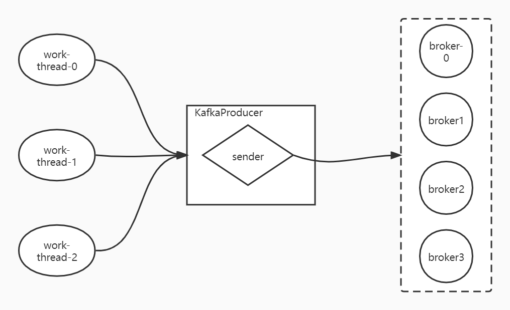
虽然Producer线程安全，不会发生数据重复推送或覆盖，且kafka-server可以保证消息的有序性，但是这种有序性和业务数据的有序性没有关系。业务数据的有序性需要通过业务分割、数据隔离等程序设计手段保证。

### Partitioner
kafka的procuser初始化时会初始化一个分区器，该分区器需要是`Partitioner.class`接口类的实现
```java
            this.partitioner = config.getConfiguredInstance(
                    ProducerConfig.PARTITIONER_CLASS_CONFIG,
                    Partitioner.class,
                    Collections.singletonMap(ProducerConfig.CLIENT_ID_CONFIG, clientId));
```
kafak提供的默认分区器：
```java
public class DefaultPartitioner implements Partitioner {

    private final StickyPartitionCache stickyPartitionCache = new StickyPartitionCache();

    public void configure(Map<String, ?> configs) {}

    /**
     * Compute the partition for the given record.
     *
     * @param topic The topic name
     * @param key The key to partition on (or null if no key)
     * @param keyBytes serialized key to partition on (or null if no key)
     * @param value The value to partition on or null
     * @param valueBytes serialized value to partition on or null
     * @param cluster The current cluster metadata
     */
    public int partition(String topic, Object key, byte[] keyBytes, Object value, byte[] valueBytes, Cluster cluster) {
        return partition(topic, key, keyBytes, value, valueBytes, cluster, cluster.partitionsForTopic(topic).size());
    }

    /**
     * Compute the partition for the given record.
     *
     * @param topic The topic name
     * @param numPartitions The number of partitions of the given {@code topic}
     * @param key The key to partition on (or null if no key)
     * @param keyBytes serialized key to partition on (or null if no key)
     * @param value The value to partition on or null
     * @param valueBytes serialized value to partition on or null
     * @param cluster The current cluster metadata
     */
    public int partition(String topic, Object key, byte[] keyBytes, Object value, byte[] valueBytes, Cluster cluster,
                         int numPartitions) {
        if (keyBytes == null) {
            return stickyPartitionCache.partition(topic, cluster);
        }
        // hash the keyBytes to choose a partition
        return Utils.toPositive(Utils.murmur2(keyBytes)) % numPartitions;
    }

    public void close() {}
    
    /**
     * If a batch completed for the current sticky partition, change the sticky partition. 
     * Alternately, if no sticky partition has been determined, set one.
     */
    public void onNewBatch(String topic, Cluster cluster, int prevPartition) {
        stickyPartitionCache.nextPartition(topic, cluster, prevPartition);
    }
}
```
可以看到，接受的消息没有key时，分区器会把消息依次负载到每个分区：
```java
    if (keyBytes == null) {
            return stickyPartitionCache.partition(topic, cluster);
        }
```
```java
/**
 * An internal class that implements a cache used for sticky partitioning behavior. The cache tracks the current sticky
 * partition for any given topic. This class should not be used externally. 
 */
public class StickyPartitionCache {
    private final ConcurrentMap<String, Integer> indexCache;
    public StickyPartitionCache() {
        this.indexCache = new ConcurrentHashMap<>();
    }

    public int partition(String topic, Cluster cluster) {
        Integer part = indexCache.get(topic);
        if (part == null) {
            return nextPartition(topic, cluster, -1);
        }
        return part;
    }

    public int nextPartition(String topic, Cluster cluster, int prevPartition) {
        List<PartitionInfo> partitions = cluster.partitionsForTopic(topic);
        Integer oldPart = indexCache.get(topic);
        Integer newPart = oldPart;
        // Check that the current sticky partition for the topic is either not set or that the partition that 
        // triggered the new batch matches the sticky partition that needs to be changed.
        if (oldPart == null || oldPart == prevPartition) {
            List<PartitionInfo> availablePartitions = cluster.availablePartitionsForTopic(topic);
            if (availablePartitions.size() < 1) {
                Integer random = Utils.toPositive(ThreadLocalRandom.current().nextInt());
                newPart = random % partitions.size();
            } else if (availablePartitions.size() == 1) {
                newPart = availablePartitions.get(0).partition();
            } else {
                while (newPart == null || newPart.equals(oldPart)) {
                    int random = Utils.toPositive(ThreadLocalRandom.current().nextInt());
                    newPart = availablePartitions.get(random % availablePartitions.size()).partition();
                }
            }
            // Only change the sticky partition if it is null or prevPartition matches the current sticky partition.
            if (oldPart == null) {
                indexCache.putIfAbsent(topic, newPart);
            } else {
                indexCache.replace(topic, prevPartition, newPart);
            }
            return indexCache.get(topic);
        }
        return indexCache.get(topic);
    }
}
```
当有key时，会对key计算hash再用hash值对分区数取模：
```java
        // hash the keyBytes to choose a partition
        return Utils.toPositive(Utils.murmur2(keyBytes)) % numPartitions;
```

### Sender
```java
...
            this.sender = newSender(logContext, kafkaClient, this.metadata);
            String ioThreadName = NETWORK_THREAD_PREFIX + " | " + clientId;
            this.ioThread = new KafkaThread(ioThreadName, this.sender, true);
            this.ioThread.start();
...
```
sender对象用于发送消息，初始化后被传递给一个新的IO子线程。
```java
public class Sender implements Runnable {

    ...

    @Override
    public void run() {
        log.debug("Starting Kafka producer I/O thread.");

        // main loop, runs until close is called
        while (running) {
            try {
                runOnce();
            } catch (Exception e) {
                log.error("Uncaught error in kafka producer I/O thread: ", e);
            }
        }

        log.debug("Beginning shutdown of Kafka producer I/O thread, sending remaining records.");

        // okay we stopped accepting requests but there may still be
        // requests in the transaction manager, accumulator or waiting for acknowledgment,
        // wait until these are completed.
        while (!forceClose && ((this.accumulator.hasUndrained() || this.client.inFlightRequestCount() > 0) || hasPendingTransactionalRequests())) {
            try {
                runOnce();
            } catch (Exception e) {
                log.error("Uncaught error in kafka producer I/O thread: ", e);
            }
        }

        // Abort the transaction if any commit or abort didn't go through the transaction manager's queue
        while (!forceClose && transactionManager != null && transactionManager.hasOngoingTransaction()) {
            if (!transactionManager.isCompleting()) {
                log.info("Aborting incomplete transaction due to shutdown");
                transactionManager.beginAbort();
            }
            try {
                runOnce();
            } catch (Exception e) {
                log.error("Uncaught error in kafka producer I/O thread: ", e);
            }
        }

        if (forceClose) {
            // We need to fail all the incomplete transactional requests and batches and wake up the threads waiting on
            // the futures.
            if (transactionManager != null) {
                log.debug("Aborting incomplete transactional requests due to forced shutdown");
                transactionManager.close();
            }
            log.debug("Aborting incomplete batches due to forced shutdown");
            this.accumulator.abortIncompleteBatches();
        }
        try {
            this.client.close();
        } catch (Exception e) {
            log.error("Failed to close network client", e);
        }

        log.debug("Shutdown of Kafka producer I/O thread has completed.");
    }
    ...
}
```
可以看到sender类是对Runnable接口的实现，可以作为子线程运行。当线程处于running状态时，会循环运行`runOnce`方法
```java
public class Sender implements Runnable {
...
    void runOnce() {
        if (transactionManager != null) {
            try {
                transactionManager.maybeResolveSequences();

                // do not continue sending if the transaction manager is in a failed state
                if (transactionManager.hasFatalError()) {
                    RuntimeException lastError = transactionManager.lastError();
                    if (lastError != null)
                        maybeAbortBatches(lastError);
                    client.poll(retryBackoffMs, time.milliseconds());
                    return;
                }

                // Check whether we need a new producerId. If so, we will enqueue an InitProducerId
                // request which will be sent below
                transactionManager.bumpIdempotentEpochAndResetIdIfNeeded();

                if (maybeSendAndPollTransactionalRequest()) {
                    return;
                }
            } catch (AuthenticationException e) {
                // This is already logged as error, but propagated here to perform any clean ups.
                log.trace("Authentication exception while processing transactional request", e);
                transactionManager.authenticationFailed(e);
            }
        }

        long currentTimeMs = time.milliseconds();
        long pollTimeout = sendProducerData(currentTimeMs);
        client.poll(pollTimeout, currentTimeMs);
    }
    ...
}
```
`runOnce`方法中调用了`Sender`实例中的`client`对象的poll方法。

#### sender中默认使用Kafka自行实现的的NIO
```java
public class KafkaProducer<K, V> implements Producer<K, V> {
...
    Sender newSender(LogContext logContext, KafkaClient kafkaClient, ProducerMetadata metadata) {
        int maxInflightRequests = configureInflightRequests(producerConfig);
        int requestTimeoutMs = producerConfig.getInt(ProducerConfig.REQUEST_TIMEOUT_MS_CONFIG);
        ChannelBuilder channelBuilder = ClientUtils.createChannelBuilder(producerConfig, time, logContext);
        ProducerMetrics metricsRegistry = new ProducerMetrics(this.metrics);
        Sensor throttleTimeSensor = Sender.throttleTimeSensor(metricsRegistry.senderMetrics);
        KafkaClient client = kafkaClient != null ? kafkaClient : new NetworkClient(
                new Selector(producerConfig.getLong(ProducerConfig.CONNECTIONS_MAX_IDLE_MS_CONFIG),
                        this.metrics, time, "producer", channelBuilder, logContext),
                metadata,
                clientId,
                maxInflightRequests,
                producerConfig.getLong(ProducerConfig.RECONNECT_BACKOFF_MS_CONFIG),
                producerConfig.getLong(ProducerConfig.RECONNECT_BACKOFF_MAX_MS_CONFIG),
                producerConfig.getInt(ProducerConfig.SEND_BUFFER_CONFIG),
                producerConfig.getInt(ProducerConfig.RECEIVE_BUFFER_CONFIG),
                requestTimeoutMs,
                producerConfig.getLong(ProducerConfig.SOCKET_CONNECTION_SETUP_TIMEOUT_MS_CONFIG),
                producerConfig.getLong(ProducerConfig.SOCKET_CONNECTION_SETUP_TIMEOUT_MAX_MS_CONFIG),
                time,
                true,
                apiVersions,
                throttleTimeSensor,
                logContext);
        short acks = configureAcks(producerConfig, log);
        return new Sender(logContext,
                client,
                metadata,
                this.accumulator,
                maxInflightRequests == 1,
                producerConfig.getInt(ProducerConfig.MAX_REQUEST_SIZE_CONFIG),
                acks,
                producerConfig.getInt(ProducerConfig.RETRIES_CONFIG),
                metricsRegistry.senderMetrics,
                time,
                requestTimeoutMs,
                producerConfig.getLong(ProducerConfig.RETRY_BACKOFF_MS_CONFIG),
                this.transactionManager,
                apiVersions);
    }
    ...
}
```
可以看到，默认情况下，初始化sender对象时传入的是未实现的`KafakClient` 对象，那么sender会创建一个NetWWorkClient对象：`KafkaClient client = kafkaClient != null ? kafkaClient : new NetworkClient(...)`，并传入kafka内部实现的selector实例作为参数`new Selector(producerConfig.getLong(ProducerConfig.CONNECTIONS_MAX_IDLE_MS_CONFIG)`。
这里的selector最终会调用JDK中NIO的selector，所以Kafka没有使用Netty框架，而是自行封装了NIO。
```java
    public Selector(int maxReceiveSize,
            long connectionMaxIdleMs,
            int failedAuthenticationDelayMs,
            Metrics metrics,
            Time time,
            String metricGrpPrefix,
            Map<String, String> metricTags,
            boolean metricsPerConnection,
            boolean recordTimePerConnection,
            ChannelBuilder channelBuilder,
            MemoryPool memoryPool,
            LogContext logContext) {
        try {
            this.nioSelector = java.nio.channels.Selector.open();
        }
        ...
```

#### sender的发送流程
在触发client的poll方法之前，sender首先调用了`sendProducerData`方法
```java
public class Sender implements Runnable {
    ...
    private long sendProducerData(long now) {
        Cluster cluster = metadata.fetch();
        // get the list of partitions with data ready to send
        RecordAccumulator.ReadyCheckResult result = this.accumulator.ready(cluster, now);

        // if there are any partitions whose leaders are not known yet, force metadata update
        if (!result.unknownLeaderTopics.isEmpty()) {
            // The set of topics with unknown leader contains topics with leader election pending as well as
            // topics which may have expired. Add the topic again to metadata to ensure it is included
            // and request metadata update, since there are messages to send to the topic.
            for (String topic : result.unknownLeaderTopics)
                this.metadata.add(topic, now);

            log.debug("Requesting metadata update due to unknown leader topics from the batched records: {}",
                result.unknownLeaderTopics);
            this.metadata.requestUpdate();
        }

        // remove any nodes we aren't ready to send to
        Iterator<Node> iter = result.readyNodes.iterator();
        long notReadyTimeout = Long.MAX_VALUE;
        while (iter.hasNext()) {
            Node node = iter.next();
            if (!this.client.ready(node, now)) {
                iter.remove();
                notReadyTimeout = Math.min(notReadyTimeout, this.client.pollDelayMs(node, now));
            }
        }

        // create produce requests
        Map<Integer, List<ProducerBatch>> batches = this.accumulator.drain(cluster, result.readyNodes, this.maxRequestSize, now);
        addToInflightBatches(batches);
        if (guaranteeMessageOrder) {
            // Mute all the partitions drained
            for (List<ProducerBatch> batchList : batches.values()) {
                for (ProducerBatch batch : batchList)
                    this.accumulator.mutePartition(batch.topicPartition);
            }
        }

        accumulator.resetNextBatchExpiryTime();
        List<ProducerBatch> expiredInflightBatches = getExpiredInflightBatches(now);
        List<ProducerBatch> expiredBatches = this.accumulator.expiredBatches(now);
        expiredBatches.addAll(expiredInflightBatches);

        // Reset the producer id if an expired batch has previously been sent to the broker. Also update the metrics
        // for expired batches. see the documentation of @TransactionState.resetIdempotentProducerId to understand why
        // we need to reset the producer id here.
        if (!expiredBatches.isEmpty())
            log.trace("Expired {} batches in accumulator", expiredBatches.size());
        for (ProducerBatch expiredBatch : expiredBatches) {
            String errorMessage = "Expiring " + expiredBatch.recordCount + " record(s) for " + expiredBatch.topicPartition
                + ":" + (now - expiredBatch.createdMs) + " ms has passed since batch creation";
            failBatch(expiredBatch, new TimeoutException(errorMessage), false);
            if (transactionManager != null && expiredBatch.inRetry()) {
                // This ensures that no new batches are drained until the current in flight batches are fully resolved.
                transactionManager.markSequenceUnresolved(expiredBatch);
            }
        }
        sensors.updateProduceRequestMetrics(batches);

        // If we have any nodes that are ready to send + have sendable data, poll with 0 timeout so this can immediately
        // loop and try sending more data. Otherwise, the timeout will be the smaller value between next batch expiry
        // time, and the delay time for checking data availability. Note that the nodes may have data that isn't yet
        // sendable due to lingering, backing off, etc. This specifically does not include nodes with sendable data
        // that aren't ready to send since they would cause busy looping.
        long pollTimeout = Math.min(result.nextReadyCheckDelayMs, notReadyTimeout);
        pollTimeout = Math.min(pollTimeout, this.accumulator.nextExpiryTimeMs() - now);
        pollTimeout = Math.max(pollTimeout, 0);
        if (!result.readyNodes.isEmpty()) {
            log.trace("Nodes with data ready to send: {}", result.readyNodes);
            // if some partitions are already ready to be sent, the select time would be 0;
            // otherwise if some partition already has some data accumulated but not ready yet,
            // the select time will be the time difference between now and its linger expiry time;
            // otherwise the select time will be the time difference between now and the metadata expiry time;
            pollTimeout = 0;
        }
        sendProduceRequests(batches, now);
        return pollTimeout;
    }
    ...
}
```
在`Sender`对象的主线程中，主要和`accumulator`对象交互。`accumulator`即生产者的记录累加器，待发送的数据都组织在这个对象中。
```java
Map<Integer, List<ProducerBatch>> batches = this.accumulator.drain(cluster, result.readyNodes, this.maxRequestSize, now);
```
调用`drain`方法会取出一组数据批准备发送，`accumulator`的`drain`方法详解见下面累加器中的解释。

### send
```java
    @Override
    public Future<RecordMetadata> send(ProducerRecord<K, V> record, Callback callback) {
        // intercept the record, which can be potentially modified; this method does not throw exceptions
        ProducerRecord<K, V> interceptedRecord = this.interceptors.onSend(record);
        return doSend(interceptedRecord, callback);
    }
    ...
    private Future<RecordMetadata> doSend(ProducerRecord<K, V> record, Callback callback) {
        TopicPartition tp = null;
        try {
            throwIfProducerClosed();
            // first make sure the metadata for the topic is available
            long nowMs = time.milliseconds();
            ClusterAndWaitTime clusterAndWaitTime;
            try {
                clusterAndWaitTime = waitOnMetadata(record.topic(), record.partition(), nowMs, maxBlockTimeMs);
            } catch (KafkaException e) {
                if (metadata.isClosed())
                    throw new KafkaException("Producer closed while send in progress", e);
                throw e;
            }
            nowMs += clusterAndWaitTime.waitedOnMetadataMs;
            long remainingWaitMs = Math.max(0, maxBlockTimeMs - clusterAndWaitTime.waitedOnMetadataMs);
            Cluster cluster = clusterAndWaitTime.cluster;
            byte[] serializedKey;
            try {
                serializedKey = keySerializer.serialize(record.topic(), record.headers(), record.key());
            } catch (ClassCastException cce) {
                throw new SerializationException("Can't convert key of class " + record.key().getClass().getName() +
                        " to class " + producerConfig.getClass(ProducerConfig.KEY_SERIALIZER_CLASS_CONFIG).getName() +
                        " specified in key.serializer", cce);
            }
            byte[] serializedValue;
            try {
                serializedValue = valueSerializer.serialize(record.topic(), record.headers(), record.value());
            } catch (ClassCastException cce) {
                throw new SerializationException("Can't convert value of class " + record.value().getClass().getName() +
                        " to class " + producerConfig.getClass(ProducerConfig.VALUE_SERIALIZER_CLASS_CONFIG).getName() +
                        " specified in value.serializer", cce);
            }
            int partition = partition(record, serializedKey, serializedValue, cluster);
            tp = new TopicPartition(record.topic(), partition);

            setReadOnly(record.headers());
            Header[] headers = record.headers().toArray();

            int serializedSize = AbstractRecords.estimateSizeInBytesUpperBound(apiVersions.maxUsableProduceMagic(),
                    compressionType, serializedKey, serializedValue, headers);
            ensureValidRecordSize(serializedSize);
            long timestamp = record.timestamp() == null ? nowMs : record.timestamp();
            if (log.isTraceEnabled()) {
                log.trace("Attempting to append record {} with callback {} to topic {} partition {}", record, callback, record.topic(), partition);
            }
            // producer callback will make sure to call both 'callback' and interceptor callback
            Callback interceptCallback = new InterceptorCallback<>(callback, this.interceptors, tp);

            if (transactionManager != null && transactionManager.isTransactional()) {
                transactionManager.failIfNotReadyForSend();
            }
            RecordAccumulator.RecordAppendResult result = accumulator.append(tp, timestamp, serializedKey,
                    serializedValue, headers, interceptCallback, remainingWaitMs, true, nowMs);

            if (result.abortForNewBatch) {
                int prevPartition = partition;
                partitioner.onNewBatch(record.topic(), cluster, prevPartition);
                partition = partition(record, serializedKey, serializedValue, cluster);
                tp = new TopicPartition(record.topic(), partition);
                if (log.isTraceEnabled()) {
                    log.trace("Retrying append due to new batch creation for topic {} partition {}. The old partition was {}", record.topic(), partition, prevPartition);
                }
                // producer callback will make sure to call both 'callback' and interceptor callback
                interceptCallback = new InterceptorCallback<>(callback, this.interceptors, tp);

                result = accumulator.append(tp, timestamp, serializedKey,
                    serializedValue, headers, interceptCallback, remainingWaitMs, false, nowMs);
            }

            if (transactionManager != null && transactionManager.isTransactional())
                transactionManager.maybeAddPartitionToTransaction(tp);

            if (result.batchIsFull || result.newBatchCreated) {
                log.trace("Waking up the sender since topic {} partition {} is either full or getting a new batch", record.topic(), partition);
                this.sender.wakeup();
            }
            return result.future;
        } catch {...}
    }
```
seng方法中的关键步骤如下：
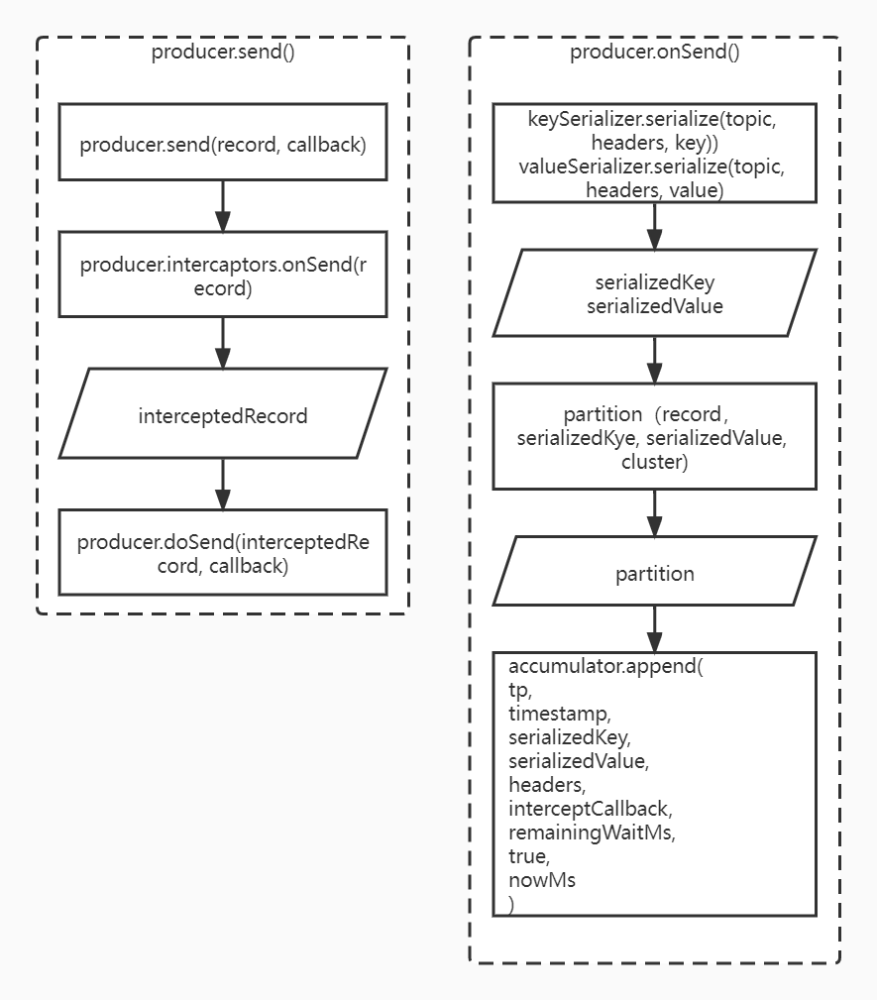

### 累加器
```java
            this.accumulator = new RecordAccumulator(logContext,
                    config.getInt(ProducerConfig.BATCH_SIZE_CONFIG),
                    this.compressionType,
                    lingerMs(config),
                    retryBackoffMs,
                    deliveryTimeoutMs,
                    metrics,
                    PRODUCER_METRIC_GROUP_NAME,
                    time,
                    apiVersions,
                    transactionManager,
                    new BufferPool(this.totalMemorySize, config.getInt(ProducerConfig.BATCH_SIZE_CONFIG), metrics, time, PRODUCER_METRIC_GROUP_NAME));
```
生产者如果每条记录都累加消息量，会影响性能，所以采用非严格模式批次推送数据时，可以把消息先堆积到累加器中。

#### drain
```java
public final class RecordAccumulator {
    ...
        public Map<Integer, List<ProducerBatch>> drain(Cluster cluster, Set<Node> nodes, int maxSize, long now) {
        if (nodes.isEmpty())
            return Collections.emptyMap();

        Map<Integer, List<ProducerBatch>> batches = new HashMap<>();
        for (Node node : nodes) {
            List<ProducerBatch> ready = drainBatchesForOneNode(cluster, node, maxSize, now);
            batches.put(node.id(), ready);
        }
        return batches;
    }
    ...
}
```
drain方法会根据配置的`MAX_REQUEST_SIZE_CONFIG`参数，取出尽可能多的batch，发送给broker。

**accumulator.append**
```java
public final class RecordAccumulator {
    ...
    public RecordAppendResult append(TopicPartition tp,
                                     long timestamp,
                                     byte[] key,
                                     byte[] value,
                                     Header[] headers,
                                     Callback callback,
                                     long maxTimeToBlock,
                                     boolean abortOnNewBatch,
                                     long nowMs) throws InterruptedException {
        // We keep track of the number of appending thread to make sure we do not miss batches in
        // abortIncompleteBatches().
        appendsInProgress.incrementAndGet();
        ByteBuffer buffer = null;
        if (headers == null) headers = Record.EMPTY_HEADERS;
        try {
            // check if we have an in-progress batch
            Deque<ProducerBatch> dq = getOrCreateDeque(tp);
            synchronized (dq) {
                if (closed)
                    throw new KafkaException("Producer closed while send in progress");
                RecordAppendResult appendResult = tryAppend(timestamp, key, value, headers, callback, dq, nowMs);
                if (appendResult != null)
                    return appendResult;
            }

            // we don't have an in-progress record batch try to allocate a new batch
            if (abortOnNewBatch) {
                // Return a result that will cause another call to append.
                return new RecordAppendResult(null, false, false, true);
            }

            byte maxUsableMagic = apiVersions.maxUsableProduceMagic();
            int size = Math.max(this.batchSize, AbstractRecords.estimateSizeInBytesUpperBound(maxUsableMagic, compression, key, value, headers));
            log.trace("Allocating a new {} byte message buffer for topic {} partition {} with remaining timeout {}ms", size, tp.topic(), tp.partition(), maxTimeToBlock);
            buffer = free.allocate(size, maxTimeToBlock);

            // Update the current time in case the buffer allocation blocked above.
            nowMs = time.milliseconds();
            synchronized (dq) {
                // Need to check if producer is closed again after grabbing the dequeue lock.
                if (closed)
                    throw new KafkaException("Producer closed while send in progress");

                RecordAppendResult appendResult = tryAppend(timestamp, key, value, headers, callback, dq, nowMs);
                if (appendResult != null) {
                    // Somebody else found us a batch, return the one we waited for! Hopefully this doesn't happen often...
                    return appendResult;
                }

                MemoryRecordsBuilder recordsBuilder = recordsBuilder(buffer, maxUsableMagic);
                ProducerBatch batch = new ProducerBatch(tp, recordsBuilder, nowMs);
                FutureRecordMetadata future = Objects.requireNonNull(batch.tryAppend(timestamp, key, value, headers,
                        callback, nowMs));

                dq.addLast(batch);
                incomplete.add(batch);

                // Don't deallocate this buffer in the finally block as it's being used in the record batch
                buffer = null;
                return new RecordAppendResult(future, dq.size() > 1 || batch.isFull(), true, false);
            }
        } finally {
            if (buffer != null)
                free.deallocate(buffer);
            appendsInProgress.decrementAndGet();
        }
    }
}
```
通过`Deque<ProducerBatch> dq = getOrCreateDeque(tp)`可以知道，每个分区都有一个对应的双端队列。
并通过加锁：
```java
            synchronized (dq) {
                if (closed)
                    throw new KafkaException("Producer closed while send in progress");
                RecordAppendResult appendResult = tryAppend(timestamp, key, value, headers, callback, dq, nowMs);
                if (appendResult != null)
                    return appendResult;
            }
```
保证线程安全。

```java
    private RecordAppendResult tryAppend(long timestamp, byte[] key, byte[] value, Header[] headers,
                                         Callback callback, Deque<ProducerBatch> deque, long nowMs) {
        ProducerBatch last = deque.peekLast();
        if (last != null) {
            FutureRecordMetadata future = last.tryAppend(timestamp, key, value, headers, callback, nowMs);
            if (future == null)
                last.closeForRecordAppends();
            else
                return new RecordAppendResult(future, deque.size() > 1 || last.isFull(), false, false);
        }
        return null;
    }
```
tryAppend方法提示，分区的双端队列中存放的是批次数据`ProducerBatch`。

### Producer的batch
kafka的producer包含以下配置：
```java
        p.setProperty(ProducerConfig.BATCH_SIZE_CONFIG, "16384");  // 16k
        p.setProperty(ProducerConfig.LINGER_MS_CONFIG, "0");
        p.setProperty(ProducerConfig.MAX_REQUEST_SIZE_CONFIG, "1048576");  // 1M
        p.setProperty(ProducerConfig.BUFFER_MEMORY_CONFIG, "33554432");  // 32M
        p.setProperty(ProducerConfig.MAX_BLOCK_MS_CONFIG, "6000");  // 60s
        p.setProperty(ProducerConfig.SEND_BUFFER_CONFIG, "32768");
        p.setProperty(ProducerConfig.RECEIVE_BUFFER_CONFIG, "32768");
```
其中`BATCH_SIZE_CONFIG`是每个批次数据的大小，`BUFFER_MEMORY_CONFIG`是`RecordAccumulator`分配到的内存大小，`MAX_BLOCK_MS_CONFIG`是`RecordAccumulator`填满后的阻塞时间，如果producer的数据发送给`RecordAccumulator`时阻塞，则阻塞超过`MAX_BLOCK_MS_CONFIG`配置的时间后会抛出异常。
这些数据往往是调优的方向，比如集群内的topic很多，即使每个topic生成的数据量较小，累加起来也可能撑满默认的32M空间。
`BATCH_SIZE_CONFIG`并不是指batch一定是16K，当消息的大小低于batch的空间时，会把消息加入到batch中，但是如果消息的大小超过btach的空间，则kafka会关闭当前批次并开辟新的空间存放当前消息：
```java
public final class RecordAccumulator {
    ...
    public FutureRecordMetadata tryAppend(long timestamp, byte[] key, byte[] value, Header[] headers, Callback callback, long now) {
        if (!recordsBuilder.hasRoomFor(timestamp, key, value, headers)) {
            return null;
        } else {
            this.recordsBuilder.append(timestamp, key, value, headers);
            this.maxRecordSize = Math.max(this.maxRecordSize, AbstractRecords.estimateSizeInBytesUpperBound(magic(),
                    recordsBuilder.compressionType(), key, value, headers));
            this.lastAppendTime = now;
            FutureRecordMetadata future = new FutureRecordMetadata(this.produceFuture, this.recordCount,
                                                                   timestamp,
                                                                   key == null ? -1 : key.length,
                                                                   value == null ? -1 : value.length,
                                                                   Time.SYSTEM);
            // we have to keep every future returned to the users in case the batch needs to be
            // split to several new batches and resent.
            thunks.add(new Thunk(callback, future));
            this.recordCount++;
            return future;
        }
    }
    ...
}
```
上面的代码展示了没有足够的空间时，`tryAppend`会返回`null`。
这种超出batch的消息需要额外申请空间，容易产生碎片，所以也是调优的关键。而且如果数据的空间超出`RecordAccumulator`申请的空间，则数据甚至不能被发送。
`LINGER_MS_CONFIG`配置的是send等待时间，主要用于非阻塞的情况下，每次收到数据后，如果batch没有填充满，会使batch等待`LINGER_MS_CONFIG`配置的时间后再发送出去。使尽可能实现批量发送，提高性能。

### producer和broker的通信
无论是生产者还是消费者，在处理数据之前一定需要先知道集群的元信息，才知道和那里的服务器通信。
```java
public class KafkaProducer<K, V> implements Producer<K, V> {
    ...
    private Future<RecordMetadata> doSend(ProducerRecord<K, V> record, Callback callback) {
        TopicPartition tp = null;
        try {
            throwIfProducerClosed();
            // first make sure the metadata for the topic is available
            long nowMs = time.milliseconds();
            ClusterAndWaitTime clusterAndWaitTime;
            try {
                clusterAndWaitTime = waitOnMetadata(record.topic(), record.partition(), nowMs, maxBlockTimeMs);
            } catch (KafkaException e) {
                if (metadata.isClosed())
                    throw new KafkaException("Producer closed while send in progress", e);
                throw e;
            }
            ...
        }
    }
}
```
producer在实际发送前，通过`waitOnMetadata`方法获取元信息。
```java
public class KafkaProducer<K, V> implements Producer<K, V> {
    ...
    private ClusterAndWaitTime waitOnMetadata(String topic, Integer partition, long nowMs, long maxWaitMs) throws InterruptedException {
        // add topic to metadata topic list if it is not there already and reset expiry
        Cluster cluster = metadata.fetch();

        if (cluster.invalidTopics().contains(topic))
            throw new InvalidTopicException(topic);

        metadata.add(topic, nowMs);

        Integer partitionsCount = cluster.partitionCountForTopic(topic);
        // Return cached metadata if we have it, and if the record's partition is either undefined
        // or within the known partition range
        if (partitionsCount != null && (partition == null || partition < partitionsCount))
            return new ClusterAndWaitTime(cluster, 0);

        long remainingWaitMs = maxWaitMs;
        long elapsed = 0;
        // Issue metadata requests until we have metadata for the topic and the requested partition,
        // or until maxWaitTimeMs is exceeded. This is necessary in case the metadata
        // is stale and the number of partitions for this topic has increased in the meantime.
        do {
            if (partition != null) {
                log.trace("Requesting metadata update for partition {} of topic {}.", partition, topic);
            } else {
                log.trace("Requesting metadata update for topic {}.", topic);
            }
            metadata.add(topic, nowMs + elapsed);
            int version = metadata.requestUpdateForTopic(topic);
            sender.wakeup();
            try {
                metadata.awaitUpdate(version, remainingWaitMs);
            } catch (TimeoutException ex) {
                // Rethrow with original maxWaitMs to prevent logging exception with remainingWaitMs
                throw new TimeoutException(
                        String.format("Topic %s not present in metadata after %d ms.",
                                topic, maxWaitMs));
            }
            cluster = metadata.fetch();
            elapsed = time.milliseconds() - nowMs;
            if (elapsed >= maxWaitMs) {
                throw new TimeoutException(partitionsCount == null ?
                        String.format("Topic %s not present in metadata after %d ms.",
                                topic, maxWaitMs) :
                        String.format("Partition %d of topic %s with partition count %d is not present in metadata after %d ms.",
                                partition, topic, partitionsCount, maxWaitMs));
            }
            metadata.maybeThrowExceptionForTopic(topic);
            remainingWaitMs = maxWaitMs - elapsed;
            partitionsCount = cluster.partitionCountForTopic(topic);
        } while (partitionsCount == null || (partition != null && partition >= partitionsCount));

        return new ClusterAndWaitTime(cluster, elapsed);
    }
    ...
}
```
首次循环时，producer线程中还没有有效的`partitionsCount`或`partition`时，`waitOnMeatadata`方法会循环执行:
```java
            int version = metadata.requestUpdateForTopic(topic);
            sender.wakeup();
```
其中`requestUpdateForTopic`方法：
```java
public class ProducerMetadata extends Metadata {
    ...
    public synchronized int requestUpdateForTopic(String topic) {
        if (newTopics.contains(topic)) {
            return requestUpdateForNewTopics();
        } else {
            return requestUpdate();
        }
    }
    ...
}
```
而在生产者刚启动时，生产者中没有topic，所以执行`requestUpdate`方法：
```java
public class ProducerMetadata extends Metadata {
    ...
        public synchronized int requestUpdate() {
        this.needFullUpdate = true;
        return this.updateVersion;
    }
    ...
}
```
可以看到，`requestUpdata`方法主要是把`needFullUpdate`参数置`true`。
之后`producer`线程唤醒`sender`线程：`sender.weakup()`。
```java
public class Sender implements Runnable {
    ...
    @Override
    public void run() {
        log.debug("Starting Kafka producer I/O thread.");

        // main loop, runs until close is called
        while (running) {
            try {
                runOnce();
            } catch (Exception e) {
                log.error("Uncaught error in kafka producer I/O thread: ", e);
            }
        }

        log.debug("Beginning shutdown of Kafka producer I/O thread, sending remaining records.");

        // okay we stopped accepting requests but there may still be
        // requests in the transaction manager, accumulator or waiting for acknowledgment,
        // wait until these are completed.
        while (!forceClose && ((this.accumulator.hasUndrained() || this.client.inFlightRequestCount() > 0) || hasPendingTransactionalRequests())) {
            try {
                runOnce();
            } catch (Exception e) {
                log.error("Uncaught error in kafka producer I/O thread: ", e);
            }
        }

        // Abort the transaction if any commit or abort didn't go through the transaction manager's queue
        while (!forceClose && transactionManager != null && transactionManager.hasOngoingTransaction()) {
            if (!transactionManager.isCompleting()) {
                log.info("Aborting incomplete transaction due to shutdown");
                transactionManager.beginAbort();
            }
            try {
                runOnce();
            } catch (Exception e) {
                log.error("Uncaught error in kafka producer I/O thread: ", e);
            }
        }

        if (forceClose) {
            // We need to fail all the incomplete transactional requests and batches and wake up the threads waiting on
            // the futures.
            if (transactionManager != null) {
                log.debug("Aborting incomplete transactional requests due to forced shutdown");
                transactionManager.close();
            }
            log.debug("Aborting incomplete batches due to forced shutdown");
            this.accumulator.abortIncompleteBatches();
        }
        try {
            this.client.close();
        } catch (Exception e) {
            log.error("Failed to close network client", e);
        }

        log.debug("Shutdown of Kafka producer I/O thread has completed.");
    }

    /**
     * Run a single iteration of sending
     *
     */
    void runOnce() {
        if (transactionManager != null) {
            try {
                transactionManager.maybeResolveSequences();

                // do not continue sending if the transaction manager is in a failed state
                if (transactionManager.hasFatalError()) {
                    RuntimeException lastError = transactionManager.lastError();
                    if (lastError != null)
                        maybeAbortBatches(lastError);
                    client.poll(retryBackoffMs, time.milliseconds());
                    return;
                }

                // Check whether we need a new producerId. If so, we will enqueue an InitProducerId
                // request which will be sent below
                transactionManager.bumpIdempotentEpochAndResetIdIfNeeded();

                if (maybeSendAndPollTransactionalRequest()) {
                    return;
                }
            } catch (AuthenticationException e) {
                // This is already logged as error, but propagated here to perform any clean ups.
                log.trace("Authentication exception while processing transactional request", e);
                transactionManager.authenticationFailed(e);
            }
        }

        long currentTimeMs = time.milliseconds();
        long pollTimeout = sendProducerData(currentTimeMs);
        client.poll(pollTimeout, currentTimeMs);
    }
    ...
}
```
可以看到`sender`被唤醒后，最终主要逻辑在`client.poll`中，即，kafka自行封装的NIO对象的poll方法：
```java
public class NetworkClient implements KafkaClient {
    ...
    @Override
    public List<ClientResponse> poll(long timeout, long now) {
        ensureActive();

        if (!abortedSends.isEmpty()) {
            // If there are aborted sends because of unsupported version exceptions or disconnects,
            // handle them immediately without waiting for Selector#poll.
            List<ClientResponse> responses = new ArrayList<>();
            handleAbortedSends(responses);
            completeResponses(responses);
            return responses;
        }

        long metadataTimeout = metadataUpdater.maybeUpdate(now);
        try {
            this.selector.poll(Utils.min(timeout, metadataTimeout, defaultRequestTimeoutMs));
        } catch (IOException e) {
            log.error("Unexpected error during I/O", e);
        }

        // process completed actions
        long updatedNow = this.time.milliseconds();
        List<ClientResponse> responses = new ArrayList<>();
        handleCompletedSends(responses, updatedNow);
        handleCompletedReceives(responses, updatedNow);
        handleDisconnections(responses, updatedNow);
        handleConnections();
        handleInitiateApiVersionRequests(updatedNow);
        handleTimedOutConnections(responses, updatedNow);
        handleTimedOutRequests(responses, updatedNow);
        completeResponses(responses);

        return responses;
    }
    ...
}
```
在client的poll中，首先会执行`maybeUpdate`方法：
```java
public class NetworkClient implements KafkaClient {
    ...
    class DefaultMetadataUpdater implements MetadataUpdater {
        ...
        @Override
        public long maybeUpdate(long now) {
            // should we update our metadata?
            long timeToNextMetadataUpdate = metadata.timeToNextUpdate(now);
            long waitForMetadataFetch = hasFetchInProgress() ? defaultRequestTimeoutMs : 0;

            long metadataTimeout = Math.max(timeToNextMetadataUpdate, waitForMetadataFetch);
            if (metadataTimeout > 0) {
                return metadataTimeout;
            }

            // Beware that the behavior of this method and the computation of timeouts for poll() are
            // highly dependent on the behavior of leastLoadedNode.
            Node node = leastLoadedNode(now);
            if (node == null) {
                log.debug("Give up sending metadata request since no node is available");
                return reconnectBackoffMs;
            }

            return maybeUpdate(now, node);
        }
        ...
    }
    ...
}
```
其中`leastLoadedNode`返回可以连接的服务节点。
```java
public class NetworkClient implements KafkaClient {
    ...
    @Override
    public Node leastLoadedNode(long now) {
        List<Node> nodes = this.metadataUpdater.fetchNodes();
        if (nodes.isEmpty())
            throw new IllegalStateException("There are no nodes in the Kafka cluster");
        int inflight = Integer.MAX_VALUE;

        Node foundConnecting = null;
        Node foundCanConnect = null;
        Node foundReady = null;

        int offset = this.randOffset.nextInt(nodes.size());
        for (int i = 0; i < nodes.size(); i++) {
            int idx = (offset + i) % nodes.size();
            Node node = nodes.get(idx);
            if (canSendRequest(node.idString(), now)) {
                int currInflight = this.inFlightRequests.count(node.idString());
                if (currInflight == 0) {
                    // if we find an established connection with no in-flight requests we can stop right away
                    log.trace("Found least loaded node {} connected with no in-flight requests", node);
                    return node;
                } else if (currInflight < inflight) {
                    // otherwise if this is the best we have found so far, record that
                    inflight = currInflight;
                    foundReady = node;
                }
            } else if (connectionStates.isPreparingConnection(node.idString())) {
                foundConnecting = node;
            } else if (canConnect(node, now)) {
                if (foundCanConnect == null ||
                        this.connectionStates.lastConnectAttemptMs(foundCanConnect.idString()) >
                                this.connectionStates.lastConnectAttemptMs(node.idString())) {
                    foundCanConnect = node;
                }
            } else {
                log.trace("Removing node {} from least loaded node selection since it is neither ready " +
                        "for sending or connecting", node);
            }
        }

        // We prefer established connections if possible. Otherwise, we will wait for connections
        // which are being established before connecting to new nodes.
        if (foundReady != null) {
            log.trace("Found least loaded node {} with {} inflight requests", foundReady, inflight);
            return foundReady;
        } else if (foundConnecting != null) {
            log.trace("Found least loaded connecting node {}", foundConnecting);
            return foundConnecting;
        } else if (foundCanConnect != null) {
            log.trace("Found least loaded node {} with no active connection", foundCanConnect);
            return foundCanConnect;
        } else {
            log.trace("Least loaded node selection failed to find an available node");
            return null;
        }
    }
    ...
}
```
最开始只能通过服务启动时传入的nodes参数取出nodes数组`List<Node> nodes = this.metadataUpdater.fetchNodes();`
```java
...
    class DefaultMetadataUpdater implements MetadataUpdater {
        @Override
        public List<Node> fetchNodes() {
            return metadata.fetch().nodes();
        }
    ...
    }
...
```
再随机取出一个节点更新元数据
```java
            int idx = (offset + i) % nodes.size();
            Node node = nodes.get(idx);
```
而随着服务的运行，一部分节点中可能积压了没有处理完的数据，那么会遍历取出数据压力较小的节点。
取出可用的节点后，继续更新`maybeUpdate(now, node)`：
```java
public class NetworkClient implements KafkaClient {
    ...
    class DefaultMetadataUpdater implements MetadataUpdater {
        ...
        private long maybeUpdate(long now, Node node) {
            String nodeConnectionId = node.idString();

            if (canSendRequest(nodeConnectionId, now)) {
                Metadata.MetadataRequestAndVersion requestAndVersion = metadata.newMetadataRequestAndVersion(now);
                MetadataRequest.Builder metadataRequest = requestAndVersion.requestBuilder;
                log.debug("Sending metadata request {} to node {}", metadataRequest, node);
                sendInternalMetadataRequest(metadataRequest, nodeConnectionId, now);
                inProgress = new InProgressData(requestAndVersion.requestVersion, requestAndVersion.isPartialUpdate);
                return defaultRequestTimeoutMs;
            }

            // If there's any connection establishment underway, wait until it completes. This prevents
            // the client from unnecessarily connecting to additional nodes while a previous connection
            // attempt has not been completed.
            if (isAnyNodeConnecting()) {
                // Strictly the timeout we should return here is "connect timeout", but as we don't
                // have such application level configuration, using reconnect backoff instead.
                return reconnectBackoffMs;
            }

            if (connectionStates.canConnect(nodeConnectionId, now)) {
                // We don't have a connection to this node right now, make one
                log.debug("Initialize connection to node {} for sending metadata request", node);
                initiateConnect(node, now);
                return reconnectBackoffMs;
            }

            // connected, but can't send more OR connecting
            // In either case, we just need to wait for a network event to let us know the selected
            // connection might be usable again.
            return Long.MAX_VALUE;
        }
        ...
    }
    ...
}
```