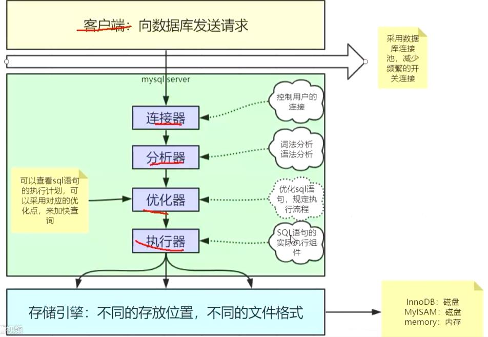

# 性能监控
## 使用show profile
mysql基本架构


客户端发起请求，服务器启动连接器校验连接的参数；
服务器使用分析器把sql语句转换成AST；
同时使用优化器按不同的存储引擎优化，优化的两种方式：RBO & CBO；RBO：基于规则的优化，CBO：基于成本的优化；
优化结束后，调用执行器和存储引擎交互。
在MySQL8.0之前，服务器中维护了查询缓存，但是缓存命中率不高，所以在8.0之后剔除了缓存。

mysql的命令行精确到小数点后两位，所以命令行有时会显示执行时间为0.00sec:
```mysql
mysql> select * from mylock;
+----+------+
| id | name |
+----+------+
|  1 | a    |
|  2 | aa   |
|  3 | b    |
|  4 | bb   |
|  5 | c    |
|  6 | cc   |
+----+------+
6 rows in set (0.00 sec)
```
设置参数后，可以通过profiles查看执行时间,show profiles查看命令的总体执行时间，show profile产看各阶段的执行时间。
```mysql
mysql> set profiling=1;
Query OK, 0 rows affected, 1 warning (0.00 sec)
mysql> select * from mylock;
+----+------+
| id | name |
+----+------+
|  1 | a    |
|  2 | aa   |
|  3 | b    |
|  4 | bb   |
|  5 | c    |
|  6 | cc   |
+----+------+
6 rows in set (0.00 sec)
mysql> show profiles;
+----------+------------+----------------------+
| Query_ID | Duration   | Query                |
+----------+------------+----------------------+
|        1 | 0.00254075 | select * from mylock |
+----------+------------+----------------------+
1 row in set, 1 warning (0.00 sec)

mysql> show profile;
+----------------------+----------+
| Status               | Duration |
+----------------------+----------+
| starting             | 0.000795 |
| checking permissions | 0.000079 |
| Opening tables       | 0.000282 |
| init                 | 0.000224 |
| System lock          | 0.000111 |
| optimizing           | 0.000022 |
| statistics           | 0.000182 |
| preparing            | 0.000084 |
| executing            | 0.000007 |
| Sending data         | 0.000548 |
| end                  | 0.000010 |
| query end            | 0.000036 |
| closing tables       | 0.000050 |
| freeing items        | 0.000048 |
| cleaning up          | 0.000064 |
+----------------------+----------+
15 rows in set, 1 warning (0.00 sec)
```
通过指明type查看更详细的资源调用
```mysql
mysql> show profile cpu;
+----------------------+----------+----------+------------+
| Status               | Duration | CPU_user | CPU_system |
+----------------------+----------+----------+------------+
| starting             | 0.000795 | 0.000420 |   0.000000 |
| checking permissions | 0.000079 | 0.000078 |   0.000000 |
| Opening tables       | 0.000282 | 0.000282 |   0.000000 |
| init                 | 0.000224 | 0.000223 |   0.000000 |
| System lock          | 0.000111 | 0.000111 |   0.000000 |
| optimizing           | 0.000022 | 0.000022 |   0.000000 |
| statistics           | 0.000182 | 0.000182 |   0.000000 |
| preparing            | 0.000084 | 0.000084 |   0.000000 |
| executing            | 0.000007 | 0.000006 |   0.000000 |
| Sending data         | 0.000548 | 0.000550 |   0.000000 |
| end                  | 0.000010 | 0.000009 |   0.000000 |
| query end            | 0.000036 | 0.000036 |   0.000000 |
| closing tables       | 0.000050 | 0.000050 |   0.000000 |
| freeing items        | 0.000048 | 0.000048 |   0.000000 |
| cleaning up          | 0.000064 | 0.000063 |   0.000000 |
+----------------------+----------+----------+------------+
15 rows in set, 1 warning (0.01 sec)
```
可选的系统资源包括:
* ALL
* BLOCK IO
* CONTEXT SWITCHES
* CPU
* IPC
* MEMORY
* PAGE FAULTS
* SOURCE
* SWAPS

mysql默认开启性能监控
```mysql
mysql> show databases;
+--------------------+
Database           |
+--------------------+
| information_schema |
| mysql              |
| performance_schema |
| sys                |
+--------------------+
4 rows in set (0.01 sec)
```
监控数据存储在performance_shema数据库中。information_schema中存放server运行过程中的元数据信息。

## Performance_schema
performance_shcema中包含87张表
```mysql
mysql> use performance_schema;
Reading table information for completion of table and column names
You can turn off this feature to get a quicker startup with -A

Database changed                                                                    
mysql> show tables;                                                                 
+------------------------------------------------------+                            
| Tables_in_performance_schema                         |                            
+------------------------------------------------------+                            
| accounts                                             |                            
| cond_instances                                       |                            
| events_stages_current                                |                            
| events_stages_history                                |                            
| events_stages_history_long                           |                            
| events_stages_summary_by_account_by_event_name       |                            
| events_stages_summary_by_host_by_event_name          |                            
|...                                                   |                            
| user_variables_by_thread                             |                            
| users                                                |                            
| variables_by_thread                                  |                            
+------------------------------------------------------+                            
87 rows in set (0.00 sec) 
```

```mysql
mysql> show variables like 'performance_schema';
+--------------------+-------+
|Variable_name      | Value |
+--------------------+-------+
|performance_schema | ON    |
+--------------------+-------+
1 row in set (0.00 sec)
```
这是只读变量，如果要修改这个属性，只能通过mysql配置文件
```
[msqld]
performance_schema=ON
```
performance_schema数据库中的表使用performance_schema存储引擎。
表中的数据不会持久化，保存在内存中。

### 生产者
instruments: 用于采集mysql中各种操作产生的时间信息，对应配置表中的配置项陈伟监控采集配置项
### 消费者
consumers: 对应的消费者表用于存储来自instruments采集的数据，对应配置表中的配置项可以称为消费存储配置项。

### 查询使用的最多的SQL
```sql
mysql> select DIGEST_TEXT,COUNT_STAR,FIRST_SEEN,LAST_SEEN from events_statements_summary_by_digest order by COUNT_STAR DESC\G;                                                               
*************************** 1. row ***************************
DIGEST_TEXT: SELECT @@SESSION . `tx_read_only`
 COUNT_STAR: 316
 FIRST_SEEN: 2021-08-08 15:28:23
 LAST_SEEN: 2021-08-08 23:19:33
*************************** 2. row ***************************
DIGEST_TEXT: SET `autocommit` = ?
 COUNT_STAR: 276
 FIRST_SEEN: 2021-08-08 15:28:23
 LAST_SEEN: 2021-08-09 01:19:33
*************************** 3. row ***************************
DIGEST_TEXT: SET SESSION TRANSACTION READ WRITE
 COUNT_STAR: 131
 FIRST_SEEN: 2021-08-08 15:31:40
 LAST_SEEN: 2021-08-09 01:19:33
...
```

## schema与数据类型优化

### 数据类型优化
1. 更小的更好
   尽量使用可以满足需求的最小数据类型
2. 简单就好
   ```sql
   mysql> select INET_ATON('192.168.11.1');
   +---------------------------+
   | INET_ATON('192.168.11.1') |
   +---------------------------+
   |                3232238337 |
   +---------------------------+
   1 row in set (0.00 sec)
   mysql> select INET_NTOA('3232238337');
   +-------------------------+
   | INET_NTOA('3232238337') |
   +-------------------------+
   | 192.168.11.1            |
   +-------------------------+
   1 row in set (0.00 sec)
   ```
3. 避免使用null
   如果查询中包含可为NULL的列，对mysql来说很难优化，因为可为null的列使得索引、索引统计和值的比较都更加复杂。通常null改为not null带来的提升较小，所以不必要修改表的schema，但是应尽量避免设计可为null的列。

4. 使用枚举类型
   ```
   mysql> create table enum_test(e enum('fish', 'apple', 'dog') not null);
   Query OK, 0 rows affected (0.02 sec)
   
   mysql> insert enum_test(e) values ('fish'),('dog'),('apple');
   Query OK, 3 rows affected (0.00 sec)
   Records: 3  Duplicates: 0  Warnings: 0
   
   mysql> select * from enum_test;
   +-------+
   | e     |
   +-------+
   | fish  |
   | dog   |
   | apple |
   +-------+
   3 rows in set (0.00 sec)
   
   
   mysql> select e+0 from enum_test;
   +-----+
   | e+0 |
   +-----+
   |   1 |
   |   3 |
   |   2 |
   +-----+
   3 rows in set (0.00 sec)

   mysql> select * from enum_test where e=1;
   +------+
   | e    |
   +------+
   | fish |
   +------+
   1 row in set (0.00 sec)

   mysql> alter table enum_test modify column e enum('fish', 'apple', 'dog', 'cat');
   Query OK, 0 rows affected (0.07 sec)
   Records: 0  Duplicates: 0  Warnings: 0
   ```
### 主键选择
#### 代理主键
与业务无关的，无意义的数字序列
#### 自然主键
事务属性中的自然唯一标识
#### 推荐使用代理主键
1. 不与业务耦合，因此更容易维护
2. 一种在大多数表，最好是全部表中的通用策略能够减少需要编写的源码数量，减少系统的总体拥有成本

## 字符集的选择
1. 如果拉丁字符可以表示内容，就没必要选择latin1之外的字符编码，可以节省存储空间
2. MySQL的数据类型可以精确到字段，所以我们需要大型数据库中存放多字节数据的时候，可以通过对不同表不同字段是用不同数据类型来减少数据存储量，进而降低IO操作次数，提高缓存命中率。

## 存储引擎
默认是INNODB。
**存储引擎代表了数据文件的组织形式。**
| | MyISAM | InnoDB |
|---|------|--------|
|索引类型|非聚族索引|聚族索引|
|支持事务|否       |是      |
|支持表锁|是       |是      |
|支持行锁|否       |是      |
|支持外键|否       |是      |
|支持全文索引|是   |是（5.6之后）|
|适合操作类型|大量select|大量insert、delete、update|

## 适当拆分
如果表中存在类似TEXT或很大的VarChar字段，如果大部分时候访问这张表都不需要这个字段，就该把这个字段拆分到独立的表中，以减少常用数据所占的存储空间。这样做的明显好处是，每个数据块中可以存储的数据条数大大增加，即减少物理IO次数，也可以大大提高内存的缓存命中率。

# 执行计划
```mysql
mysql> explain select hash_val from file;
+----+-------------+-------+------------+-------+---------------+----------+---------+------+------+----------+-------------+
| id | select_type | table | partitions | type  | possible_keys | key      | key_len | ref  | rows | filtered | Extra       |
+----+-------------+-------+------------+-------+---------------+----------+---------+------+------+----------+-------------+
|  1 | SIMPLE      | file  | NULL       | index | NULL          | hash_val | 168     | NULL |    1 |   100.00 | Using index |
+----+-------------+-------+------------+-------+---------------+----------+---------+------+------+----------+-------------+
1 row in set, 1 warning (0.00 sec)
```
`id`表示select的查询序列号，包含一组数字，表示查询中执行select子句或操作表的顺序
id分为三种情况
1. 如果id相同，那么执行顺序从上到下
2. 如果id不同，如果是子查询，id的序号会递增，id值越大优先级越高，越先被执行
3. id相同和不同的，同时存在：相同的可以认为是一组，从上往下顺序执行，在所有组中，id值越大，优先级越高，越先执行

`select_type`主要分辨查询的类型，是普通查询还是联合查询还是子查询。

`type`表示访问类型，及以何种方式访问数据，最容易的是全盘扫描，但是效率极低
使用`select *` 或 查询非索引字段时就会使用全表扫描
```mysql
mysql> explain select * from file;
+----+-------------+-------+------------+------+---------------+------+---------+------+------+----------+-------+
| id | select_type | table | partitions | type | possible_keys | key  | key_len | ref  | rows | filtered | Extra |
+----+-------------+-------+------------+------+---------------+------+---------+------+------+----------+-------+
|  1 | SIMPLE      | file  | NULL       | ALL  | NULL          | NULL | NULL    | NULL |    1 |   100.00 | NULL  |
+----+-------------+-------+------------+------+---------------+------+---------+------+------+----------+-------+
1 row in set, 1 warning (0.00 sec)
mysql> explain select slice_hash_val from file;
+----+-------------+-------+------------+------+---------------+------+---------+------+------+----------+-------+
| id | select_type | table | partitions | type | possible_keys | key  | key_len | ref  | rows | filtered | Extra |
+----+-------------+-------+------------+------+---------------+------+---------+------+------+----------+-------+
|  1 | SIMPLE      | file  | NULL       | ALL  | NULL          | NULL | NULL    | NULL |    1 |   100.00 | NULL  |
+----+-------------+-------+------------+------+---------------+------+---------+------+------+----------+-------+
1 row in set, 1 warning (0.01 sec)
```
访问类型很多，效率下哦那个最好到最坏依次是
system > const > eq_ref > ref > fulltext > ref_or_null > index_merge > unique_subquery > index_subquery > range > index > ALL
一般情况下，的保证查询至少达到range级别，最好能达到ref
```mysql
mysql> explain select id from file where id=1;
+----+-------------+-------+------------+-------+---------------+---------+---------+-------+------+----------+-------------+
| id | select_type | table | partitions | type  | possible_keys | key     | key_len | ref   | rows | filtered | Extra       |
+----+-------------+-------+------------+-------+---------------+---------+---------+-------+------+----------+-------------+
|  1 | SIMPLE      | file  | NULL       | const | PRIMARY       | PRIMARY | 4       | const |    1 |   100.00 | Using index |
+----+-------------+-------+------------+-------+---------------+---------+---------+-------+------+----------+-------------+
1 row in set, 1 warning (0.01 sec)
```

`possible_keys`表示可能应用在这张表中的索引，一个或多个，查询涉及到的字段上若存在索引，则该索引将被列出，但不一定被查询实际使用。

`key`表示实际使用的索引。

`key_length`表示索引使用的字节数，可以通过key_len计算查询中使用的索引长度，在不损失精度的情况下越短越好。

# 索引
## 索引的优点
1. 减少服务器需要扫描的数据量
2. 避免排序和临时表
3. 把随机io变成顺序io

## 索引的用处


## 索引的匹配方式
### 全值匹配
和索引中的所有列进行匹配
### 匹配最左前缀
只匹配前面的几列
### 匹配列前缀
可以匹配某一列的值的开头部分
### 匹配范围值
可以查找某一个范围的数据
### 精确匹配某一列并范围匹配另外一列
可以查询第一列的全部和第二列的部分
### 只访问索引的查询
查询的时候只需要访问索引，不需要访问数据行，本质上就是覆盖索引

## HASH索引
基于hash表的实现，只有精确匹配索引所有列的查询才有效。

hash索引自身只需要存储对应的hash值，所以索引的结构十分紧凑，这让hash索引查找的速度非常快。

### 限制
1. hash索引只包含hash值和行指针，而不存储字段值，索引不能使用索引中的值避免读取行；
2. hash索引数据并不是按照索引值顺序存储的，所以无法进行排序
3. hash索引不支持部分匹配查找，hash索引是使用索引列的全部内容来计算hash值
4. hash索引支持等值比较查询，不支持任何范围查询
5. 访问hash索引的数据非常快，除非有很多hash冲突，当出现hash冲突的时候，存储引擎必须遍历链表中的所有行指针，逐行进行比较，直到找到所有符合条件的行
6. hash冲突较多的时候，维护的代价也会很高

MySQL的InnoDB引擎为什么不用Hash做索引？

**MySQL的InMemory引擎使用的是hash做索引。**

B+树对B树的优化，只在叶子节点中存储数据。

当需要存储大量的URL，并且根据URL进行搜索查找，如果使用B+树，存储的内容就会很大，可以利用将URL做CRC32做哈希，可以使用如下方式`select id from url where url = "" and url_crc = CRC32("")`，因为使用了体积很小的索引来完成查找，所以性能较高。

#### 回表
对普通列创建索引时，B+树的叶子节点中不会存放整行数据，而是主键，取到主键后，在查询主键的B+树，进而查到数据。
`select * from emp where name=1`

#### 覆盖索引
在回表情况下，如果只查询主键值，那么不需要根据主键再去查询数据，称为覆盖索引。
`select id from emp where name=1`

#### 最左匹配
如果经常通过name和age查询数据，那么给name和age创建组合索引
`select * from emp where name=? ans age=?`
但是如果只使用age：`select * from emp where age=?`就没法使用组合索引。
只有组合索引中才有最左匹配的概念。

如果要给某个字段单独创建索引，优先选择age，因为age字节少。

#### 索引下推
在组合索引中，比如（name, age），有如下查询条件where name='' and age = ''。在从存储引擎取数据时，把存储引擎把age的值过滤掉，只返回name的数据，


