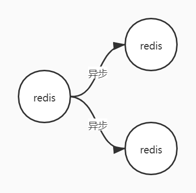
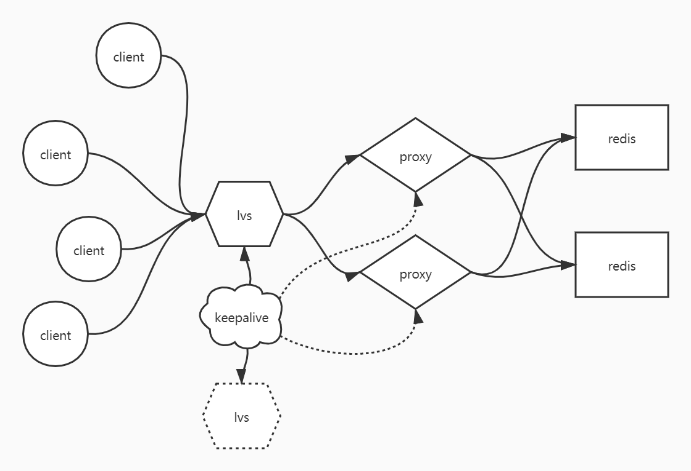

# 高并发解决方案
1. 基于四层的解决方案
2. 基于七层的解决方案

```bash
z@z:~$ cd /proc/$$/fd  # 切换到当前bash进程的文件描述符路径
z@z:/proc/1778/fd$ exec 8<> /dev/tcp/www.baidu.com/80  # 新建8号文件描述符，输入、输出都指向/dev/tcp/www.baidu.com/80
z@z:/proc/1778/fd$ ll
total 0
dr-x------ 2 z z  0 Jul  6 12:57 ./
dr-xr-xr-x 9 z z  0 Jul  6 12:57 ../
lrwx------ 1 z z 64 Jul  6 12:57 0 -> /dev/pts/2
lrwx------ 1 z z 64 Jul  6 12:57 1 -> /dev/pts/2
lrwx------ 1 z z 64 Jul  6 12:57 2 -> /dev/pts/2
lrwx------ 1 z z 64 Jul  6 12:57 255 -> /dev/pts/2
lrwx------ 1 z z 64 Jul  6 12:57 8 -> 'socket:[21855]'
z@z:/proc/1778/fd$ echo -e 'GET / HTTP/1.0\n' >& 8  # 向8号描述符传入'GET / HTTP/1.0\n'
z@z:/proc/1778/fd$ cat 0<& 8  # 查看响应
HTTP/1.0 200 OK
Accept-Ranges: bytes
Cache-Control: no-cache
Content-Length: 14615
Content-Type: text/html
Date: Tue, 06 Jul 2021 04:58:34 GMT
P3p: CP=" OTI DSP COR IVA OUR IND COM "
P3p: CP=" OTI DSP COR IVA OUR IND COM "
Pragma: no-cache
Server: BWS/1.1
...
```

IP地址和Netmask按位与预算，可以得到当前设备所属的网络，
```bash
z@z:/etc$ ifconfig
eth0: flags=4163<UP,BROADCAST,RUNNING,MULTICAST>  mtu 1500
        inet 172.17.75.220  netmask 255.255.240.0  broadcast 172.17.79.255
        inet6 fe80::215:5dff:fe05:bf1e  prefixlen 64  scopeid 0x20<link>
        ether 00:15:5d:05:bf:1e  txqueuelen 1000  (Ethernet)
        RX packets 9534  bytes 1529252 (1.5 MB)
        RX errors 0  dropped 0  overruns 0  frame 0
        TX packets 6386  bytes 3004080 (3.0 MB)
        TX errors 0  dropped 0 overruns 0  carrier 0  collisions 0
```
比如172.17.75.220 & 255.255.240.0 = 192.168.64.0，则当前网络属于172.17.64.0网段。

查看路由表
```bash
z@z:/etc$ route -n
Kernel IP routing table
Destination     Gateway         Genmask         Flags Metric Ref    Use Iface
0.0.0.0         172.17.64.1     0.0.0.0         UG    0      0        0 eth0
172.17.64.0     0.0.0.0         255.255.240.0   U     0      0        0 eth0
```
假如百度的ip是61.135.169.121，那么拿着这个ip对照路由表中的掩码依次做按位与运算，只要计算结果和Destination匹配，则把数据包发给该条目的Gateway。
比如61.135.169.121 & 0.0.0.0 = 0.0.0.0，和Destination匹配，那么数据包会发给172.17.64.1；假如172.17.64.0那一条路由规则在上面，则61.135.169.121 & 255.255.240.0 = 61.135.160.0 和172.17.64.0不匹配，则会掠过这一条。

链路层
```bash
z@z:/etc$ arp -a
z (172.17.64.1) at 00:15:5d:93:81:c8 [ether] on eth0
```
在网络层找到下一条的ip过后，需要通过arp协议找到该ip对应的网关的设备地址，即mac地址。
数据包中目标地址还是原地址，外层包裹mac地址。
当计算机才开机时，没有mac地址列表，则会广播一条信息，寻找有下一跳ip的设备的mac地址，网段内有该ip的设备会返回mac地址，没有该ip的设备会丢弃该信息。
当这些信息经过交换机时，交换机会学习这些信息，比如收到广播信息时，会记录发送方对应的端口，这样目标设备回复信息时，交换机会直接吧回复信息从记录的端口返回。

`route add -host 192.168.88.88 gw 192.168.150.13`在路由表添加一条对主机192.168.88.88的精确条目，把流量转发给192.168.150.13。

`route add -net 192.168.88.0/24 gw 192.168.150.13`在路由表中添加一条网段记录，添加网络时需要设置网络掩码。添加主机时，网络掩码默认是255.255.255.255。

# LVS的DR、TUN、NAT
web服务和Nginx都属于应用层，到达应用层会有传输控制层三次握手、应用层数据在内核态、用户态切换等消耗，所以相对会慢。四层负载均衡需要不和客户端握手，检查完端口后，不返回确认数据包，直接把数据包丢给目标节点。因为四层负载是数据包级别的，不会检查内部内容，所以后端服务必须是镜像的。

内网设备的ip:port 通过路由器发送到外部时，路由器会替换成自己的ip:自己唯一端口号，并维护端口号和内网设备ip:port之间的映射关系。

使用D-NAT负载均衡，首先客户端的发送的目标地址是负载均衡服务器的虚拟VIP，负载均衡服务器把VIP转换为某一台服务器实例的真实RIP,服务器处理后把响应返回给CIP，负载均衡服务器收到响应后把RIP转换为VIP，再发送给客户端，所以真实服务器的默认网关需要指向负载均衡服务器。

因为所有的请求都需要通过负载均衡服务器，且需要他替换IP，所以一方面负载均衡服务器的带宽会称为瓶颈，另一方面会消耗负载均衡服务器的算力。再没有图片、视频等文件下载需求时，是可用的负载均衡方案。

优化方案 DR：MAC地址欺骗

这个模式要求负载均衡服务器和真实服务器连接同一台交换机，才能直接替换mac地址把数据包移交给真实服务器，同时真实服务器自己也包含仅自己可见的VIP，可以直接把响应返回给客户端。

TUN隧道技术：
常见用途：VPN

隐藏VIP的方法：对外隐藏，对内可见
Kernel parameter
目标mac地址为全F，交换机触发广播
/proc/sys/net/ipv4/conf/\*IF\*/
arp_ignore: 定义接受到ARP请求时的响应级别；
0: 只要本地配置的有相应地址，就给予响应
1: 仅在请求的目标(MAC)地址配置请求到达的接口上的时候，才给予响应

arp_announce: 定义将自己的地址向外通告是的通告级别：
0：将本地任何接口上的任何地址向外通告
1：试图仅向目标网络通告与其网络匹配的地址
2：仅向与本地接口上地址匹配的网络进行通告

调度算法：
静态：
rr \ wrr \ dh \ sh

动态：
lc: 最少链接 \ wlc: 加权最少连接 \ sed: 最短期望延迟 \ nq: never queue \ LBLC: 基于本地的最少链接 \ DH \ LBLCR: 基于本地的带复制功能的最少连接

linux内核默认把LVS封装为ipvs内核模块

使用VMware构建DR模型：
在lvs主机网卡上添加一个新地址
`ifconfig eth0:8 192.168.150.100/24`, 网卡后面的数字是随便写的，表示第几个接口，/24 表示子网掩码是255.255.255.0，因为转为二进制后是24个1
在服务器主机上先调整arp协议：
```bash
z@z:~$ cd /proc/sys/net/ipv4/conf/
z@z:/proc/sys/net/ipv4/conf$ ll
total 0
dr-xr-xr-x 1 root root 0 Jul  7 12:52 ./
dr-xr-xr-x 1 root root 0 Jul  7 12:52 ../
dr-xr-xr-x 1 root root 0 Jul  7 12:52 all/
dr-xr-xr-x 1 root root 0 Jul  7 12:52 bond0/
dr-xr-xr-x 1 root root 0 Jul  7 12:52 default/
dr-xr-xr-x 1 root root 0 Jul  7 12:52 dummy0/
dr-xr-xr-x 1 root root 0 Jul  7 12:52 eth0/
dr-xr-xr-x 1 root root 0 Jul  7 12:52 lo/
dr-xr-xr-x 1 root root 0 Jul  7 12:52 sit0/
z@z:/proc/sys/net/ipv4/conf$ cd eth0
z@z:/proc/sys/net/ipv4/conf/eth0$ ll
total 0
dr-xr-xr-x 1 root root 0 Jul  7 12:52 ./
dr-xr-xr-x 1 root root 0 Jul  7 12:52 ../
-rw-r--r-- 1 root root 0 Jul  7 12:52 accept_local
-rw-r--r-- 1 root root 0 Jul  7 12:52 accept_redirects
-rw-r--r-- 1 root root 0 Jul  7 12:52 accept_source_route
-rw-r--r-- 1 root root 0 Jul  7 12:52 arp_accept
-rw-r--r-- 1 root root 0 Jul  7 12:52 arp_announce
-rw-r--r-- 1 root root 0 Jul  7 12:52 arp_filter
-rw-r--r-- 1 root root 0 Jul  7 12:52 arp_ignore
-rw-r--r-- 1 root root 0 Jul  7 12:52 arp_notify
-rw-r--r-- 1 root root 0 Jul  7 12:52 bc_forwarding
-rw-r--r-- 1 root root 0 Jul  7 12:52 bootp_relay
-rw-r--r-- 1 root root 0 Jul  7 12:52 disable_policy
-rw-r--r-- 1 root root 0 Jul  7 12:52 disable_xfrm
-rw-r--r-- 1 root root 0 Jul  7 12:52 drop_gratuitous_arp
-rw-r--r-- 1 root root 0 Jul  7 12:52 drop_unicast_in_l2_multicast
-rw-r--r-- 1 root root 0 Jul  7 12:52 force_igmp_version
-rw-r--r-- 1 root root 0 Jul  7 12:52 forwarding
-rw-r--r-- 1 root root 0 Jul  7 12:52 igmpv2_unsolicited_report_interval
-rw-r--r-- 1 root root 0 Jul  7 12:52 igmpv3_unsolicited_report_interval
-rw-r--r-- 1 root root 0 Jul  7 12:52 ignore_routes_with_linkdown
-rw-r--r-- 1 root root 0 Jul  7 12:52 log_martians
-r--r--r-- 1 root root 0 Jul  7 12:52 mc_forwarding
-rw-r--r-- 1 root root 0 Jul  7 12:52 medium_id
-rw-r--r-- 1 root root 0 Jul  7 12:52 promote_secondaries
-rw-r--r-- 1 root root 0 Jul  7 12:52 proxy_arp
-rw-r--r-- 1 root root 0 Jul  7 12:52 proxy_arp_pvlan
-rw-r--r-- 1 root root 0 Jul  7 12:52 route_localnet
-rw-r--r-- 1 root root 0 Jul  7 12:52 rp_filter
-rw-r--r-- 1 root root 0 Jul  7 12:52 secure_redirects
-rw-r--r-- 1 root root 0 Jul  7 12:52 send_redirects
-rw-r--r-- 1 root root 0 Jul  7 12:52 shared_media
-rw-r--r-- 1 root root 0 Jul  7 12:52 src_valid_mark
-rw-r--r-- 1 root root 0 Jul  7 12:52 tag
z@z:/proc/sys/net/ipv4/conf/eth0$ cat arp_ignore
0
z@z:/proc/sys/net/ipv4/conf/eth0$ cat arp_announce
0                               
z@z:/proc/sys/net/ipv4/conf/eth0$ echo 1 > arp_ignore
z@z:/proc/sys/net/ipv4/conf/eth0$ echo 2 > arp_announce
z@z:/proc/sys/net/ipv4/conf/eth0$ cd ../all/
z@z:/proc/sys/net/ipv4/conf/all$ ls
accept_local         arp_announce  bc_forwarding   drop_gratuitous_arp           igmpv2_unsolicited_report_interval  mc_forwarding        proxy_arp_pvlan   send_redirects
accept_redirects     arp_filter    bootp_relay     drop_unicast_in_l2_multicast  igmpv3_unsolicited_report_interval  medium_id            route_localnet    shared_media 
accept_source_route  arp_ignore    disable_policy  force_igmp_version            ignore_routes_with_linkdown         promote_secondaries  rp_filter         src_valid_mark
arp_accept           arp_notify    disable_xfrm    forwarding                    log_martians                        proxy_arp            secure_redirects  tag
z@z:/proc/sys/net/ipv4/conf/all$ echo 1 > arp_ignore
z@z:/proc/sys/net/ipv4/conf/all$ echo 2 > arp_announce
```
注意，这里不能用vim修改arp_ignore等内容，因为这里是内核参数。
再修改环路网卡，添加子接口
`ifconfig lo:2 192.168.150.100 netmask:255.255.255.255`
这里的掩码要设置成全255，规避死循环。

# 基于keepalive的LVDS高可用
负载均衡可能出现的问题：
1. lvs宕机，单点问题
2. RS宕机，部分用户请求异常

单点故障的结局问题：一台主机变成多台主机
2种方式，1. 主备；2. 主主

主备的方案
1. 备用服务器定期查询主服务器是否健康，但是会增加主服务器的压力
2. 主服务器定期广播自己的健康信息，如果备用服务器一段时间没有收到信息，则认为主服务器宕机

怎么确认RS宕机？
不可以用ping，因为网络不通ping也不会成功。所以要访问一下，可以验证应用层的http协议，返回200，则服务器正常。

## keepalive
代替人实现自动化运维，解决单点故障，实现HA
1. 监控自己服务
2. Master通告自己还活着，Backup监听Master状态，Master宕机后，一堆Backup推荐一个新的Master
3. 配置虚拟IP，添加ipvs，
4. 对后端server做健康检查
如果公司只有两三万的并发，可以只用nginx做负载均衡，这是也可以用keepalive守护nginx

## 实验
主机：node01 ~ node04
node01、node04:
`yum install keepaliced ipcsadm -y`
配置
```bash
cd /etc/keepalived
cp keeplived.conf keepalived.conf.backup
vim keepalived.conf
```
vrrp，虚拟路由冗余协议
```bash
vrrp_instance VI_1 {
    state MASTER
    interface eth0
    virtual_router_id 51
    priority 100
    adcert_int 1
    authentication {
        auth_type PASS
        auth_pass 1111
    }
    virtual_ipaddress {
        192.168.200.16
        192.168.200.17
        192.168.200.18
    }
}
```

# Redis
redis通过epoll实现同步非阻塞。
redis进程默认创建16个区域，不同区域中的数据是隔离的。
在redis-cli中输入help @generic 可以查看常用操作，
## string
`help @string`查看字符串相关的操作。
`set key1 ooxx nx`，当key1不存在时，添加k1并设置为ooxx，常用于分布式锁。
```redis
127.0.0.1:6379> set key1 hello
OK
127.0.0.1:6379> append key1 " world"
(integer) 11
127.0.0.1:6379> get key1
"hello world"
127.0.0.1:6379> GETRANGE key1 6 10
"world"            
```
redis中存在负向索引，从后向前数是-1、-2 ...
```redis
127.0.0.1:6379> getrange key1 6 -1
"world" 
```
在redis的key中会登记value的类型。使用type可以查看
```redis
127.0.0.1:6379> type key1
string
127.0.0.1:6379> set key2 99
OK
127.0.0.1:6379> type key2
string 
```
set是属于字符串类型的方法，所以设置的value都是string类型
```redis
127.0.0.1:6379> set key2 99
OK
127.0.0.1:6379> type key2
string
127.0.0.1:6379> object encoding key2
"int"
127.0.0.1:6379> incrby key2 22
(integer) 121
127.0.0.1:6379> get key2
"121"
127.0.0.1:6379> incr key2
(integer) 122
127.0.0.1:6379> strlen key2
(integer) 3
127.0.0.1:6379> append key2 8
(integer) 4
127.0.0.1:6379> get key2
"1228"
127.0.0.1:6379> object encoding key2
"raw"
127.0.0.1:6379> strlen key2
(integer) 4
127.0.0.1:6379> set key3 a
OK
127.0.0.1:6379> strlen key3
(integer) 1
127.0.0.1:6379> append key3 中
(integer) 4
127.0.0.1:6379> get key3
"a\xe4\xb8\xad"
127.0.0.1:6379> strlen key3
(integer) 4
```
二进制安全：在redis进程与外界交互时，操作的时字节流不是字符流，可以保证统一编码
使用reids是需要在客户端约定好编码。

### bitmap
```redis
127.0.0.1:6379> setbit key4 1 1
(integer) 0
127.0.0.1:6379> get key4
"@"
127.0.0.1:6379> strlen key4
(integer) 1
127.0.0.1:6379> setbit key4 7 1
(integer) 0
127.0.0.1:6379> get key4
"A"
127.0.0.1:6379> strlen key4
(integer) 1
127.0.0.1:6379> setbit key4 9 1
(integer) 0
127.0.0.1:6379> get key4
"A@"
127.0.0.1:6379> strlen key4
(integer) 2                 
```
一个字节8个bit位
当执行`setbit key4 1 1`时，是把第一个字节的第二个(从0计数)bit位设置为1，在ASCII中01000000代表的字符是@
使用`man ASCII`可以查看
```
ASCII(7)                                      Linux Programmer's Manual                                      ASCII
NAME
        ascii - ASCII character set encoded in octal, decimal, and hexadecimal
DESCRIPTION
        ASCII is the American Standard Code for Information Interchange.  It is a 7-bit code.  Many 8-bit codes (e.g.,
        ISO 8859-1) contain ASCII as their lower half.  The  international  counterpart  of  ASCII  is  known  as  ISO
        646-IRV.
        
        The following table contains the 128 ASCII characters.                                                                                                                                             
        C program '\X' escapes are noted.                                                                      
        
        Oct   Dec   Hex   Char                        Oct   Dec   Hex   Char
        ────────────────────────────────────────────────────────────────────────
        000   0     00    NUL '\0' (null character)   100   64    40    @
        001   1     01    SOH (start of heading)      101   65    41    A
        002   2     02    STX (start of text)         102   66    42    B
        003   3     03    ETX (end of text)           103   67    43    C
        004   4     04    EOT (end of transmission)   104   68    44    D
        005   5     05    ENQ (enquiry)               105   69    45    E
        006   6     06    ACK (acknowledge)           106   70    46    F
        007   7     07    BEL '\a' (bell)             107   71    47    G
        010   8     08    BS  '\b' (backspace)        110   72    48    H
        011   9     09    HT  '\t' (horizontal tab)   111   73    49    I
        012   10    0A    LF  '\n' (new line)         112   74    4A    J
        013   11    0B    VT  '\v' (vertical tab)     113   75    4B    K
        014   12    0C    FF  '\f' (form feed)        114   76    4C    L
        015   13    0D    CR  '\r' (carriage ret)     115   77    4D    M
        016   14    0E    SO  (shift out)             116   78    4E    N
        017   15    0F    SI  (shift in)              117   79    4F    O
```
`setbit key4 7 1`，是把第8个bit位设为1，01000001表示A，`setbit key4 9 1`，此时key4的值增加到两个字节，第一个字节是`01000001`，第二个字节是`01000000`
bitcount\bitpos\bitop
考虑需求：
1. 假如有用户系统，统计用户登录天数，且窗口随机。
思路1：使用SQL数据库记录用户每一天登录数据，缺点：空间成本高
思路2：大数据
思路3：使用redis，每一个二进制位表示用户某一天是否登录，则用户364天的登陆数据，使用365/8 = 46个字节就可以记录
sean第二天登录：`set sean 1 1`，sean第365天登录：`set sean 364 1` 统计用户最后两天登录天数`bitcount sean -2 -1`
假如有1千万用户，则4百兆左右的空间即可完成计算，且使用二进制运算速度更快
2. 假如京东设计618每个用户送一件礼物，那么要准备多少礼物？
   思路，统计活跃用户数量，以日期为key，用户id为bit位记录用户登录数据，并作或运算
   统计1号、2号两天登录的用户数量
   ```
   setbit 20210101 1 1
   setbit 20200102 1 1
   setbit 20200102 7 1
   bitop or destkey 20200101 2020102
   bitcount destkey 0 -1
   ```

## list
redis的key保留了head和tail两个指针
`help @List`可以查看redis中list的操作
list包含栈、队列、数组的特性，同时可以用作阻塞的单播队列FIFO

## map
使用字符串实现同一个对象多个属性的存取
`set sean::name 'zzp'`
`set sean::age 18`
`get sean::name`
`get sean::age`
使用hash设置同一个对象多个属性
`hset sean name zzp`
`hmset sean age 18 address sh`
`hget sean age`
`hmget sean name age`
`hincrbyfloat sean age 0.5`
`hincrbyfloat sean age -1`

## set
无序、不重复
```redis
127.0.0.1:6379> sadd k1 1 2 3 4 5
(integer) 5
127.0.0.1:6379> sadd k2 4 5 6 7 8(integer) 5
127.0.0.1:6379> SINTER k1 k2  # 计算并集
1) "4"
2) "5"
127.0.0.1:6379> SINTERSTORE dest k1 k2  # 计算并集且存给新变量
(integer) 2
127.0.0.1:6379> SMEMBERS dest
1) "4"
2) "5"
```
如果使用SINTER，则还需要客户端把结果发给服务端存储，会增加IO，所以可以根据需求选择操作。
```redis
127.0.0.1:6379> SUNION k1 k2
1) "1"
2) "2"
3) "3"
4) "4"
5) "5"
6) "6"
7) "7"
8) "8"
127.0.0.1:6379> SUNIONSTORE dest2 k1 k2
(integer) 8
127.0.0.1:6379> SMEMBERS dest2
1) "1"
2) "2"
3) "3"
4) "4" 
5) "5"
6) "6"
7) "7"
8) "8" 
```
set可以用于随机事件
`SRANDOMEMBER key count`取出一定数量的结果集，正数表示取出该数量的值，且不重复，所以正数不能超过set中的元素数量；负数表示取出该数值绝对值的元素，允许重复。可用于抽奖，比如在所有粉丝中抽出三个发奖品，可以把粉丝id加入到set中，如果抽3个不同的粉丝，就设置3，如果允许抽到重复的粉丝，就设置-3
```redis
127.0.0.1:6379> sadd k1 tom bob dick rachoul monica pheebe jojo rose
(integer) 8
127.0.0.1:6379> srandmember k1 3
1) "rose"
2) "dick"
3) "bob"
127.0.0.1:6379> srandmember k1 -3
1) "dick"
2) "bob"
3) "rose"
127.0.0.1:6379> srandmember k1 -3
1) "tom"
2) "rachoul"
3) "tom"                      
```
## sorted_set
有序集
传入值时还要传入排序用的分值，如果分值一样，则按名称的字典序排列。
`help @sorted_sort`
```redis
127.0.0.1:6379> zadd k1 8 apple 2 banana 3 orange
(integer) 3
127.0.0.1:6379> zrange k1 0 -1
1) "banana"
2) "orange"
3) "apple"
127.0.0.1:6379> zrange k1 0 -1 withscores
1) "banana"
2) "2"
3) "orange"
4) "3"
5) "apple"
6) "8"
127.0.0.1:6379> zrangebyscore k1 3 8
1) "orange"
2) "apple" 
```
元素按排序顺序在物理内存中按左小右大存储
```redis
127.0.0.1:6379> zscore k1 apple
"8" 
127.0.0.1:6379> zrank k1 apple
(integer) 2
```
修改排序值
```redis
127.0.0.1:6379> zincrby k1 2.5 banana
"4.5"
127.0.0.1:6379> zrange k1 0 -1
1) "orange"
2) "banana"
3) "apple"
127.0.0.1:6379> zrange k1 0 -1 withscores
1) "orange"
2) "3"
3) "banana"
4) "4.5"
5) "apple"
6) "8"      
```
可用于歌曲排行榜等场景

sorted_list的排序是怎么实现的
skip list 跳跃表

# 消息订阅
使用redis支持聊天的思路：

高可用方案


# 事务
`help @transactions`
redis是单进程、单线程的，使用redis是为了速度快，如果为了别的属性降低了速度，是不可取的。
如果两个客户端同时对一个元素发起了事务，那么谁的`exec`指令先到达服务端，谁的事务先执行，另一个客户端的事务会失败。
可以使用`watch key`命令辅助监控一个元素，提示客户端该元素是否发生改变。

# 布隆过滤器
三种使用布隆过滤算法的架构

最下方的架构比较符合微服务架构。
访问redis.io -> modules -> RedisBloom github -> wget bloom8.zip -> 解压 -> 编译
```redis
make
cp bloom.so /opt/redis/redis5/
redis-server --loadmodule /op   redis/redis5/redisbloom.so
```
```redis
redis-cli
bf.add key1 adb
bf.exists key1
bf.exists key2
```
布谷鸟过滤器
`cf.add`

# redis作为数据库和缓存的区别
缓存数据不是全量数据，数据在数据库中；
缓存会随着访问变化。存放的是热数据；
因为内存大小有限，所以需要redis中数据随着业务变化，只保留热数据；
key的有效期;
内存是有效的，应该淘汰掉冷数据;
在 /etc/redis/redis.conf 中通过maxmemeory 可以配置redis最大可用内存。
使用expires设计key的有效期，读操作不会改变有效期，写操作会取消有效期。

# Redis持久化
## RDB
Redis DB
时点性，每个一段时间生成快照
实现方案：
1. 阻塞，在快照落盘期间，redis不对外提供服务；
2. 非阻塞。

### 子进程
linux管道用于把前一个命令的输出交给后一个命令作为输入，使用管道时会分别在管道两侧启动子进程，在子进程中执行命令
```bash
z@z:~$ echo $BASHPID
150
z@z:~$ echo $BASHPID | more
849 
```
正常情况下。进程间数据隔离，子进程读不到父进程的环境变量。父进程可以让子进程读到环境变量，但是子进程修改环境变量不会影响到父进程的环境变量。父进程修改也不会影响子进程中的环境变量。
所以可以用子进程落盘数据快照，和父进程之间保持写隔离。
需要考虑的问题：
1. 创建子进程的速度
2. 内存空间是否足够

fork(): 1. 速度快；2. 占用空间小
使用fork()创建的子进程，那么父、子进程的虚拟内存地址都指向数据的物理内存地址。
copy on write，创建进程时不复制数据，1. 创建速度加快；2. 根据经验，不可能子进程把所有数据都改一遍。
每次使用fork创建子进程落盘快照，即可保证落盘的是fork()时点的数据，同时父进程继续提供服务。

### RDB触发方式
手动执行: `save`， `bgsave`，`bgsave`使用fork执行，`save`用于关机维护的场景
配置文件：`SNAPSHOTTING`章节,`save <seconds> <changes>`，可以配置多条，标注在second时间内，发生changes次数的更改，则落盘，如果写`save ""`表示不配置自动落盘。配置中的save都是通过fork的方式由子进程执行。

### RDB弊端：
不支持拉链，只有一个dump.rdb
可能会丢数据，时点与时点之间串口的数据容易丢失

### RDB优点：
数据序列化，恢复数据相对快

## AOF
Append Only File
只记录redis的写操作，丢失数据少。
redis可以同时开启RDB和AODF，但是此时redis只用AOF恢复数据，redis4.0之后，AOF中包含RDB全量，先恢复RDB，再恢复写操作。
假设redis开启AOF，运行了10年，然后宕机了，此时AOF多大？恢复会不会溢出？要多久？
不会溢出，但是恢复时间很久，可能很多年。
### AOF弊端
体谅无限变大，恢复很慢

优化：设计一个日志方案，AOF足够小。hdfs, fsimage + edits.log，让日志只记录增量。redis4.0后，每次重写，先把老数据RDB到aof中，再把增量以指令方式Append到AOF。

redis是内存数据库，但是写操作必然会触发写操作，redis有三种写操作: 1. NO； 2. ALWAYS; 3. everysec
在`APPEND ONLY MODE`中配置
`appendfsync always`

no是指redis不调用内核态的flush命令，always是指每次向buffer中写入数据，都调用一次flush命令，everysec是指每秒调用一次flush数量。
配置no时，如果丢失数据，会丢失一个buffer大小的数据。

# Redis集群
redisd但是离做缓存时，使用RDB就可以了，但是做数据库的话需要AOF。
单实例的问题：1. 单点故障；2. 容量有限；3. 压力
## AKF:
x轴拓展，镜像/复制拓展服务实例，比如主从复制，可以解决读取操作
y轴拓展，按功能或业务拆分实例，
z轴拓展，按用户id/访问级别/优先级拆分
引入的问题：
实例一边多，需要解决一致性问题。强一致性容易破坏可用性，与为了解决可用性，拓展服务实例的需求冲突。
解决思路1：容忍一部分数据丢失、使用异步非阻塞。

解决思路2：最终一致性


主备：客户端只能访问主服务器，主服务器宕机后，备用服务器才接替主服务器
主从：从服务器分担部分读或者写操作
生产中一般使用主从模式。

因为主服务器依然是单实例的，所以对主服务器做高可用，监控其故障时，启动备用服务器。可以由某个技术、某个程序监控主服务器，但是程序总会有单点故障问题，所以监控程序也要是一个高可用的集群。

只有集群中超过一半的监控服务。如果低于一般的监控认为服务故障就替换服务，会导致脑裂。（如果分区容忍性较高，脑裂也不一定不可以）。建议有单数的实例，避免相同数量的实例给出不同的结论。
## CAP定理
一致性/Consistency, 可用性/Availability，分区容错性/Partition tolerance不可能同时满足。

## 主从复制
配置redis服务作为另一个redis实例的从服务
`REPLICAOF 127.0.0.1 6379`
可以看到主服务收到从服务同步请求后，启动了一个子进程，执行BGSAVE任务

从服务器会先刷洗本地数据，在录入收到的新数据

如果主服务宕机，从服务还可以继续查询，但是依然不能写入。执行`REPLICAOF no one`后，可以切换为
`replica-serve-stable-data yes`配置为yes表示即使没有把主服务器的数据同步完，也可以接受客户端请求；
`replica-read-only yes`配置为yes，表示从服务只支持查询
`repl-diskless-sync no`配置为yes，表示主服务器生成RDB文件时，不落盘，直接通过网络发给从服务器
`repl-backlog-size 1mb`主服务器内位置1mb大小的队列，记录从服务器第一次RDB之后发生的增量数据
`min-replicas-to-write 3`
`min-replicas-max-lag 10`

## Sentinel
准备任意名称的.conf文件
```
port 26379
sentinel monitor mymaster 127.0.0.1 6379 2
```
第一行时每个服务自己哨兵进程的端口号，第二行中mymaster是主服务器的逻辑名称，因为哨兵模式支持监控多个服务实例，最后一个参数是权重。
启动一个哨兵实例：
`redis-server ./sentinal.conf --sentinel`
作为哨兵实例启动后，redis不能做读写操作，
哨兵实例会监控多个主服务器，以及每个主服务器的从服务，当主服务宕机后，哨兵服务之间会从主服务的从服务中投票出一个新的master。并且哨兵服务会修改自己的配置文件。
哨兵会在主服务上开启发布订阅，互相发现监控该主服务的哨兵。

## 容量问题
客户端针对不同的业务把数据拆分到不同的redis中；
按算法把数据分片到不同的数据库，比如hash + 取模 即，modula，但是模数值是固定的，会影响分布式下的拓展；
采用random方法分片数据，因为同一个客户端存进去的数据，自己找不到，一般用于消息队列，一个客户端随机push数据到list中，其他的客户端随机pop消息并处理；
kemata，一致性哈希算法，分片数据，key和redis服务器一起参数分片运算，规划成一个哈希环。
数据hash会得到一个值，节点hash也会得到一个值，数据hash结果向上找到第一个映射了节点的值，存入该节点即可。优点，新加节点不会导致全局洗牌，缺点，部分数据不能命中。可能会导致缓存击穿，导致压力短时内积压到后方，比如MySQL，有一个优化方法，如果在最近的节点没找到数据，尝试向上再找一个节点。这种方案更常用于缓存而不是数据库。

当有多客户端实例时，建立连接消耗的资源会很高：

这时候可以考虑引入nginx代理

进一步可以引入lvs降低代理压力，同时用keepalive做lvs的主从备份


只有第二层模型做到无状态，才可以灵活的拓展成第三层模型，第二层可以做etama\modula等算法，解耦数据状态和存储逻辑，参考twemproxy\Predixy。

### 设计redis做分布式数据库

# ZooKeeper
处理分布式协调工作。
zookeeper是一种主从架构集群。那么主服务器一定是单点的，必然存在单点故障问题。从节点收到的写请求会被转发给主服务。
如果主服务宕机，zookeeper集群会由可用状态进入不可用状态。官方压测显示从不可用状态选取出新的leeder，低于200ms。
**不要把ZooKeeper当作数据库使用**
zookeeper是一个目录树结构，每个node可以存放1MB数据。
## zookeeper安装
1. 安装配置java
2. aookeeper.apache.org 下载zookeeper
3. tar xvf zookeeper.*tar.gz -C /opt
4. vim /etc/profile
    ```
    export ZOOKEEPER_HOME=/opt/zookeeper-$(version)
    export PATH=$PATH:$ZOOKEEPER_HOME/bin
    ```
5. cd zookeeper/conf
6. cp zoo_sample.cfg zoo.cfg
## zoo.cfg
tickTime 主从之间的心跳间隔时间
initLimit 新的从节点接入时，允许用于初始化的同步心跳次数，
syncLimit 主节点发给从节点同步请求后，允许多少次心跳间隔内没有回复
dataDir 快照数据存放路径
clientPort 客户端连接的端口
server.1=node01:2888:3888
server.2=node02:2888:3888
server.3=node03:2888:3888
server.4=node04:2888:3888
配置集群中的节点，第一个端口是leader接受write请求的端口，第二个端口是投票选举leader的端口。
在每台服务器的dataDir路径下创建myid文件，填入服务的id

zookeeper默认在后台启动，使用如下命令，使其前台阻塞执行
zkServer.sh start-foreground

依次启动三台服务：
启动第一台：
```bash
[root@spark01 ~]# zkServer.sh start-foreground
ZooKeeper JMX enabled by default
Using config: /opt/zookeeper-3.7.0/bin/../conf/zoo.cfg
2021-07-14 09:42:24,174 [myid:] - INFO  [main:QuorumPeerConfig@174] - Reading configuration from: /opt/zookeeper-3.7.0/bin/../conf/zoo.cfg
2021-07-14 09:42:24,190 [myid:] - INFO  [main:QuorumPeerConfig@444] - clientPortAddress is 0.0.0.0:22181
2021-07-14 09:42:24,190 [myid:] - INFO  [main:QuorumPeerConfig@448] - secureClientPort is not set
2021-07-14 09:42:24,190 [myid:] - INFO  [main:QuorumPeerConfig@464] - observerMasterPort is not set
2021-07-14 09:42:24,191 [myid:] - INFO  [main:QuorumPeerConfig@481] - metricsProvider.className is org.apache.zookeeper.metrics.impl.DefaultMetricsProvider
2021-07-14 09:42:24,208 [myid:1] - INFO  [main:DatadirCleanupManager@78] - autopurge.snapRetainCount set to 3
2021-07-14 09:42:24,208 [myid:1] - INFO  [main:DatadirCleanupManager@79] - autopurge.purgeInterval set to 0
2021-07-14 09:42:24,208 [myid:1] - INFO  [main:DatadirCleanupManager@101] - Purge task is not scheduled.
2021-07-14 09:42:24,213 [myid:1] - INFO  [main:ManagedUtil@44] - Log4j 1.2 jmx support found and enabled.
2021-07-14 09:42:24,229 [myid:1] - INFO  [main:QuorumPeerMain@152] - Starting quorum peer, myid=1
2021-07-14 09:42:24,256 [myid:1] - INFO  [main:ServerMetrics@62] - ServerMetrics initialized with provider org.apache.zookeeper.metrics.impl.DefaultMetricsProvider@39ba5a14
2021-07-14 09:42:24,262 [myid:1] - INFO  [main:DigestAuthenticationProvider@47] - ACL digest algorithm is: SHA1
2021-07-14 09:42:24,263 [myid:1] - INFO  [main:DigestAuthenticationProvider@61] - zookeeper.DigestAuthenticationProvider.enabled = true
2021-07-14 09:42:24,273 [myid:1] - INFO  [main:ServerCnxnFactory@169] - Using org.apache.zookeeper.server.NIOServerCnxnFactory as server connection factory
2021-07-14 09:42:24,275 [myid:1] - WARN  [main:ServerCnxnFactory@309] - maxCnxns is not configured, using default value 0.
2021-07-14 09:42:24,287 [myid:1] - INFO  [main:NIOServerCnxnFactory@652] - Configuring NIO connection handler with 10s sessionless connection timeout, 1 selector thread(s), 4 worker threads, and 64 kB direct buffers.
2021-07-14 09:42:24,303 [myid:1] - INFO  [main:NIOServerCnxnFactory@660] - binding to port 0.0.0.0/0.0.0.0:22181
2021-07-14 09:42:24,318 [myid:1] - INFO  [main:QuorumPeer@796] - zookeeper.quorumCnxnTimeoutMs=-1
2021-07-14 09:42:24,367 [myid:1] - INFO  [main:Log@169] - Logging initialized @16038ms to org.eclipse.jetty.util.log.Slf4jLog
2021-07-14 09:42:24,571 [myid:1] - WARN  [main:ContextHandler@1660] - o.e.j.s.ServletContextHandler@33c7e1bb{/,null,STOPPED} contextPath ends with /*
2021-07-14 09:42:24,572 [myid:1] - WARN  [main:ContextHandler@1671] - Empty contextPath
2021-07-14 09:42:24,607 [myid:1] - INFO  [main:X509Util@77] - Setting -D jdk.tls.rejectClientInitiatedRenegotiation=true to disable client-initiated TLS renegotiation
2021-07-14 09:42:24,612 [myid:1] - INFO  [main:FileTxnSnapLog@124] - zookeeper.snapshot.trust.empty : false
2021-07-14 09:42:24,619 [myid:1] - INFO  [main:QuorumPeer@1739] - Local sessions disabled
2021-07-14 09:42:24,619 [myid:1] - INFO  [main:QuorumPeer@1750] - Local session upgrading disabled
2021-07-14 09:42:24,620 [myid:1] - INFO  [main:QuorumPeer@1717] - tickTime set to 2000
2021-07-14 09:42:24,620 [myid:1] - INFO  [main:QuorumPeer@1761] - minSessionTimeout set to 4000
2021-07-14 09:42:24,620 [myid:1] - INFO  [main:QuorumPeer@1772] - maxSessionTimeout set to 40000
2021-07-14 09:42:24,620 [myid:1] - INFO  [main:QuorumPeer@1797] - initLimit set to 10
 2021-07-14 09:42:24,620 [myid:1] - INFO  [main:QuorumPeer@1984] - syncLimit set to 5
 2021-07-14 09:42:24,620 [myid:1] - INFO  [main:QuorumPeer@1999] - connectToLearnerMasterLimit set to 0
 2021-07-14 09:42:24,644 [myid:1] - INFO  [main:ZookeeperBanner@42] -
2021-07-14 09:42:24,645 [myid:1] - INFO  [main:ZookeeperBanner@42] -   ______                  _
2021-07-14 09:42:24,645 [myid:1] - INFO  [main:ZookeeperBanner@42] -  |___  /                 | |
2021-07-14 09:42:24,645 [myid:1] - INFO  [main:ZookeeperBanner@42] -     / /    ___     ___   | | __   ___    ___   _ __     ___   _ __
2021-07-14 09:42:24,645 [myid:1] - INFO  [main:ZookeeperBanner@42] -    / /    / _ \   / _ \  | |/ /  / _ \  / _ \ | '_ \   / _ \ | '__|
2021-07-14 09:42:24,645 [myid:1] - INFO  [main:ZookeeperBanner@42] -   / /__  | (_) | | (_) | |   <  |  __/ |  __/ | |_) | |  __/ | |
2021-07-14 09:42:24,645 [myid:1] - INFO  [main:ZookeeperBanner@42] -  /_____|  \___/   \___/  |_|\_\  \___|  \___| | .__/   \___| |_|
2021-07-14 09:42:24,645 [myid:1] - INFO  [main:ZookeeperBanner@42] -                                               | |
2021-07-14 09:42:24,646 [myid:1] - INFO  [main:ZookeeperBanner@42] -                                               |_|
2021-07-14 09:42:24,646 [myid:1] - INFO  [main:ZookeeperBanner@42] -
2021-07-14 09:42:39,705 [myid:1] - INFO  [main:Environment@98] - Server environment:zookeeper.version=3.7.0-e3704b390a6697bfdf4b0bef79e3da7a4f6bac4b, built on 2021-03-17 09:46 UTC
2021-07-14 09:42:39,706 [myid:1] - INFO  [main:Environment@98] - Server environment:host.name=hadoop01
2021-07-14 09:42:39,706 [myid:1] - INFO  [main:Environment@98] - Server environment:java.version=1.8.0_272
2021-07-14 09:42:39,706 [myid:1] - INFO  [main:Environment@98] - Server environment:java.vendor=Red Hat, Inc.
2021-07-14 09:42:39,706 [myid:1] - INFO  [main:Environment@98] - Server environment:java.home=/usr/lib/jvm/java-1.8.0-openjdk-1.8.0.272.b10-1.el7_9.x86_64/jre
2021-07-14 09:42:39,707 [myid:1] - INFO  [main:Environment@98] - Server environment:java.class.path=/opt/zookeeper-3.7.0/bin/../zookeeper-server/target/classes:/opt/zookeeper-3.7.0/bin/../build/classes:/opt/zookeeper-3.7.0/bin/../zookeeper-server/target/lib/*.jar:/opt/zookeeper-3.7.0/bin/../build/lib/*.jar:/opt/zookeeper-3.7.0/bin/../lib/zookeeper-prometheus-metrics-3.7.0.jar:/opt/zookeeper-3.7.0/bin/../lib/zookeeper-jute-3.7.0.jar:/opt/zookeeper-3.7.0/bin/../lib/zookeeper-3.7.0.jar:/opt/zookeeper-3.7.0/bin/../lib/snappy-java-1.1.7.7.jar:/opt/zookeeper-3.7.0/bin/../lib/slf4j-log4j12-1.7.30.jar:/opt/zookeeper-3.7.0/bin/../lib/slf4j-api-1.7.30.jar:/opt/zookeeper-3.7.0/bin/../lib/simpleclient_servlet-0.9.0.jar:/opt/zookeeper-3.7.0/bin/../lib/simpleclient_hotspot-0.9.0.jar:/opt/zookeeper-3.7.0/bin/../lib/simpleclient_common-0.9.0.jar:/opt/zookeeper-3.7.0/bin/../lib/simpleclient-0.9.0.jar:/opt/zookeeper-3.7.0/bin/../lib/netty-transport-native-unix-common-4.1.59.Final.jar:/opt/zookeeper-3.7.0/bin/../lib/netty-transport-native-epoll-4.1.59.Final.jar:/opt/zookeeper-3.7.0/bin/../lib/netty-transport-4.1.59.Final.jar:/opt/zookeeper-3.7.0/bin/../lib/netty-resolver-4.1.59.Final.jar:/opt/zookeeper-3.7.0/bin/../lib/netty-handler-4.1.59.Final.jar:/opt/zookeeper-3.7.0/bin/../lib/netty-common-4.1.59.Final.jar:/opt/zookeeper-3.7.0/bin/../lib/netty-codec-4.1.59.Final.jar:/opt/zookeeper-3.7.0/bin/../lib/netty-buffer-4.1.59.Final.jar:/opt/zookeeper-3.7.0/bin/../lib/metrics-core-4.1.12.1.jar:/opt/zookeeper-3.7.0/bin/../lib/log4j-1.2.17.jar:/opt/zookeeper-3.7.0/bin/../lib/jline-2.14.6.jar:/opt/zookeeper-3.7.0/bin/../lib/jetty-util-ajax-9.4.38.v20210224.jar:/opt/zookeeper-3.7.0/bin/../lib/jetty-util-9.4.38.v20210224.jar:/opt/zookeeper-3.7.0/bin/../lib/jetty-servlet-9.4.38.v20210224.jar:/opt/zookeeper-3.7.0/bin/../lib/jetty-server-9.4.38.v20210224.jar:/opt/zookeeper-3.7.0/bin/../lib/jetty-security-9.4.38.v20210224.jar:/opt/zookeeper-3.7.0/bin/../lib/jetty-io-9.4.38.v20210224.jar:/opt/zookeeper-3.7.0/bin/../lib/jetty-http-9.4.38.v20210224.jar:/opt/zookeeper-3.7.0/bin/../lib/javax.servlet-api-3.1.0.jar:/opt/zookeeper-3.7.0/bin/../lib/jackson-databind-2.10.5.1.jar:/opt/zookeeper-3.7.0/bin/../lib/jackson-core-2.10.5.jar:/opt/zookeeper-3.7.0/bin/../lib/jackson-annotations-2.10.5.jar:/opt/zookeeper-3.7.0/bin/../lib/commons-cli-1.4.jar:/opt/zookeeper-3.7.0/bin/../lib/audience-annotations-0.12.0.jar:/opt/zookeeper-3.7.0/bin/../zookeeper-*.jar:/opt/zookeeper-3.7.0/bin/../zookeeper-server/src/main/resources/lib/*.jar:/opt/zookeeper-3.7.0/bin/../conf:/usr/lib/jvm/java-1.8.0-openjdk-1.8.0.272.b10-1.el7_9.x86_64/lib:/usr/lib/jvm/java-1.8.0-openjdk-1.8.0.272.b10-1.el7_9.x86_64/jre/lib:
2021-07-14 09:42:39,707 [myid:1] - INFO  [main:Environment@98] - Server environment:java.library.path=/usr/java/packages/lib/amd64:/usr/lib64:/lib64:/lib:/usr/lib
2021-07-14 09:42:39,707 [myid:1] - INFO  [main:Environment@98] - Server environment:java.io.tmpdir=/tmp
2021-07-14 09:42:39,708 [myid:1] - INFO  [main:Environment@98] - Server environment:java.compiler=<NA>
2021-07-14 09:42:39,708 [myid:1] - INFO  [main:Environment@98] - Server environment:os.name=Linux 
2021-07-14 09:42:39,708 [myid:1] - INFO  [main:Environment@98] - Server environment:os.arch=amd64
2021-07-14 09:42:39,708 [myid:1] - INFO  [main:Environment@98] - Server environment:os.version=3.10.0-693.17.1.el7.x86_64
2021-07-14 09:42:39,708 [myid:1] - INFO  [main:Environment@98] - Server environment:user.name=root
2021-07-14 09:42:39,708 [myid:1] - INFO  [main:Environment@98] - Server environment:user.home=/root
2021-07-14 09:42:39,708 [myid:1] - INFO  [main:Environment@98] - Server environment:user.dir=/root
2021-07-14 09:42:39,709 [myid:1] - INFO  [main:Environment@98] - Server environment:os.memory.free=94MB
2021-07-14 09:42:39,709 [myid:1] - INFO  [main:Environment@98] - Server environment:os.memory.max=889MB
2021-07-14 09:42:39,710 [myid:1] - INFO  [main:Environment@98] - Server environment:os.memory.total=117MB
2021-07-14 09:42:39,710 [myid:1] - INFO  [main:ZooKeeperServer@138] - zookeeper.enableEagerACLCheck = false
2021-07-14 09:42:39,710 [myid:1] - INFO  [main:ZooKeeperServer@151] - zookeeper.digest.enabled = true
2021-07-14 09:42:39,710 [myid:1] - INFO  [main:ZooKeeperServer@155] - zookeeper.closeSessionTxn.enabled = true
2021-07-14 09:42:39,711 [myid:1] - INFO  [main:ZooKeeperServer@1499] - zookeeper.flushDelay=0
2021-07-14 09:42:39,711 [myid:1] - INFO  [main:ZooKeeperServer@1508] - zookeeper.maxWriteQueuePollTime=0
2021-07-14 09:42:39,711 [myid:1] - INFO  [main:ZooKeeperServer@1517] - zookeeper.maxBatchSize=1000
2021-07-14 09:42:39,711 [myid:1] - INFO  [main:ZooKeeperServer@260] - zookeeper.intBufferStartingSizeBytes = 1024
2021-07-14 09:42:39,723 [myid:1] - INFO  [main:WatchManagerFactory@42] - Using org.apache.zookeeper.server.watch.WatchManager as watch manager
2021-07-14 09:42:39,723 [myid:1] - INFO  [main:WatchManagerFactory@42] - Using org.apache.zookeeper.server.watch.WatchManager as watch manager
2021-07-14 09:42:39,724 [myid:1] - INFO  [main:ZKDatabase@133] - zookeeper.snapshotSizeFactor = 0.33
2021-07-14 09:42:39,724 [myid:1] - INFO  [main:ZKDatabase@153] - zookeeper.commitLogCount=500
2021-07-14 09:42:39,756 [myid:1] - INFO  [main:QuorumPeer@2063] - Using insecure (non-TLS) quorum communication
2021-07-14 09:42:39,756 [myid:1] - INFO  [main:QuorumPeer@2069] - Port unification disabled
2021-07-14 09:42:39,757 [myid:1] - INFO  [main:QuorumPeer@179] - multiAddress.enabled set to false
2021-07-14 09:42:39,757 [myid:1] - INFO  [main:QuorumPeer@204] - multiAddress.reachabilityCheckEnabled set to true
2021-07-14 09:42:39,757 [myid:1] - INFO  [main:QuorumPeer@191] - multiAddress.reachabilityCheckTimeoutMs set to 1000
2021-07-14 09:42:39,757 [myid:1] - INFO  [main:QuorumPeer@2524] - QuorumPeer communication is not secured! (SASL auth disabled)
2021-07-14 09:42:39,757 [myid:1] - INFO  [main:QuorumPeer@2549] - quorum.cnxn.threads.size set to 20
2021-07-14 09:42:39,775 [myid:1] - INFO  [main:SnapStream@61] - zookeeper.snapshot.compression.method = CHECKED
2021-07-14 09:42:39,775 [myid:1] - INFO  [main:FileTxnSnapLog@479] - Snapshotting: 0x0 to /var/zookeeper/data/version-2/snapshot.0
2021-07-14 09:42:39,782 [myid:1] - INFO  [main:ZKDatabase@290] - Snapshot loaded in 24 ms, highest zxid is 0x0, digest is 1371985504
2021-07-14 09:42:39,783 [myid:1] - INFO  [main:QuorumPeer@1157] - currentEpoch not found! Creating with a reasonable default of 0. This should only happen when you are upgrading your installation
2021-07-14 09:42:39,808 [myid:1] - INFO  [main:QuorumPeer@1177] - acceptedEpoch not found! Creating with a reasonable default of 0. This should only happen when you are upgrading your installation
2021-07-14 09:42:39,826 [myid:1] - INFO  [main:Server@375] - jetty-9.4.38.v
20210224; built:
2021-02-24T20:25:07.675Z; git: 288f3cc74549e8a913bf363250b0744f2695b8e6; jvm 1.8.0_272-b10
2021-07-14 09:42:39,893 [myid:1] - INFO  [main:DefaultSessionIdManager@334] - DefaultSessionIdManager workerName=node0
2021-07-14 09:42:39,893 [myid:1] - INFO  [main:DefaultSessionIdManager@339] - No SessionScavenger set, using defaults
2021-07-14 09:42:39,896 [myid:1] - INFO  [main:HouseKeeper@132] - node0 Scavenging every 660000ms
2021-07-14 09:42:39,904 [myid:1] - WARN  [main:ConstraintSecurityHandler@759] - ServletContext@o.e.j.s.ServletContextHandler@33c7e1bb{/,null,STARTING} has uncovered http methods for path: /*
2021-07-14 09:42:39,932 [myid:1] - INFO  [main:ContextHandler@916] - Started o.e.j.s.ServletContextHandler@33c7e1bb{/,null,AVAILABLE}
2021-07-14 09:42:39,940 [myid:1] - WARN  [main:QuorumPeer@1135] - Problem starting AdminServer                                                                                                                                               org.apache.zookeeper.server.admin.AdminServer$AdminServerException: Problem starting AdminServer on address 0.0.0.0, port 8080 and command URL /commands                                                                                             at org.apache.zookeeper.server.admin.JettyAdminServer.start(JettyAdminServer.java:179)                                                                                                                                                       at org.apache.zookeeper.server.quorum.QuorumPeer.start(QuorumPeer.java:1133)                                                                                                                                                                 at org.apache.zookeeper.server.quorum.QuorumPeerMain.runFromConfig(QuorumPeerMain.java:229)                                                                                                                                                  at org.apache.zookeeper.server.quorum.QuorumPeerMain.initializeAndRun(QuorumPeerMain.java:137)                                                                                                                                               at org.apache.zookeeper.server.quorum.QuorumPeerMain.main(QuorumPeerMain.java:91)                                                                                                                                                    Caused by: java.io.IOException: Failed to bind to /0.0.0.0:8080                                                                                                                                                                                      at org.eclipse.jetty.server.ServerConnector.openAcceptChannel(ServerConnector.java:349)                                                                                                                                                      at org.eclipse.jetty.server.ServerConnector.open(ServerConnector.java:310)                                                                                                                                                                   at org.eclipse.jetty.server.AbstractNetworkConnector.doStart(AbstractNetworkConnector.java:80)                                                                                                                                               at org.eclipse.jetty.server.ServerConnector.doStart(ServerConnector.java:234)                                                                                                                                                                at org.eclipse.jetty.util.component.AbstractLifeCycle.start(AbstractLifeCycle.java:73)                                                                                                                                                       at org.eclipse.jetty.server.Server.doStart(Server.java:401)                                                                                                                                                                                  at org.eclipse.jetty.util.component.AbstractLifeCycle.start(AbstractLifeCycle.java:73)                                                                                                                                                       at org.apache.zookeeper.server.admin.JettyAdminServer.start(JettyAdminServer.java:170)                                                                                                                                                       ... 4 more                                                                                                                                                                                                                           Caused by: java.net.BindException: Address already in use                                                                                                                                                                                            at sun.nio.ch.Net.bind0(Native Method)                                                                                                                                                                                                       at sun.nio.ch.Net.bind(Net.java:461)                                                                                                                                                                                                         at sun.nio.ch.Net.bind(Net.java:453)                                                                                                                                                                                                         at sun.nio.ch.ServerSocketChannelImpl.bind(ServerSocketChannelImpl.java:222)                                                                                                                                                                 at sun.nio.ch.ServerSocketAdaptor.bind(ServerSocketAdaptor.java:85)                                                                                                                                                                          at org.eclipse.jetty.server.ServerConnector.openAcceptChannel(ServerConnector.java:344)                                                                                                                                                      ... 11 more                                                                                                                                                                                                                          org.apache.zookeeper.server.admin.AdminServer$AdminServerException: Problem starting AdminServer on address 0.0.0.0, port 8080 and command URL /commands
2021-07-14 09:42:39,946 [myid:1] - INFO  [main:QuorumPeer@2566] - Using 10000ms as the quorum cnxn socket timeout
2021-07-14 09:42:39,958 [myid:1] - INFO  [main:QuorumCnxManager$Listener@924] - Election port bind maximum retries is 3
2021-07-14 09:42:39,961 [myid:1] - INFO  [main:FastLeaderElection@89] - zookeeper.fastleader.minNotificationInterval=200
2021-07-14 09:42:39,961 [myid:1] - INFO  [main:FastLeaderElection@91] - zookeeper.fastleader.maxNotificationInterval=60000
2021-07-14 09:42:39,970 [myid:1] - INFO  [main:ZKAuditProvider@42] - ZooKeeper audit is disabled.
2021-07-14 09:42:39,983 [myid:1] - INFO  [ListenerHandler-hadoop01/192.168.11.171:3888:QuorumCnxManager$Listener$ListenerHandler@1066] - 1 is accepting connections now, my election bind port: hadoop01/192.168.11.171:3888
2021-07-14 09:42:40,024 [myid:1] - INFO  [QuorumPeer[myid=1](plain=0.0.0.0:22181)(secure=disabled):QuorumPeer@1430] - LOOKING
2021-07-14 09:42:40,028 [myid:1] - INFO  [QuorumPeer[myid=1](plain=0.0.0.0:22181)(secure=disabled):FastLeaderElection@945] - New election. My id = 1, proposed zxid=0x0
2021-07-14 09:42:40,035 [myid:1] - INFO  [WorkerReceiver[myid=1]:FastLeaderElection$Messenger$WorkerReceiver@390] - Notification: my state:LOOKING; n.sid:1, n.state:LOOKING, n.leader:1, n.round:0x1, n.peerEpoch:0x0, n.zxid:0x0, message format version:0x2, n.config version:0x0
2021-07-14 09:42:40,072 [myid:1] - WARN  [QuorumConnectionThread-[myid=1]-2:QuorumCnxManager@401] - Cannot open channel to 3 at election address hadoop03/192.168.11.170:3888
```
可以看到服务启动后尝试去连接配置文件中的另外两台服务，并发起了选取。
启动第二台：
```bash
[root@spark02 zookeeper-3.7.0]# zkServer.sh start-foreground
...


2021-07-14 09:44:02,870 [myid:2] - INFO  [main:QuorumPeer@2566] - Using 10000ms as the quorum cnxn socket timeout
2021-07-14 09:44:02,880 [myid:2] - INFO  [main:QuorumCnxManager$Listener@924] - Election port bind maximum retries is 3
2021-07-14 09:44:02,884 [myid:2] - INFO  [main:FastLeaderElection@89] - zookeeper.fastleader.minNotificationInterval=200
2021-07-14 09:44:02,884 [myid:2] - INFO  [main:FastLeaderElection@91] - zookeeper.fastleader.maxNotificationInterval=60000
2021-07-14 09:44:02,891 [myid:2] - INFO  [main:ZKAuditProvider@42] - ZooKeeper audit is disabled.
2021-07-14 09:44:02,898 [myid:2] - INFO  [QuorumPeer[myid=2](plain=0.0.0.0:22181)(secure=disabled):QuorumPeer@1430] - LOOKING
2021-07-14 09:44:02,903 [myid:2] - INFO  [ListenerHandler-hadoop02/192.168.11.177:3888:QuorumCnxManager$Listener$ListenerHandler@1066] - 2 is accepting connections now, my election bind port: hadoop02/192.168.11.177:3888
2021-07-14 09:44:02,904 [myid:2] - INFO  [QuorumPeer[myid=2](plain=0.0.0.0:22181)(secure=disabled):FastLeaderElection@945] - New election. My id = 2, proposed zxid=0x0
2021-07-14 09:44:02,945 [myid:2] - INFO  [WorkerReceiver[myid=2]:FastLeaderElection$Messenger$WorkerReceiver@390] - Notification: my state:LOOKING; n.sid:2, n.state:LOOKING, n.leader:2, n.round:0x1, n.peerEpoch:0x0, n.zxid:0x0, message format version:0x2, n.config version:0x0
2021-07-14 09:44:02,959 [myid:2] - WARN  [QuorumConnectionThread-[myid=2]-2:QuorumCnxManager@401] - Cannot open channel to 3 at election address hadoop03/192.168.11.170:3888

2021-07-14 09:44:02,959 [myid:2] - WARN  [QuorumConnectionThread-[myid=2]-2:QuorumCnxManager@401] - Cannot open channel to 3 at election address hadoop03/192.168.11.170:3888                                                                java.net.ConnectException: Connection refused (Connection refused)                                                                                                                                                                                   at java.net.PlainSocketImpl.socketConnect(Native Method)                                                                                                                                                                                     at java.net.AbstractPlainSocketImpl.doConnect(AbstractPlainSocketImpl.java:350)                                                                                                                                                              at java.net.AbstractPlainSocketImpl.connectToAddress(AbstractPlainSocketImpl.java:206)                                                                                                                                                       at java.net.AbstractPlainSocketImpl.connect(AbstractPlainSocketImpl.java:188)                                                                                                                                                                at java.net.SocksSocketImpl.connect(SocksSocketImpl.java:392)                                                                                                                                                                                at java.net.Socket.connect(Socket.java:607)                                                                                                                                                                                                  at org.apache.zookeeper.server.quorum.QuorumCnxManager.initiateConnection(QuorumCnxManager.java:384)                                                                                                                                         at org.apache.zookeeper.server.quorum.QuorumCnxManager$QuorumConnectionReqThread.run(QuorumCnxManager.java:458)                                                                                                                              at java.util.concurrent.ThreadPoolExecutor.runWorker(ThreadPoolExecutor.java:1149)                                                                                                                                                           at java.util.concurrent.ThreadPoolExecutor$Worker.run(ThreadPoolExecutor.java:624)                                                                                                                                                           at java.lang.Thread.run(Thread.java:748)
2021-07-14 09:44:02,986 [myid:2] - INFO  [WorkerReceiver[myid=2]:FastLeaderElection$Messenger$WorkerReceiver@390] - Notification: my state:LOOKING; n.sid:1, n.state:LOOKING, n.leader:1, n.round:0x1, n.peerEpoch:0x0, n.zxid:0x0, message format version:0x2, n.config version:0x0
2021-07-14 09:44:02,996 [myid:2] - INFO  [WorkerReceiver[myid=2]:FastLeaderElection$Messenger$WorkerReceiver@390] - Notification: my state:LOOKING; n.sid:1, n.state:LOOKING, n.leader:2, n.round:0x1, n.peerEpoch:0x0, n.zxid:0x0, message format version:0x2, n.config version:0x0
2021-07-14 09:44:03,197 [myid:2] - INFO  [QuorumPeer[myid=2](plain=0.0.0.0:22181)(secure=disabled):QuorumPeer@901] - Peer state changed: leading
2021-07-14 09:44:03,198 [myid:2] - INFO  [QuorumPeer[myid=2](plain=0.0.0.0:22181)(secure=disabled):QuorumPeer@1524] - LEADING
2021-07-14 09:44:03,204 [myid:2] - INFO  [QuorumPeer[myid=2](plain=0.0.0.0:22181)(secure=disabled):LearnerMaster@47] - zookeeper.leader.maxConcurrentSnapSyncs = 10
2021-07-14 09:44:03,204 [myid:2] - INFO  [QuorumPeer[myid=2](plain=0.0.0.0:22181)(secure=disabled):LearnerMaster@50] - zookeeper.leader.maxConcurrentDiffSyncs = 100
2021-07-14 09:44:03,204 [myid:2] - INFO  [QuorumPeer[myid=2](plain=0.0.0.0:22181)(secure=disabled):Leader@87] - TCP NoDelay set to: true
2021-07-14 09:44:03,205 [myid:2] - INFO  [QuorumPeer[myid=2](plain=0.0.0.0:22181)(secure=disabled):Leader@108] - zookeeper.leader.ackLoggingFrequency = 1000
2021-07-14 09:44:03,205 [myid:2] - INFO  [QuorumPeer[myid=2](plain=0.0.0.0:22181)(secure=disabled):Leader@1345] - zookeeper.leader.maxTimeToWaitForEpoch = -1ms
2021-07-14 09:44:03,209 [myid:2] - INFO  [QuorumPeer[myid=2](plain=0.0.0.0:22181)(secure=disabled):BlueThrottle@141] - Weighed connection throttling is disabled
2021-07-14 09:44:03,210 [myid:2] - INFO  [QuorumPeer[myid=2](plain=0.0.0.0:22181)(secure=disabled):ZooKeeperServer@1300] - minSessionTimeout set to 4000
2021-07-14 09:44:03,210 [myid:2] - INFO  [QuorumPeer[myid=2](plain=0.0.0.0:22181)(secure=disabled):ZooKeeperServer@1309] - maxSessionTimeout set to 40000
2021-07-14 09:44:03,212 [myid:2] - INFO  [QuorumPeer[myid=2](plain=0.0.0.0:22181)(secure=disabled):ResponseCache@45] - getData response cache size is initialized with value 400.
2021-07-14 09:44:03,212 [myid:2] - INFO  [QuorumPeer[myid=2](plain=0.0.0.0:22181)(secure=disabled):ResponseCache@45] - getChildren response cache size is initialized with value 400.
2021-07-14 09:44:03,214 [myid:2] - INFO  [QuorumPeer[myid=2](plain=0.0.0.0:22181)(secure=disabled):RequestPathMetricsCollector@109] - zookeeper.pathStats.slotCapacity = 60
2021-07-14 09:44:03,215 [myid:2] - INFO  [QuorumPeer[myid=2](plain=0.0.0.0:22181)(secure=disabled):RequestPathMetricsCollector@110] - zookeeper.pathStats.slotDuration = 15
2021-07-14 09:44:03,215 [myid:2] - INFO  [QuorumPeer[myid=2](plain=0.0.0.0:22181)(secure=disabled):RequestPathMetricsCollector@111] - zookeeper.pathStats.maxDepth = 6
2021-07-14 09:44:03,215 [myid:2] - INFO  [QuorumPeer[myid=2](plain=0.0.0.0:22181)(secure=disabled):RequestPathMetricsCollector@112] - zookeeper.pathStats.initialDelay = 5
2021-07-14 09:44:03,215 [myid:2] - INFO  [QuorumPeer[myid=2](plain=0.0.0.0:22181)(secure=disabled):RequestPathMetricsCollector@113] - zookeeper.pathStats.delay = 5
2021-07-14 09:44:03,215 [myid:2] - INFO  [QuorumPeer[myid=2](plain=0.0.0.0:22181)(secure=disabled):RequestPathMetricsCollector@114] - zookeeper.pathStats.enabled = false
2021-07-14 09:44:03,219 [myid:2] - INFO  [QuorumPeer[myid=2](plain=0.0.0.0:22181)(secure=disabled):ZooKeeperServer@1536] - The max bytes for all large requests are set to 104857600
2021-07-14 09:44:03,219 [myid:2] - INFO  [QuorumPeer[myid=2](plain=0.0.0.0:22181)(secure=disabled):ZooKeeperServer@1550] - The large request threshold is set to -1
2021-07-14 09:44:03,220 [myid:2] - INFO  [QuorumPeer[myid=2](plain=0.0.0.0:22181)(secure=disabled):AuthenticationHelper@66] - zookeeper.enforce.auth.enabled = false
2021-07-14 09:44:03,220 [myid:2] - INFO  [QuorumPeer[myid=2](plain=0.0.0.0:22181)(secure=disabled):AuthenticationHelper@67] - zookeeper.enforce.auth.schemes = []
2021-07-14 09:44:03,220 [myid:2] - INFO  [QuorumPeer[myid=2](plain=0.0.0.0:22181)(secure=disabled):ZooKeeperServer@361] - Created server with tickTime 2000 minSessionTimeout 4000 maxSessionTimeout 40000 clientPortListenBacklog -1 datadir /var/zookeeper/data/version-2 snapdir /var/zookeeper/data/version-2
2021-07-14 09:44:03,227 [myid:2] - INFO  [QuorumPeer[myid=2](plain=0.0.0.0:22181)(secure=disabled):Leader@584] - LEADING - LEADER ELECTION TOOK - 323 MS
2021-07-14 09:44:03,231 [myid:2] - INFO  [QuorumPeer[myid=2](plain=0.0.0.0:22181)(secure=disabled):QuorumPeer@915] - Peer state changed: leading - discovery
2021-07-14 09:44:03,233 [myid:2] - INFO  [QuorumPeer[myid=2](plain=0.0.0.0:22181)(secure=disabled):FileTxnSnapLog@479] - Snapshotting: 0x0 to /var/zookeeper/data/version-2/snapshot.0
2021-07-14 09:44:03,234 [myid:2] - INFO  [QuorumPeer[myid=2](plain=0.0.0.0:22181)(secure=disabled):ZooKeeperServer@543] - Snapshot taken in 1 ms
2021-07-14 09:44:03,245 [myid:2] - INFO  [LearnerCnxAcceptorHandler-hadoop02/192.168.11.177:2888:LearnerHandler@72] - leader.closeSocketAsync = false
2021-07-14 09:44:03,252 [myid:2] - INFO  [LearnerHandler-/192.168.11.171:37652:LearnerHandler@506] - Follower sid: 1 : info : hadoop01:2888:3888:participant
2021-07-14 09:44:03,282 [myid:2] - INFO  [QuorumPeer[myid=2](plain=0.0.0.0:22181)(secure=disabled):QuorumPeer@1867] - Dynamic reconfig is disabled, we don't store the last seen config.
2021-07-14 09:44:03,297 [myid:2] - INFO  [LearnerHandler-/192.168.11.171:37652:ZKDatabase@346] - On disk txn sync enabled with snapshotSizeFactor 0.33
2021-07-14 09:44:03,297 [myid:2] - INFO  [LearnerHandler-/192.168.11.171:37652:LearnerHandler@801] - Synchronizing with Learner sid: 1 maxCommittedLog=0x0 minCommittedLog=0x0 lastProcessedZxid=0x0 peerLastZxid=0x0
2021-07-14 09:44:03,297 [myid:2] - INFO  [LearnerHandler-/192.168.11.171:37652:LearnerHandler@846] - Sending DIFF zxid=0x0 for peer sid: 1
2021-07-14 09:44:03,333 [myid:2] - INFO  [QuorumPeer[myid=2](plain=0.0.0.0:22181)(secure=disabled):QuorumPeer@915] - Peer state changed: leading - synchronization
2021-07-14 09:44:03,367 [myid:2] - INFO  [QuorumPeer[myid=2](plain=0.0.0.0:22181)(secure=disabled):Leader@1495] - Have quorum of supporters, sids: [[1, 2]]; starting up and setting last processed zxid: 0x100000000
2021-07-14 09:44:03,368 [myid:2] - INFO  [QuorumPeer[myid=2](plain=0.0.0.0:22181)(secure=disabled):Leader@1517] - Dynamic reconfig feature is disabled, skip designatedLeader calculation and reconfig processing.
2021-07-14 09:44:03,380 [myid:2] - INFO  [QuorumPeer[myid=2](plain=0.0.0.0:22181)(secure=disabled):CommitProcessor@491] - Configuring CommitProcessor with readBatchSize -1 commitBatchSize 1
2021-07-14 09:44:03,380 [myid:2] - INFO  [QuorumPeer[myid=2](plain=0.0.0.0:22181)(secure=disabled):CommitProcessor@452] - Configuring CommitProcessor with 2 worker threads.
2021-07-14 09:44:03,383 [myid:2] - INFO  [QuorumPeer[myid=2](plain=0.0.0.0:22181)(secure=disabled):ProposalRequestProcessor@57] - zookeeper.forward_learner_requests_to_commit_processor_disabled = false
2021-07-14 09:44:03,390 [myid:2] - INFO  [ProcessThread(sid:2 cport:-1)::PrepRequestProcessor@137] - PrepRequestProcessor (sid:2) started, reconfigEnabled=false
2021-07-14 09:44:03,392 [myid:2] - INFO  [QuorumPeer[myid=2](plain=0.0.0.0:22181)(secure=disabled):ContainerManager@84] - Using checkIntervalMs=60000 maxPerMinute=10000 maxNeverUsedIntervalMs=0
2021-07-14 09:44:03,393 [myid:2] - INFO  [QuorumPeer[myid=2](plain=0.0.0.0:22181)(secure=disabled):RequestThrottler@75] - zookeeper.request_throttler.shutdownTimeout = 10000
2021-07-14 09:44:03,416 [myid:2] - INFO  [QuorumPeer[myid=2](plain=0.0.0.0:22181)(secure=disabled):QuorumPeer@915] - Peer state changed: leading - broadcast 
```
可以看到2号服务器加入后，选举为了leader角色，再看一号服务的日志：
```bash
2021-07-14 09:44:02,958 [myid:1] - INFO  [ListenerHandler-hadoop01/192.168.11.171:3888:QuorumCnxManager$Listener$ListenerHandler@1071] - Received connection request from /192.168.11.177:53506
2021-07-14 09:44:02,989 [myid:1] - INFO  [WorkerReceiver[myid=1]:FastLeaderElection$Messenger$WorkerReceiver@390] - Notification: my state:LOOKING; n.sid:2, n.state:LOOKING, n.leader:2, n.round:0x1, n.peerEpoch:0x0, n.zxid:0x0, message format version:0x2, n.config version:0x0
2021-07-14 09:44:02,997 [myid:1] - INFO  [WorkerReceiver[myid=1]:FastLeaderElection$Messenger$WorkerReceiver@390] - Notification: my state:LOOKING; n.sid:1, n.state:LOOKING, n.leader:2, n.round:0x1, n.peerEpoch:0x0, n.zxid:0x0, message format version:0x2, n.config version:0x0
2021-07-14 09:44:03,002 [myid:1] - WARN  [QuorumConnectionThread-[myid=1]-4:QuorumCnxManager@401] - Cannot open channel to 3 at election address hadoop03/192.168.11.170:3888                                                                java.net.ConnectException: Connection refused (Connection refused)                                                                                                                                                                                   at java.net.PlainSocketImpl.socketConnect(Native Method)                                                                                                                                                                                     at java.net.AbstractPlainSocketImpl.doConnect(AbstractPlainSocketImpl.java:350)                                                                                                                                                              at java.net.AbstractPlainSocketImpl.connectToAddress(AbstractPlainSocketImpl.java:206)                                                                                                                                                       at java.net.AbstractPlainSocketImpl.connect(AbstractPlainSocketImpl.java:188)                                                                                                                                                                at java.net.SocksSocketImpl.connect(SocksSocketImpl.java:392)                                                                                                                                                                                at java.net.Socket.connect(Socket.java:607)                                                                                                                                                                                                  at org.apache.zookeeper.server.quorum.QuorumCnxManager.initiateConnection(QuorumCnxManager.java:384)                                                                                                                                         at org.apache.zookeeper.server.quorum.QuorumCnxManager$QuorumConnectionReqThread.run(QuorumCnxManager.java:458)                                                                                                                              at java.util.concurrent.ThreadPoolExecutor.runWorker(ThreadPoolExecutor.java:1149)                                                                                                                                                           at java.util.concurrent.ThreadPoolExecutor$Worker.run(ThreadPoolExecutor.java:624)                                                                                                                                                           at java.lang.Thread.run(Thread.java:748)
2021-07-14 09:44:03,198 [myid:1] - INFO  [QuorumPeer[myid=1](plain=0.0.0.0:22181)(secure=disabled):QuorumPeer@901] - Peer state changed: following
2021-07-14 09:44:03,199 [myid:1] - INFO  [QuorumPeer[myid=1](plain=0.0.0.0:22181)(secure=disabled):QuorumPeer@1512] - FOLLOWING
2021-07-14 09:44:03,208 [myid:1] - INFO  [QuorumPeer[myid=1](plain=0.0.0.0:22181)(secure=disabled):Learner@127] - leaderConnectDelayDuringRetryMs: 100
2021-07-14 09:44:03,208 [myid:1] - INFO  [QuorumPeer[myid=1](plain=0.0.0.0:22181)(secure=disabled):Learner@128] - TCP NoDelay set to: true
2021-07-14 09:44:03,208 [myid:1] - INFO  [QuorumPeer[myid=1](plain=0.0.0.0:22181)(secure=disabled):Learner@129] - learner.asyncSending = false
2021-07-14 09:44:03,208 [myid:1] - INFO  [QuorumPeer[myid=1](plain=0.0.0.0:22181)(secure=disabled):Learner@130] - learner.closeSocketAsync = false
2021-07-14 09:44:03,211 [myid:1] - INFO  [QuorumPeer[myid=1](plain=0.0.0.0:22181)(secure=disabled):BlueThrottle@141] - Weighed connection throttling is disabled
2021-07-14 09:44:03,213 [myid:1] - INFO  [QuorumPeer[myid=1](plain=0.0.0.0:22181)(secure=disabled):ZooKeeperServer@1300] - minSessionTimeout set to 4000
2021-07-14 09:44:03,213 [myid:1] - INFO  [QuorumPeer[myid=1](plain=0.0.0.0:22181)(secure=disabled):ZooKeeperServer@1309] - maxSessionTimeout set to 40000
2021-07-14 09:44:03,215 [myid:1] - INFO  [QuorumPeer[myid=1](plain=0.0.0.0:22181)(secure=disabled):ResponseCache@45] - getData response cache size is initialized with value 400.
2021-07-14 09:44:03,215 [myid:1] - INFO  [QuorumPeer[myid=1](plain=0.0.0.0:22181)(secure=disabled):ResponseCache@45] - getChildren response cache size is initialized with value 400.
2021-07-14 09:44:03,217 [myid:1] - INFO  [QuorumPeer[myid=1](plain=0.0.0.0:22181)(secure=disabled):RequestPathMetricsCollector@109] - zookeeper.pathStats.slotCapacity = 60
2021-07-14 09:44:03,217 [myid:1] - INFO  [QuorumPeer[myid=1](plain=0.0.0.0:22181)(secure=disabled):RequestPathMetricsCollector@110] - zookeeper.pathStats.slotDuration = 15
2021-07-14 09:44:03,218 [myid:1] - INFO  [QuorumPeer[myid=1](plain=0.0.0.0:22181)(secure=disabled):RequestPathMetricsCollector@111] - zookeeper.pathStats.maxDepth = 6
2021-07-14 09:44:03,218 [myid:1] - INFO  [QuorumPeer[myid=1](plain=0.0.0.0:22181)(secure=disabled):RequestPathMetricsCollector@112] - zookeeper.pathStats.initialDelay = 5
2021-07-14 09:44:03,218 [myid:1] - INFO  [QuorumPeer[myid=1](plain=0.0.0.0:22181)(secure=disabled):RequestPathMetricsCollector@113] - zookeeper.pathStats.delay = 5
2021-07-14 09:44:03,218 [myid:1] - INFO  [QuorumPeer[myid=1](plain=0.0.0.0:22181)(secure=disabled):RequestPathMetricsCollector@114] - zookeeper.pathStats.enabled = false
2021-07-14 09:44:03,223 [myid:1] - INFO  [QuorumPeer[myid=1](plain=0.0.0.0:22181)(secure=disabled):ZooKeeperServer@1536] - The max bytes for all large requests are set to 104857600
2021-07-14 09:44:03,223 [myid:1] - INFO  [QuorumPeer[myid=1](plain=0.0.0.0:22181)(secure=disabled):ZooKeeperServer@1550] - The large request threshold is set to -1
2021-07-14 09:44:03,224 [myid:1] - INFO  [QuorumPeer[myid=1](plain=0.0.0.0:22181)(secure=disabled):AuthenticationHelper@66] - zookeeper.enforce.auth.enabled = false
2021-07-14 09:44:03,224 [myid:1] - INFO  [QuorumPeer[myid=1](plain=0.0.0.0:22181)(secure=disabled):AuthenticationHelper@67] - zookeeper.enforce.auth.schemes = []
2021-07-14 09:44:03,224 [myid:1] - INFO  [QuorumPeer[myid=1](plain=0.0.0.0:22181)(secure=disabled):ZooKeeperServer@361] - Created server with tickTime 2000 minSessionTimeout 4000 maxSessionTimeout 40000 clientPortListenBacklog -1 datadir /var/zookeeper/data/version-2 snapdir /var/zookeeper/data/version-2
2021-07-14 09:44:03,226 [myid:1] - INFO  [QuorumPeer[myid=1](plain=0.0.0.0:22181)(secure=disabled):Follower@77] - FOLLOWING - LEADER ELECTION TOOK - 83198 MS
2021-07-14 09:44:03,231 [myid:1] - INFO  [QuorumPeer[myid=1](plain=0.0.0.0:22181)(secure=disabled):QuorumPeer@915] - Peer state changed: following - discovery
2021-07-14 09:44:03,239 [myid:1] - INFO  [LeaderConnector-hadoop02/192.168.11.177:2888:Learner$LeaderConnector@381] - Successfully connected to leader, using address: hadoop02/192.168.11.177:2888
2021-07-14 09:44:03,299 [myid:1] - INFO  [QuorumPeer[myid=1](plain=0.0.0.0:22181)(secure=disabled):QuorumPeer@915] - Peer state changed: following - synchronization
2021-07-14 09:44:03,303 [myid:1] - INFO  [QuorumPeer[myid=1](plain=0.0.0.0:22181)(secure=disabled):Learner@562] - Getting a diff from the leader 0x0
2021-07-14 09:44:03,303 [myid:1] - INFO  [QuorumPeer[myid=1](plain=0.0.0.0:22181)(secure=disabled):QuorumPeer@920] - Peer state changed: following - synchronization - diff
2021-07-14 09:44:03,309 [myid:1] - INFO  [QuorumPeer[myid=1](plain=0.0.0.0:22181)(secure=disabled):Learner@734] - Learner received NEWLEADER message
2021-07-14 09:44:03,310 [myid:1] - INFO  [QuorumPeer[myid=1](plain=0.0.0.0:22181)(secure=disabled):QuorumPeer@1867] - Dynamic reconfig is disabled, we don't store the last seen config.
2021-07-14 09:44:03,320 [myid:1] - INFO  [QuorumPeer[myid=1](plain=0.0.0.0:22181)(secure=disabled):QuorumPeer@920] - Peer state changed: following - synchronization
2021-07-14 09:44:03,329 [myid:1] - INFO  [QuorumPeer[myid=1](plain=0.0.0.0:22181)(secure=disabled):CommitProcessor@491] - Configuring CommitProcessor with readBatchSize -1 commitBatchSize 1
2021-07-14 09:44:03,330 [myid:1] - INFO  [QuorumPeer[myid=1](plain=0.0.0.0:22181)(secure=disabled):CommitProcessor@452] - Configuring CommitProcessor with 2 worker threads.
2021-07-14 09:44:03,332 [myid:1] - INFO  [QuorumPeer[myid=1](plain=0.0.0.0:22181)(secure=disabled):FollowerRequestProcessor@59] - Initialized FollowerRequestProcessor with zookeeper.follower.skipLearnerRequestToNextProcessor as false
2021-07-14 09:44:03,337 [myid:1] - INFO  [QuorumPeer[myid=1](plain=0.0.0.0:22181)(secure=disabled):RequestThrottler@75] - zookeeper.request_throttler.shutdownTimeout = 10000
2021-07-14 09:44:03,418 [myid:1] - INFO  [QuorumPeer[myid=1](plain=0.0.0.0:22181)(secure=disabled):Learner@718] - Learner received UPTODATE message
2021-07-14 09:44:03,418 [myid:1] - INFO  [QuorumPeer[myid=1](plain=0.0.0.0:22181)(secure=disabled):QuorumPeer@915] - Peer state changed: following - broadcast
```
1号服务收到2号服务53506端口发来的选举请求，并更改自己的角色为follower。同时两台服务都在尝试连接服务3。

因为此时已经有两台服务存在，超过配置数量的一半，所以可以选举leader。如果配置中设置了4台服务，那么至少启动3台服务，才可以选举出leader。

启动服务3
```bash

2021-07-14 10:50:07,594 [myid:3] - INFO  [main:QuorumPeer@2566] - Using 10000ms as the quorum cnxn socket timeout
2021-07-14 10:50:07,602 [myid:3] - INFO  [main:QuorumCnxManager$Listener@924] - Election port bind maximum retries is 3
2021-07-14 10:50:07,605 [myid:3] - INFO  [main:FastLeaderElection@89] - zookeeper.fastleader.minNotificationInterval=200
2021-07-14 10:50:07,605 [myid:3] - INFO  [main:FastLeaderElection@91] - zookeeper.fastleader.maxNotificationInterval=60000
2021-07-14 10:50:07,618 [myid:3] - INFO  [main:ZKAuditProvider@42] - ZooKeeper audit is disabled.
2021-07-14 10:50:07,623 [myid:3] - INFO  [ListenerHandler-hadoop03/192.168.11.170:3888:QuorumCnxManager$Listener$ListenerHandler@1066] - 3 is accepting connections now, my election bind port: hadoop03/192.168.11.170:3888
2021-07-14 10:50:07,628 [myid:3] - INFO  [QuorumPeer[myid=3](plain=0.0.0.0:22181)(secure=disabled):QuorumPeer@1430] - LOOKING
2021-07-14 10:50:07,629 [myid:3] - INFO  [QuorumPeer[myid=3](plain=0.0.0.0:22181)(secure=disabled):FastLeaderElection@945] - New election. My id = 3, proposed zxid=0x0
2021-07-14 10:50:07,681 [myid:3] - INFO  [WorkerReceiver[myid=3]:FastLeaderElection$Messenger$WorkerReceiver@390] - Notification: my state:LOOKING; n.sid:3, n.state:LOOKING, n.leader:3, n.round:0x1, n.peerEpoch:0x0, n.zxid:0x0, message format version:0x2, n.config version:0x0
2021-07-14 10:50:07,690 [myid:3] - INFO  [WorkerReceiver[myid=3]:FastLeaderElection$Messenger$WorkerReceiver@390] - Notification: my state:LOOKING; n.sid:1, n.state:LOOKING, n.leader:2, n.round:0x1, n.peerEpoch:0x0, n.zxid:0x0, message format version:0x2, n.config version:0x0
2021-07-14 10:50:07,691 [myid:3] - INFO  [WorkerReceiver[myid=3]:FastLeaderElection$Messenger$WorkerReceiver@390] - Notification: my state:LOOKING; n.sid:2, n.state:LOOKING, n.leader:2, n.round:0x1, n.peerEpoch:0x0, n.zxid:0x0, message format version:0x2, n.config version:0x0
2021-07-14 10:50:07,694 [myid:3] - INFO  [WorkerReceiver[myid=3]:FastLeaderElection$Messenger$WorkerReceiver@390] - Notification: my state:LOOKING; n.sid:1, n.state:FOLLOWING, n.leader:2, n.round:0x1, n.peerEpoch:0x1, n.zxid:0x0, message format version:0x2, n.config version:0x0
2021-07-14 10:50:07,695 [myid:3] - INFO  [WorkerReceiver[myid=3]:FastLeaderElection$Messenger$WorkerReceiver@390] - Notification: my state:LOOKING; n.sid:2, n.state:LEADING, n.leader:2, n.round:0x1, n.peerEpoch:0x1, n.zxid:0x0, message format version:0x2, n.config version:0x0
2021-07-14 10:50:07,695 [myid:3] - INFO  [QuorumPeer[myid=3](plain=0.0.0.0:22181)(secure=disabled):QuorumPeer@901] - Peer state changed: following
2021-07-14 10:50:07,696 [myid:3] - INFO  [QuorumPeer[myid=3](plain=0.0.0.0:22181)(secure=disabled):QuorumPeer@1512] - FOLLOWING
2021-07-14 10:50:07,702 [myid:3] - INFO  [QuorumPeer[myid=3](plain=0.0.0.0:22181)(secure=disabled):Learner@127] - leaderConnectDelayDuringRetryMs: 100
2021-07-14 10:50:07,703 [myid:3] - INFO  [QuorumPeer[myid=3](plain=0.0.0.0:22181)(secure=disabled):Learner@128] - TCP NoDelay set to: true
2021-07-14 10:50:07,703 [myid:3] - INFO  [QuorumPeer[myid=3](plain=0.0.0.0:22181)(secure=disabled):Learner@129] - learner.asyncSending = false
2021-07-14 10:50:07,703 [myid:3] - INFO  [QuorumPeer[myid=3](plain=0.0.0.0:22181)(secure=disabled):Learner@130] - learner.closeSocketAsync = false
2021-07-14 10:50:07,706 [myid:3] - INFO  [QuorumPeer[myid=3](plain=0.0.0.0:22181)(secure=disabled):BlueThrottle@141] - Weighed connection throttling is disabled
2021-07-14 10:50:07,707 [myid:3] - INFO  [QuorumPeer[myid=3](plain=0.0.0.0:22181)(secure=disabled):ZooKeeperServer@1300] - minSessionTimeout set to 4000
2021-07-14 10:50:07,707 [myid:3] - INFO  [QuorumPeer[myid=3](plain=0.0.0.0:22181)(secure=disabled):ZooKeeperServer@1309] - maxSessionTimeout set to 40000
2021-07-14 10:50:07,708 [myid:3] - INFO  [QuorumPeer[myid=3](plain=0.0.0.0:22181)(secure=disabled):ResponseCache@45] - getData response cache size is initialized with value 400.
2021-07-14 10:50:07,709 [myid:3] - INFO  [QuorumPeer[myid=3](plain=0.0.0.0:22181)(secure=disabled):ResponseCache@45] - getChildren response cache size is initialized with value 400.
2021-07-14 10:50:07,712 [myid:3] - INFO  [QuorumPeer[myid=3](plain=0.0.0.0:22181)(secure=disabled):RequestPathMetricsCollector@109] - zookeeper.pathStats.slotCapacity = 60
2021-07-14 10:50:07,712 [myid:3] - INFO  [QuorumPeer[myid=3](plain=0.0.0.0:22181)(secure=disabled):RequestPathMetricsCollector@110] - zookeeper.pathStats.slotDuration = 15
2021-07-14 10:50:07,713 [myid:3] - INFO  [QuorumPeer[myid=3](plain=0.0.0.0:22181)(secure=disabled):RequestPathMetricsCollector@111] - zookeeper.pathStats.maxDepth = 6
2021-07-14 10:50:07,713 [myid:3] - INFO  [QuorumPeer[myid=3](plain=0.0.0.0:22181)(secure=disabled):RequestPathMetricsCollector@112] - zookeeper.pathStats.initialDelay = 5
2021-07-14 10:50:07,713 [myid:3] - INFO  [QuorumPeer[myid=3](plain=0.0.0.0:22181)(secure=disabled):RequestPathMetricsCollector@113] - zookeeper.pathStats.delay = 5
2021-07-14 10:50:07,713 [myid:3] - INFO  [QuorumPeer[myid=3](plain=0.0.0.0:22181)(secure=disabled):RequestPathMetricsCollector@114] - zookeeper.pathStats.enabled = false
2021-07-14 10:50:07,716 [myid:3] - INFO  [QuorumPeer[myid=3](plain=0.0.0.0:22181)(secure=disabled):ZooKeeperServer@1536] - The max bytes for all large requests are set to 104857600
2021-07-14 10:50:07,716 [myid:3] - INFO  [QuorumPeer[myid=3](plain=0.0.0.0:22181)(secure=disabled):ZooKeeperServer@1550] - The large request threshold is set to -1
2021-07-14 10:50:07,717 [myid:3] - INFO  [QuorumPeer[myid=3](plain=0.0.0.0:22181)(secure=disabled):AuthenticationHelper@66] - zookeeper.enforce.auth.enabled = false
2021-07-14 10:50:07,717 [myid:3] - INFO  [QuorumPeer[myid=3](plain=0.0.0.0:22181)(secure=disabled):AuthenticationHelper@67] - zookeeper.enforce.auth.schemes = []
2021-07-14 10:50:07,718 [myid:3] - INFO  [QuorumPeer[myid=3](plain=0.0.0.0:22181)(secure=disabled):ZooKeeperServer@361] - Created server with tickTime 2000 minSessionTimeout 4000 maxSessionTimeout 40000 clientPortListenBacklog -1 datadir /var/zookeeper/data/version-2 snapdir /var/zookeeper/data/version-2
2021-07-14 10:50:07,719 [myid:3] - INFO  [QuorumPeer[myid=3](plain=0.0.0.0:22181)(secure=disabled):Follower@77] - FOLLOWING - LEADER ELECTION TOOK - 90 MS
2021-07-14 10:50:07,723 [myid:3] - INFO  [QuorumPeer[myid=3](plain=0.0.0.0:22181)(secure=disabled):QuorumPeer@915] - Peer state changed: following - discovery
2021-07-14 10:50:07,730 [myid:3] - INFO  [LeaderConnector-hadoop02/192.168.11.177:2888:Learner$LeaderConnector@381] - Successfully connected to leader, using address: hadoop02/192.168.11.177:2888
2021-07-14 10:50:07,761 [myid:3] - INFO  [QuorumPeer[myid=3](plain=0.0.0.0:22181)(secure=disabled):QuorumPeer@915] - Peer state changed: following - synchronization
2021-07-14 10:50:07,763 [myid:3] - INFO  [QuorumPeer[myid=3](plain=0.0.0.0:22181)(secure=disabled):QuorumPeer@920] - Peer state changed: following - synchronization - snap
2021-07-14 10:50:07,764 [myid:3] - INFO  [QuorumPeer[myid=3](plain=0.0.0.0:22181)(secure=disabled):Learner@573] - Getting a snapshot from leader 0x100000000
2021-07-14 10:50:07,764 [myid:3] - INFO  [QuorumPeer[myid=3](plain=0.0.0.0:22181)(secure=disabled):WatchManagerFactory@42] - Using org.apache.zookeeper.server.watch.WatchManager as watch manager
2021-07-14 10:50:07,765 [myid:3] - INFO  [QuorumPeer[myid=3](plain=0.0.0.0:22181)(secure=disabled):WatchManagerFactory@42] - Using org.apache.zookeeper.server.watch.WatchManager as watch manager
2021-07-14 10:50:07,786 [myid:3] - INFO  [QuorumPeer[myid=3](plain=0.0.0.0:22181)(secure=disabled):Learner@734] - Learner received NEWLEADER message
2021-07-14 10:50:07,786 [myid:3] - INFO  [QuorumPeer[myid=3](plain=0.0.0.0:22181)(secure=disabled):QuorumPeer@1867] - Dynamic reconfig is disabled, we don't store the last seen config.
2021-07-14 10:50:07,787 [myid:3] - INFO  [QuorumPeer[myid=3](plain=0.0.0.0:22181)(secure=disabled):FileTxnSnapLog@479] - Snapshotting: 0x100000000 to /var/zookeeper/data/version-2/snapshot.100000000
2021-07-14 10:50:07,805 [myid:3] - INFO  [QuorumPeer[myid=3](plain=0.0.0.0:22181)(secure=disabled):ZooKeeperServer@543] - Snapshot taken in 18 ms
2021-07-14 10:50:07,817 [myid:3] - INFO  [QuorumPeer[myid=3](plain=0.0.0.0:22181)(secure=disabled):QuorumPeer@920] - Peer state changed: following - synchronization
2021-07-14 10:50:07,825 [myid:3] - INFO  [QuorumPeer[myid=3](plain=0.0.0.0:22181)(secure=disabled):CommitProcessor@491] - Configuring CommitProcessor with readBatchSize -1 commitBatchSize 1
2021-07-14 10:50:07,825 [myid:3] - INFO  [QuorumPeer[myid=3](plain=0.0.0.0:22181)(secure=disabled):CommitProcessor@452] - Configuring CommitProcessor with 2 worker threads.
2021-07-14 10:50:07,827 [myid:3] - INFO  [QuorumPeer[myid=3](plain=0.0.0.0:22181)(secure=disabled):FollowerRequestProcessor@59] - Initialized FollowerRequestProcessor with zookeeper.follower.skipLearnerRequestToNextProcessor as false
2021-07-14 10:50:07,832 [myid:3] - INFO  [QuorumPeer[myid=3](plain=0.0.0.0:22181)(secure=disabled):RequestThrottler@75] - zookeeper.request_throttler.shutdownTimeout = 10000
2021-07-14 10:50:07,856 [myid:3] - INFO  [QuorumPeer[myid=3](plain=0.0.0.0:22181)(secure=disabled):Learner@718] - Learner received UPTODATE message
2021-07-14 10:50:07,856 [myid:3] - INFO  [QuorumPeer[myid=3](plain=0.0.0.0:22181)(secure=disabled):QuorumPeer@915] - Peer state changed: following - broadcast
```
可以看到经过选举后，虽然服务3的id更大，但是因为服务1和2之间已经选举出了leader，所以第三台服务的角色页变成了follower。
此时关停服务2，可以看到服务1和服务3之间选举出了新的leader。
服务3：
```bash

2021-07-14 10:56:03,600 [myid:3] - WARN  [RecvWorker:2:QuorumCnxManager$RecvWorker@1397] - Connection broken for id 2, my id = 3                                                                                                             java.io.EOFException                                                                                                                                                                                                                                 at java.io.DataInputStream.readInt(DataInputStream.java:392)                                                                                                                                                                                 at org.apache.zookeeper.server.quorum.QuorumCnxManager$RecvWorker.run(QuorumCnxManager.java:1385)
2021-07-14 10:56:03,600 [myid:3] - WARN  [QuorumPeer[myid=3](plain=0.0.0.0:22181)(secure=disabled):Follower@131] - Exception when following the leader                                                                                       java.io.EOFException                                                                                                                                                                                                                                 at java.io.DataInputStream.readInt(DataInputStream.java:392)                                                                                                                                                                                 at org.apache.jute.BinaryInputArchive.readInt(BinaryInputArchive.java:96)                                                                                                                                                                    at org.apache.zookeeper.server.quorum.QuorumPacket.deserialize(QuorumPacket.java:86)                                                                                                                                                         at org.apache.jute.BinaryInputArchive.readRecord(BinaryInputArchive.java:134)                                                                                                                                                                at org.apache.zookeeper.server.quorum.Learner.readPacket(Learner.java:225)                                                                                                                                                                   at org.apache.zookeeper.server.quorum.Follower.followLeader(Follower.java:127)                                                                                                                                                               at org.apache.zookeeper.server.quorum.QuorumPeer.run(QuorumPeer.java:1514)
2021-07-14 10:56:03,602 [myid:3] - WARN  [RecvWorker:2:QuorumCnxManager$RecvWorker@1403] - Interrupting SendWorker thread from RecvWorker. sid: 2. myId: 3
2021-07-14 10:56:03,605 [myid:3] - WARN  [SendWorker:2:QuorumCnxManager$SendWorker@1283] - Interrupted while waiting for message on queue                                                                                                    java.lang.InterruptedException                                                                                                                                                                                                                       at java.util.concurrent.locks.AbstractQueuedSynchronizer$ConditionObject.reportInterruptAfterWait(AbstractQueuedSynchronizer.java:2014)                                                                                                      at java.util.concurrent.locks.AbstractQueuedSynchronizer$ConditionObject.awaitNanos(AbstractQueuedSynchronizer.java:2088)                                                                                                                    at org.apache.zookeeper.util.CircularBlockingQueue.poll(CircularBlockingQueue.java:105)                                                                                                                                                      at org.apache.zookeeper.server.quorum.QuorumCnxManager.pollSendQueue(QuorumCnxManager.java:1448)                                                                                                                                             at org.apache.zookeeper.server.quorum.QuorumCnxManager.access$900(QuorumCnxManager.java:99)                                                                                                                                                  at org.apache.zookeeper.server.quorum.QuorumCnxManager$SendWorker.run(QuorumCnxManager.java:1272)
2021-07-14 10:56:03,606 [myid:3] - INFO  [QuorumPeer[myid=3](plain=0.0.0.0:22181)(secure=disabled):Follower@145] - Disconnected from leader (with address: hadoop02/192.168.11.177:2888). Was connected for 355870ms. Sync state: true
2021-07-14 10:56:03,606 [myid:3] - INFO  [QuorumPeer[myid=3](plain=0.0.0.0:22181)(secure=disabled):Follower@289] - shutdown Follower
2021-07-14 10:56:03,609 [myid:3] - INFO  [QuorumPeer[myid=3](plain=0.0.0.0:22181)(secure=disabled):ZooKeeperServer@829] - shutting down
2021-07-14 10:56:03,609 [myid:3] - INFO  [QuorumPeer[myid=3](plain=0.0.0.0:22181)(secure=disabled):RequestThrottler@258] - Shutting down
2021-07-14 10:56:03,610 [myid:3] - INFO  [RequestThrottler:RequestThrottler@219] - Draining request throttler queue
2021-07-14 10:56:03,613 [myid:3] - INFO  [RequestThrottler:RequestThrottler@195] - RequestThrottler shutdown. Dropped 0 requests
2021-07-14 10:56:03,613 [myid:3] - WARN  [SendWorker:2:QuorumCnxManager$SendWorker@1295] - Send worker leaving thread id 2 my id = 3
2021-07-14 10:56:03,613 [myid:3] - INFO  [QuorumPeer[myid=3](plain=0.0.0.0:22181)(secure=disabled):FollowerRequestProcessor@172] - Shutting down
2021-07-14 10:56:03,613 [myid:3] - INFO  [QuorumPeer[myid=3](plain=0.0.0.0:22181)(secure=disabled):CommitProcessor@632] - Shutting down
2021-07-14 10:56:03,614 [myid:3] - INFO  [QuorumPeer[myid=3](plain=0.0.0.0:22181)(secure=disabled):FinalRequestProcessor@684] - shutdown of request processor complete
2021-07-14 10:56:03,614 [myid:3] - INFO  [CommitProcessor:3:CommitProcessor@420] - CommitProcessor exited loop!
2021-07-14 10:56:03,615 [myid:3] - INFO  [FollowerRequestProcessor:3:FollowerRequestProcessor@128] - FollowerRequestProcessor exited loop!
2021-07-14 10:56:03,616 [myid:3] - INFO  [QuorumPeer[myid=3](plain=0.0.0.0:22181)(secure=disabled):QuorumPeer@915] - Peer state changed: looking
2021-07-14 10:56:03,616 [myid:3] - WARN  [QuorumPeer[myid=3](plain=0.0.0.0:22181)(secure=disabled):QuorumPeer@1560] - PeerState set to LOOKING
2021-07-14 10:56:03,616 [myid:3] - INFO  [QuorumPeer[myid=3](plain=0.0.0.0:22181)(secure=disabled):QuorumPeer@1430] - LOOKING
2021-07-14 10:56:03,617 [myid:3] - INFO  [QuorumPeer[myid=3](plain=0.0.0.0:22181)(secure=disabled):FastLeaderElection@945] - New election. My id = 3, proposed zxid=0x100000000
2021-07-14 10:56:03,623 [myid:3] - WARN  [QuorumConnectionThread-[myid=3]-3:QuorumCnxManager@401] - Cannot open channel to 2 at election address hadoop02/192.168.11.177:3888                                                                java.net.ConnectException: Connection refused (Connection refused)                                                                                                                                                                                   at java.net.PlainSocketImpl.socketConnect(Native Method)                                                                                                                                                                                     at java.net.AbstractPlainSocketImpl.doConnect(AbstractPlainSocketImpl.java:350)                                                                                                                                                              at java.net.AbstractPlainSocketImpl.connectToAddress(AbstractPlainSocketImpl.java:206)                                                                                                                                                       at java.net.AbstractPlainSocketImpl.connect(AbstractPlainSocketImpl.java:188)                                                                                                                                                                at java.net.SocksSocketImpl.connect(SocksSocketImpl.java:392)                                                                                                                                                                                at java.net.Socket.connect(Socket.java:607)                                                                                                                                                                                                  at org.apache.zookeeper.server.quorum.QuorumCnxManager.initiateConnection(QuorumCnxManager.java:384)                                                                                                                                         at org.apache.zookeeper.server.quorum.QuorumCnxManager$QuorumConnectionReqThread.run(QuorumCnxManager.java:458)                                                                                                                              at java.util.concurrent.ThreadPoolExecutor.runWorker(ThreadPoolExecutor.java:1149)                                                                                                                                                           at java.util.concurrent.ThreadPoolExecutor$Worker.run(ThreadPoolExecutor.java:624)                                                                                                                                                           at java.lang.Thread.run(Thread.java:748)
2021-07-14 10:56:03,623 [myid:3] - INFO  [WorkerReceiver[myid=3]:FastLeaderElection$Messenger$WorkerReceiver@390] - Notification: my state:LOOKING; n.sid:3, n.state:LOOKING, n.leader:3, n.round:0x2, n.peerEpoch:0x1, n.zxid:0x100000000, message format version:0x2, n.config version:0x0
2021-07-14 10:56:03,629 [myid:3] - INFO  [WorkerReceiver[myid=3]:FastLeaderElection$Messenger$WorkerReceiver@390] - Notification: my state:LOOKING; n.sid:1, n.state:FOLLOWING, n.leader:2, n.round:0x1, n.peerEpoch:0x1, n.zxid:0x0, message format version:0x2, n.config version:0x0
2021-07-14 10:56:03,641 [myid:3] - INFO  [WorkerReceiver[myid=3]:FastLeaderElection$Messenger$WorkerReceiver@390] - Notification: my state:LOOKING; n.sid:1, n.state:LOOKING, n.leader:1, n.round:0x2, n.peerEpoch:0x1, n.zxid:0x0, message format version:0x2, n.config version:0x0
2021-07-14 10:56:03,843 [myid:3] - INFO  [QuorumPeer[myid=3](plain=0.0.0.0:22181)(secure=disabled):FastLeaderElection@980] - Notification time out: 400
2021-07-14 10:56:03,845 [myid:3] - INFO  [WorkerReceiver[myid=3]:FastLeaderElection$Messenger$WorkerReceiver@390] - Notification: my state:LOOKING; n.sid:3, n.state:LOOKING, n.leader:3, n.round:0x2, n.peerEpoch:0x1, n.zxid:0x100000000, message format version:0x2, n.config version:0x0
2021-07-14 10:56:03,846 [myid:3] - INFO  [WorkerReceiver[myid=3]:FastLeaderElection$Messenger$WorkerReceiver@390] - Notification: my state:LOOKING; n.sid:1, n.state:LOOKING, n.leader:1, n.round:0x2, n.peerEpoch:0x1, n.zxid:0x0, message format version:0x2, n.config version:0x0
2021-07-14 10:56:03,847 [myid:3] - WARN  [QuorumConnectionThread-[myid=3]-4:QuorumCnxManager@401] - Cannot open channel to 2 at election address hadoop02/192.168.11.177:3888                                                                java.net.ConnectException: Connection refused (Connection refused)                                                                                                                                                                                   at java.net.PlainSocketImpl.socketConnect(Native Method)                                                                                                                                                                                     at java.net.AbstractPlainSocketImpl.doConnect(AbstractPlainSocketImpl.java:350)                                                                                                                                                              at java.net.AbstractPlainSocketImpl.connectToAddress(AbstractPlainSocketImpl.java:206)                                                                                                                                                       at java.net.AbstractPlainSocketImpl.connect(AbstractPlainSocketImpl.java:188)                                                                                                                                                                at java.net.SocksSocketImpl.connect(SocksSocketImpl.java:392)                                                                                                                                                                                at java.net.Socket.connect(Socket.java:607)                                                                                                                                                                                                  at org.apache.zookeeper.server.quorum.QuorumCnxManager.initiateConnection(QuorumCnxManager.java:384)                                                                                                                                         at org.apache.zookeeper.server.quorum.QuorumCnxManager$QuorumConnectionReqThread.run(QuorumCnxManager.java:458)                                                                                                                              at java.util.concurrent.ThreadPoolExecutor.runWorker(ThreadPoolExecutor.java:1149)                                                                                                                                                           at java.util.concurrent.ThreadPoolExecutor$Worker.run(ThreadPoolExecutor.java:624)                                                                                                                                                           at java.lang.Thread.run(Thread.java:748)
2021-07-14 10:56:03,855 [myid:3] - INFO  [WorkerReceiver[myid=3]:FastLeaderElection$Messenger$WorkerReceiver@390] - Notification: my state:LOOKING; n.sid:1, n.state:LOOKING, n.leader:3, n.round:0x2, n.peerEpoch:0x1, n.zxid:0x100000000, message format version:0x2, n.config version:0x0
2021-07-14 10:56:04,056 [myid:3] - INFO  [QuorumPeer[myid=3](plain=0.0.0.0:22181)(secure=disabled):QuorumPeer@901] - Peer state changed: leading
2021-07-14 10:56:04,057 [myid:3] - INFO  [QuorumPeer[myid=3](plain=0.0.0.0:22181)(secure=disabled):QuorumPeer@1524] - LEADING
2021-07-14 10:56:04,066 [myid:3] - INFO  [QuorumPeer[myid=3](plain=0.0.0.0:22181)(secure=disabled):LearnerMaster@47] - zookeeper.leader.maxConcurrentSnapSyncs = 10
2021-07-14 10:56:04,066 [myid:3] - INFO  [QuorumPeer[myid=3](plain=0.0.0.0:22181)(secure=disabled):LearnerMaster@50] - zookeeper.leader.maxConcurrentDiffSyncs = 100
2021-07-14 10:56:04,067 [myid:3] - INFO  [QuorumPeer[myid=3](plain=0.0.0.0:22181)(secure=disabled):Leader@87] - TCP NoDelay set to: true
2021-07-14 10:56:04,067 [myid:3] - INFO  [QuorumPeer[myid=3](plain=0.0.0.0:22181)(secure=disabled):Leader@108] - zookeeper.leader.ackLoggingFrequency = 1000
2021-07-14 10:56:04,067 [myid:3] - INFO  [QuorumPeer[myid=3](plain=0.0.0.0:22181)(secure=disabled):Leader@1345] - zookeeper.leader.maxTimeToWaitForEpoch = -1ms
2021-07-14 10:56:04,069 [myid:3] - INFO  [QuorumPeer[myid=3](plain=0.0.0.0:22181)(secure=disabled):ZooKeeperServer@1300] - minSessionTimeout set to 4000
2021-07-14 10:56:04,069 [myid:3] - INFO  [QuorumPeer[myid=3](plain=0.0.0.0:22181)(secure=disabled):ZooKeeperServer@1309] - maxSessionTimeout set to 40000
2021-07-14 10:56:04,069 [myid:3] - INFO  [QuorumPeer[myid=3](plain=0.0.0.0:22181)(secure=disabled):ResponseCache@45] - getData response cache size is initialized with value 400.
2021-07-14 10:56:04,069 [myid:3] - INFO  [QuorumPeer[myid=3](plain=0.0.0.0:22181)(secure=disabled):ResponseCache@45] - getChildren response cache size is initialized with value 400.
2021-07-14 10:56:04,069 [myid:3] - INFO  [QuorumPeer[myid=3](plain=0.0.0.0:22181)(secure=disabled):RequestPathMetricsCollector@109] - zookeeper.pathStats.slotCapacity = 60
2021-07-14 10:56:04,069 [myid:3] - INFO  [QuorumPeer[myid=3](plain=0.0.0.0:22181)(secure=disabled):RequestPathMetricsCollector@110] - zookeeper.pathStats.slotDuration = 15
2021-07-14 10:56:04,069 [myid:3] - INFO  [QuorumPeer[myid=3](plain=0.0.0.0:22181)(secure=disabled):RequestPathMetricsCollector@111] - zookeeper.pathStats.maxDepth = 6
2021-07-14 10:56:04,070 [myid:3] - INFO  [QuorumPeer[myid=3](plain=0.0.0.0:22181)(secure=disabled):RequestPathMetricsCollector@112] - zookeeper.pathStats.initialDelay = 5
2021-07-14 10:56:04,070 [myid:3] - INFO  [QuorumPeer[myid=3](plain=0.0.0.0:22181)(secure=disabled):RequestPathMetricsCollector@113] - zookeeper.pathStats.delay = 5
2021-07-14 10:56:04,070 [myid:3] - INFO  [QuorumPeer[myid=3](plain=0.0.0.0:22181)(secure=disabled):RequestPathMetricsCollector@114] - zookeeper.pathStats.enabled = false
2021-07-14 10:56:04,071 [myid:3] - INFO  [QuorumPeer[myid=3](plain=0.0.0.0:22181)(secure=disabled):ZooKeeperServer@1536] - The max bytes for all large requests are set to 104857600
2021-07-14 10:56:04,071 [myid:3] - INFO  [QuorumPeer[myid=3](plain=0.0.0.0:22181)(secure=disabled):ZooKeeperServer@1550] - The large request threshold is set to -1
2021-07-14 10:56:04,071 [myid:3] - INFO  [QuorumPeer[myid=3](plain=0.0.0.0:22181)(secure=disabled):AuthenticationHelper@66] - zookeeper.enforce.auth.enabled = false
2021-07-14 10:56:04,071 [myid:3] - INFO  [QuorumPeer[myid=3](plain=0.0.0.0:22181)(secure=disabled):AuthenticationHelper@67] - zookeeper.enforce.auth.schemes = []
2021-07-14 10:56:04,071 [myid:3] - INFO  [QuorumPeer[myid=3](plain=0.0.0.0:22181)(secure=disabled):ZooKeeperServer@361] - Created server with tickTime 2000 minSessionTimeout 4000 maxSessionTimeout 40000 clientPortListenBacklog -1 datadir /var/zookeeper/data/version-2 snapdir /var/zookeeper/data/version-2
2021-07-14 10:56:04,077 [myid:3] - INFO  [QuorumPeer[myid=3](plain=0.0.0.0:22181)(secure=disabled):Leader@584] - LEADING - LEADER ELECTION TOOK - 461 MS
2021-07-14 10:56:04,080 [myid:3] - INFO  [QuorumPeer[myid=3](plain=0.0.0.0:22181)(secure=disabled):QuorumPeer@915] - Peer state changed: leading - discovery
2021-07-14 10:56:04,082 [myid:3] - INFO  [QuorumPeer[myid=3](plain=0.0.0.0:22181)(secure=disabled):FileTxnSnapLog@479] - Snapshotting: 0x100000000 to /var/zookeeper/data/version-2/snapshot.100000000
2021-07-14 10:56:04,083 [myid:3] - INFO  [QuorumPeer[myid=3](plain=0.0.0.0:22181)(secure=disabled):ZooKeeperServer@543] - Snapshot taken in 1 ms
2021-07-14 10:56:04,175 [myid:3] - INFO  [LearnerCnxAcceptorHandler-hadoop03/192.168.11.170:2888:LearnerHandler@72] - leader.closeSocketAsync = false
2021-07-14 10:56:04,180 [myid:3] - INFO  [LearnerHandler-/192.168.11.171:39340:LearnerHandler@506] - Follower sid: 1 : info : hadoop01:2888:3888:participant
2021-07-14 10:56:04,198 [myid:3] - INFO  [QuorumPeer[myid=3](plain=0.0.0.0:22181)(secure=disabled):QuorumPeer@1867] - Dynamic reconfig is disabled, we don't store the last seen config.
2021-07-14 10:56:04,209 [myid:3] - INFO  [LearnerHandler-/192.168.11.171:39340:ZKDatabase@346] - On disk txn sync enabled with snapshotSizeFactor 0.33
2021-07-14 10:56:04,210 [myid:3] - INFO  [LearnerHandler-/192.168.11.171:39340:LearnerHandler@801] - Synchronizing with Learner sid: 1 maxCommittedLog=0x0 minCommittedLog=0x0 lastProcessedZxid=0x100000000 peerLastZxid=0x0
2021-07-14 10:56:04,213 [myid:3] - INFO  [LearnerHandler-/192.168.11.171:39340:LearnerHandler@568] - Sending snapshot last zxid of peer is 0x0, zxid of leader is 0x200000000, send zxid of db as 0x100000000, 1 concurrent snapshot sync, snapshot sync was exempt from throttle
2021-07-14 10:56:04,225 [myid:3] - INFO  [QuorumPeer[myid=3](plain=0.0.0.0:22181)(secure=disabled):QuorumPeer@915] - Peer state changed: leading - synchronization
2021-07-14 10:56:04,254 [myid:3] - INFO  [QuorumPeer[myid=3](plain=0.0.0.0:22181)(secure=disabled):Leader@1495] - Have quorum of supporters, sids: [[1, 3]]; starting up and setting last processed zxid: 0x200000000
2021-07-14 10:56:04,254 [myid:3] - INFO  [QuorumPeer[myid=3](plain=0.0.0.0:22181)(secure=disabled):Leader@1517] - Dynamic reconfig feature is disabled, skip designatedLeader calculation and reconfig processing.
2021-07-14 10:56:04,256 [myid:3] - INFO  [QuorumPeer[myid=3](plain=0.0.0.0:22181)(secure=disabled):CommitProcessor@491] - Configuring CommitProcessor with readBatchSize -1 commitBatchSize 1
2021-07-14 10:56:04,256 [myid:3] - INFO  [QuorumPeer[myid=3](plain=0.0.0.0:22181)(secure=disabled):CommitProcessor@452] - Configuring CommitProcessor with 2 worker threads.
2021-07-14 10:56:04,258 [myid:3] - INFO  [QuorumPeer[myid=3](plain=0.0.0.0:22181)(secure=disabled):ProposalRequestProcessor@57] - zookeeper.forward_learner_requests_to_commit_processor_disabled = false
2021-07-14 10:56:04,266 [myid:3] - INFO  [ProcessThread(sid:3 cport:-1)::PrepRequestProcessor@137] - PrepRequestProcessor (sid:3) started, reconfigEnabled=false
2021-07-14 10:56:04,269 [myid:3] - INFO  [QuorumPeer[myid=3](plain=0.0.0.0:22181)(secure=disabled):ContainerManager@84] - Using checkIntervalMs=60000 maxPerMinute=10000 maxNeverUsedIntervalMs=0
2021-07-14 10:56:04,276 [myid:3] - INFO  [QuorumPeer[myid=3](plain=0.0.0.0:22181)(secure=disabled):QuorumPeer@915] - Peer state changed: leading - broadcast
```
服务2：
```
2021-07-14 10:56:03,603 [myid:1] - WARN  [QuorumPeer[myid=1](plain=0.0.0.0:22181)(secure=disabled):Follower@131] - Exception when following the leader                                                                                       java.io.EOFException                                                                                                                                                                                                                                 at java.io.DataInputStream.readInt(DataInputStream.java:392)                                                                                                                                                                                 at org.apache.jute.BinaryInputArchive.readInt(BinaryInputArchive.java:96)                                                                                                                                                                    at org.apache.zookeeper.server.quorum.QuorumPacket.deserialize(QuorumPacket.java:86)                                                                                                                                                         at org.apache.jute.BinaryInputArchive.readRecord(BinaryInputArchive.java:134)                                                                                                                                                                at org.apache.zookeeper.server.quorum.Learner.readPacket(Learner.java:225)                                                                                                                                                                   at org.apache.zookeeper.server.quorum.Follower.followLeader(Follower.java:127)                                                                                                                                                               at org.apache.zookeeper.server.quorum.QuorumPeer.run(QuorumPeer.java:1514)
2021-07-14 10:56:03,603 [myid:1] - WARN  [RecvWorker:2:QuorumCnxManager$RecvWorker@1397] - Connection broken for id 2, my id = 1                                                                                                             java.io.EOFException                                                                                                                                                                                                                                 at java.io.DataInputStream.readInt(DataInputStream.java:392)                                                                                                                                                                                 at org.apache.zookeeper.server.quorum.QuorumCnxManager$RecvWorker.run(QuorumCnxManager.java:1385)
2021-07-14 10:56:03,613 [myid:1] - INFO  [QuorumPeer[myid=1](plain=0.0.0.0:22181)(secure=disabled):Follower@145] - Disconnected from leader (with address: hadoop02/192.168.11.177:2888). Was connected for 378587ms. Sync state: true
2021-07-14 10:56:03,613 [myid:1] - WARN  [RecvWorker:2:QuorumCnxManager$RecvWorker@1403] - Interrupting SendWorker thread from RecvWorker. sid: 2. myId: 1
2021-07-14 10:56:03,614 [myid:1] - INFO  [QuorumPeer[myid=1](plain=0.0.0.0:22181)(secure=disabled):Follower@289] - shutdown Follower
2021-07-14 10:56:03,617 [myid:1] - WARN  [SendWorker:2:QuorumCnxManager$SendWorker@1283] - Interrupted while waiting for message on queue                                                                                                    java.lang.InterruptedException                                                                                                                                                                                                                       at java.util.concurrent.locks.AbstractQueuedSynchronizer$ConditionObject.reportInterruptAfterWait(AbstractQueuedSynchronizer.java:2014)                                                                                                      at java.util.concurrent.locks.AbstractQueuedSynchronizer$ConditionObject.awaitNanos(AbstractQueuedSynchronizer.java:2088)                                                                                                                    at org.apache.zookeeper.util.CircularBlockingQueue.poll(CircularBlockingQueue.java:105)                                                                                                                                                      at org.apache.zookeeper.server.quorum.QuorumCnxManager.pollSendQueue(QuorumCnxManager.java:1448)                                                                                                                                             at org.apache.zookeeper.server.quorum.QuorumCnxManager.access$900(QuorumCnxManager.java:99)                                                                                                                                                  at org.apache.zookeeper.server.quorum.QuorumCnxManager$SendWorker.run(QuorumCnxManager.java:1272)
2021-07-14 10:56:03,623 [myid:1] - WARN  [SendWorker:2:QuorumCnxManager$SendWorker@1295] - Send worker leaving thread id 2 my id = 1
2021-07-14 10:56:03,623 [myid:1] - INFO  [QuorumPeer[myid=1](plain=0.0.0.0:22181)(secure=disabled):ZooKeeperServer@829] - shutting down
2021-07-14 10:56:03,626 [myid:1] - INFO  [QuorumPeer[myid=1](plain=0.0.0.0:22181)(secure=disabled):RequestThrottler@258] - Shutting down
2021-07-14 10:56:03,627 [myid:1] - INFO  [WorkerReceiver[myid=1]:FastLeaderElection$Messenger$WorkerReceiver@390] - Notification: my state:FOLLOWING; n.sid:3, n.state:LOOKING, n.leader:3, n.round:0x2, n.peerEpoch:0x1, n.zxid:0x100000000, message format version:0x2, n.config version:0x0
2021-07-14 10:56:03,627 [myid:1] - INFO  [RequestThrottler:RequestThrottler@219] - Draining request throttler queue
2021-07-14 10:56:03,630 [myid:1] - INFO  [RequestThrottler:RequestThrottler@195] - RequestThrottler shutdown. Dropped 0 requests
2021-07-14 10:56:03,631 [myid:1] - INFO  [QuorumPeer[myid=1](plain=0.0.0.0:22181)(secure=disabled):FollowerRequestProcessor@172] - Shutting down
2021-07-14 10:56:03,632 [myid:1] - INFO  [QuorumPeer[myid=1](plain=0.0.0.0:22181)(secure=disabled):CommitProcessor@632] - Shutting down
2021-07-14 10:56:03,632 [myid:1] - INFO  [FollowerRequestProcessor:1:FollowerRequestProcessor@128] - FollowerRequestProcessor exited loop!
2021-07-14 10:56:03,633 [myid:1] - INFO  [CommitProcessor:1:CommitProcessor@420] - CommitProcessor exited loop!
2021-07-14 10:56:03,634 [myid:1] - INFO  [QuorumPeer[myid=1](plain=0.0.0.0:22181)(secure=disabled):FinalRequestProcessor@684] - shutdown of request processor complete
2021-07-14 10:56:03,635 [myid:1] - INFO  [QuorumPeer[myid=1](plain=0.0.0.0:22181)(secure=disabled):QuorumPeer@915] - Peer state changed: looking
2021-07-14 10:56:03,635 [myid:1] - WARN  [QuorumPeer[myid=1](plain=0.0.0.0:22181)(secure=disabled):QuorumPeer@1560] - PeerState set to LOOKING
2021-07-14 10:56:03,635 [myid:1] - INFO  [QuorumPeer[myid=1](plain=0.0.0.0:22181)(secure=disabled):QuorumPeer@1430] - LOOKING
2021-07-14 10:56:03,636 [myid:1] - INFO  [QuorumPeer[myid=1](plain=0.0.0.0:22181)(secure=disabled):FastLeaderElection@945] - New election. My id = 1, proposed zxid=0x0
2021-07-14 10:56:03,640 [myid:1] - INFO  [WorkerReceiver[myid=1]:FastLeaderElection$Messenger$WorkerReceiver@390] - Notification: my state:LOOKING; n.sid:1, n.state:LOOKING, n.leader:1, n.round:0x2, n.peerEpoch:0x1, n.zxid:0x0, message format version:0x2, n.config version:0x0
2021-07-14 10:56:03,641 [myid:1] - WARN  [QuorumConnectionThread-[myid=1]-5:QuorumCnxManager@401] - Cannot open channel to 2 at election address hadoop02/192.168.11.177:3888                                                                java.net.ConnectException: Connection refused (Connection refused)                                                                                                                                                                                   at java.net.PlainSocketImpl.socketConnect(Native Method)                                                                                                                                                                                     at java.net.AbstractPlainSocketImpl.doConnect(AbstractPlainSocketImpl.java:350)                                                                                                                                                              at java.net.AbstractPlainSocketImpl.connectToAddress(AbstractPlainSocketImpl.java:206)                                                                                                                                                       at java.net.AbstractPlainSocketImpl.connect(AbstractPlainSocketImpl.java:188)                                                                                                                                                                at java.net.SocksSocketImpl.connect(SocksSocketImpl.java:392)                                                                                                                                                                                at java.net.Socket.connect(Socket.java:607)                                                                                                                                                                                                  at org.apache.zookeeper.server.quorum.QuorumCnxManager.initiateConnection(QuorumCnxManager.java:384)                                                                                                                                         at org.apache.zookeeper.server.quorum.QuorumCnxManager$QuorumConnectionReqThread.run(QuorumCnxManager.java:458)                                                                                                                              at java.util.concurrent.ThreadPoolExecutor.runWorker(ThreadPoolExecutor.java:1149)                                                                                                                                                           at java.util.concurrent.ThreadPoolExecutor$Worker.run(ThreadPoolExecutor.java:624)                                                                                                                                                           at java.lang.Thread.run(Thread.java:748)
2021-07-14 10:56:03,845 [myid:1] - INFO  [WorkerReceiver[myid=1]:FastLeaderElection$Messenger$WorkerReceiver@390] - Notification: my state:LOOKING; n.sid:1, n.state:LOOKING, n.leader:1, n.round:0x2, n.peerEpoch:0x1, n.zxid:0x0, message format version:0x2, n.config version:0x0
2021-07-14 10:56:03,845 [myid:1] - INFO  [QuorumPeer[myid=1](plain=0.0.0.0:22181)(secure=disabled):FastLeaderElection@980] - Notification time out: 400
2021-07-14 10:56:03,848 [myid:1] - INFO  [WorkerReceiver[myid=1]:FastLeaderElection$Messenger$WorkerReceiver@390] - Notification: my state:LOOKING; n.sid:3, n.state:LOOKING, n.leader:3, n.round:0x2, n.peerEpoch:0x1, n.zxid:0x100000000, message format version:0x2, n.config version:0x0
2021-07-14 10:56:03,849 [myid:1] - WARN  [QuorumConnectionThread-[myid=1]-6:QuorumCnxManager@401] - Cannot open channel to 2 at election address hadoop02/192.168.11.177:3888                                                                java.net.ConnectException: Connection refused (Connection refused)                                                                                                                                                                                   at java.net.PlainSocketImpl.socketConnect(Native Method)                                                                                                                                                                                     at java.net.AbstractPlainSocketImpl.doConnect(AbstractPlainSocketImpl.java:350)                                                                                                                                                              at java.net.AbstractPlainSocketImpl.connectToAddress(AbstractPlainSocketImpl.java:206)                                                                                                                                                       at java.net.AbstractPlainSocketImpl.connect(AbstractPlainSocketImpl.java:188)                                                                                                                                                                at java.net.SocksSocketImpl.connect(SocksSocketImpl.java:392)                                                                                                                                                                                at java.net.Socket.connect(Socket.java:607)                                                                                                                                                                                                  at org.apache.zookeeper.server.quorum.QuorumCnxManager.initiateConnection(QuorumCnxManager.java:384)                                                                                                                                         at org.apache.zookeeper.server.quorum.QuorumCnxManager$QuorumConnectionReqThread.run(QuorumCnxManager.java:458)                                                                                                                              at java.util.concurrent.ThreadPoolExecutor.runWorker(ThreadPoolExecutor.java:1149)                                                                                                                                                           at java.util.concurrent.ThreadPoolExecutor$Worker.run(ThreadPoolExecutor.java:624)                                                                                                                                                           at java.lang.Thread.run(Thread.java:748)
2021-07-14 10:56:03,855 [myid:1] - INFO  [WorkerReceiver[myid=1]:FastLeaderElection$Messenger$WorkerReceiver@390] - Notification: my state:LOOKING; n.sid:1, n.state:LOOKING, n.leader:3, n.round:0x2, n.peerEpoch:0x1, n.zxid:0x100000000, message format version:0x2, n.config version:0x0
2021-07-14 10:56:03,859 [myid:1] - WARN  [QuorumConnectionThread-[myid=1]-7:QuorumCnxManager@401] - Cannot open channel to 2 at election address hadoop02/192.168.11.177:3888                                                                java.net.ConnectException: Connection refused (Connection refused)                                                                                                                                                                                   at java.net.PlainSocketImpl.socketConnect(Native Method)                                                                                                                                                                                     at java.net.AbstractPlainSocketImpl.doConnect(AbstractPlainSocketImpl.java:350)                                                                                                                                                              at java.net.AbstractPlainSocketImpl.connectToAddress(AbstractPlainSocketImpl.java:206)                                                                                                                                                       at java.net.AbstractPlainSocketImpl.connect(AbstractPlainSocketImpl.java:188)                                                                                                                                                                at java.net.SocksSocketImpl.connect(SocksSocketImpl.java:392)                                                                                                                                                                                at java.net.Socket.connect(Socket.java:607)                                                                                                                                                                                                  at org.apache.zookeeper.server.quorum.QuorumCnxManager.initiateConnection(QuorumCnxManager.java:384)                                                                                                                                         at org.apache.zookeeper.server.quorum.QuorumCnxManager$QuorumConnectionReqThread.run(QuorumCnxManager.java:458)                                                                                                                              at java.util.concurrent.ThreadPoolExecutor.runWorker(ThreadPoolExecutor.java:1149)                                                                                                                                                           at java.util.concurrent.ThreadPoolExecutor$Worker.run(ThreadPoolExecutor.java:624)                                                                                                                                                           at java.lang.Thread.run(Thread.java:748)
2021-07-14 10:56:04,056 [myid:1] - INFO  [QuorumPeer[myid=1](plain=0.0.0.0:22181)(secure=disabled):QuorumPeer@901] - Peer state changed: following
2021-07-14 10:56:04,057 [myid:1] - INFO  [QuorumPeer[myid=1](plain=0.0.0.0:22181)(secure=disabled):QuorumPeer@1512] - FOLLOWING
2021-07-14 10:56:04,057 [myid:1] - INFO  [QuorumPeer[myid=1](plain=0.0.0.0:22181)(secure=disabled):ZooKeeperServer@1300] - minSessionTimeout set to 4000
2021-07-14 10:56:04,057 [myid:1] - INFO  [QuorumPeer[myid=1](plain=0.0.0.0:22181)(secure=disabled):ZooKeeperServer@1309] - maxSessionTimeout set to 40000
2021-07-14 10:56:04,058 [myid:1] - INFO  [QuorumPeer[myid=1](plain=0.0.0.0:22181)(secure=disabled):ResponseCache@45] - getData response cache size is initialized with value 400.
2021-07-14 10:56:04,058 [myid:1] - INFO  [QuorumPeer[myid=1](plain=0.0.0.0:22181)(secure=disabled):ResponseCache@45] - getChildren response cache size is initialized with value 400.
2021-07-14 10:56:04,059 [myid:1] - INFO  [QuorumPeer[myid=1](plain=0.0.0.0:22181)(secure=disabled):RequestPathMetricsCollector@109] - zookeeper.pathStats.slotCapacity = 60
2021-07-14 10:56:04,059 [myid:1] - INFO  [QuorumPeer[myid=1](plain=0.0.0.0:22181)(secure=disabled):RequestPathMetricsCollector@110] - zookeeper.pathStats.slotDuration = 15
2021-07-14 10:56:04,059 [myid:1] - INFO  [QuorumPeer[myid=1](plain=0.0.0.0:22181)(secure=disabled):RequestPathMetricsCollector@111] - zookeeper.pathStats.maxDepth = 6
2021-07-14 10:56:04,060 [myid:1] - INFO  [QuorumPeer[myid=1](plain=0.0.0.0:22181)(secure=disabled):RequestPathMetricsCollector@112] - zookeeper.pathStats.initialDelay = 5
2021-07-14 10:56:04,060 [myid:1] - INFO  [QuorumPeer[myid=1](plain=0.0.0.0:22181)(secure=disabled):RequestPathMetricsCollector@113] - zookeeper.pathStats.delay = 5
2021-07-14 10:56:04,060 [myid:1] - INFO  [QuorumPeer[myid=1](plain=0.0.0.0:22181)(secure=disabled):RequestPathMetricsCollector@114] - zookeeper.pathStats.enabled = false
2021-07-14 10:56:04,062 [myid:1] - INFO  [QuorumPeer[myid=1](plain=0.0.0.0:22181)(secure=disabled):ZooKeeperServer@1536] - The max bytes for all large requests are set to 104857600
2021-07-14 10:56:04,062 [myid:1] - INFO  [QuorumPeer[myid=1](plain=0.0.0.0:22181)(secure=disabled):ZooKeeperServer@1550] - The large request threshold is set to -1
2021-07-14 10:56:04,063 [myid:1] - INFO  [QuorumPeer[myid=1](plain=0.0.0.0:22181)(secure=disabled):AuthenticationHelper@66] - zookeeper.enforce.auth.enabled = false
2021-07-14 10:56:04,063 [myid:1] - INFO  [QuorumPeer[myid=1](plain=0.0.0.0:22181)(secure=disabled):AuthenticationHelper@67] - zookeeper.enforce.auth.schemes = []
2021-07-14 10:56:04,064 [myid:1] - INFO  [QuorumPeer[myid=1](plain=0.0.0.0:22181)(secure=disabled):ZooKeeperServer@361] - Created server with tickTime 2000 minSessionTimeout 4000 maxSessionTimeout 40000 clientPortListenBacklog -1 datadir /var/zookeeper/data/version-2 snapdir /var/zookeeper/data/version-2
2021-07-14 10:56:04,064 [myid:1] - INFO  [QuorumPeer[myid=1](plain=0.0.0.0:22181)(secure=disabled):Follower@77] - FOLLOWING - LEADER ELECTION TOOK - 428 MS
2021-07-14 10:56:04,065 [myid:1] - INFO  [QuorumPeer[myid=1](plain=0.0.0.0:22181)(secure=disabled):QuorumPeer@915] - Peer state changed: following - discovery
2021-07-14 10:56:04,068 [myid:1] - WARN  [LeaderConnector-hadoop03/192.168.11.170:2888:Learner$LeaderConnector@445] - Unexpected exception, tries=0, remaining init limit=19999, connecting to hadoop03/192.168.11.170:2888                  java.net.ConnectException: Connection refused (Connection refused)                                                                                                                                                                                   at java.net.PlainSocketImpl.socketConnect(Native Method)                                                                                                                                                                                     at java.net.AbstractPlainSocketImpl.doConnect(AbstractPlainSocketImpl.java:350)                                                                                                                                                              at java.net.AbstractPlainSocketImpl.connectToAddress(AbstractPlainSocketImpl.java:206)                                                                                                                                                       at java.net.AbstractPlainSocketImpl.connect(AbstractPlainSocketImpl.java:188)                                                                                                                                                                at java.net.SocksSocketImpl.connect(SocksSocketImpl.java:392)                                                                                                                                                                                at java.net.Socket.connect(Socket.java:607)                                                                                                                                                                                                  at org.apache.zookeeper.server.quorum.Learner.sockConnect(Learner.java:302)                                                                                                                                                                  at org.apache.zookeeper.server.quorum.Learner$LeaderConnector.connectToLeader(Learner.java:419)                                                                                                                                              at org.apache.zookeeper.server.quorum.Learner$LeaderConnector.run(Learner.java:377)                                                                                                                                                          at java.util.concurrent.Executors$RunnableAdapter.call(Executors.java:511)                                                                                                                                                                   at java.util.concurrent.FutureTask.run(FutureTask.java:266)                                                                                                                                                                                  at java.util.concurrent.ThreadPoolExecutor.runWorker(ThreadPoolExecutor.java:1149)                                                                                                                                                           at java.util.concurrent.ThreadPoolExecutor$Worker.run(ThreadPoolExecutor.java:624)                                                                                                                                                           at java.lang.Thread.run(Thread.java:748)
2021-07-14 10:56:04,170 [myid:1] - INFO  [LeaderConnector-hadoop03/192.168.11.170:2888:Learner$LeaderConnector@381] - Successfully connected to leader, using address: hadoop03/192.168.11.170:2888
2021-07-14 10:56:04,210 [myid:1] - INFO  [QuorumPeer[myid=1](plain=0.0.0.0:22181)(secure=disabled):QuorumPeer@915] - Peer state changed: following - synchronization
2021-07-14 10:56:04,215 [myid:1] - INFO  [QuorumPeer[myid=1](plain=0.0.0.0:22181)(secure=disabled):QuorumPeer@920] - Peer state changed: following - synchronization - snap
2021-07-14 10:56:04,215 [myid:1] - INFO  [QuorumPeer[myid=1](plain=0.0.0.0:22181)(secure=disabled):Learner@573] - Getting a snapshot from leader 0x100000000
2021-07-14 10:56:04,216 [myid:1] - INFO  [QuorumPeer[myid=1](plain=0.0.0.0:22181)(secure=disabled):WatchManagerFactory@42] - Using org.apache.zookeeper.server.watch.WatchManager as watch manager
2021-07-14 10:56:04,217 [myid:1] - INFO  [QuorumPeer[myid=1](plain=0.0.0.0:22181)(secure=disabled):WatchManagerFactory@42] - Using org.apache.zookeeper.server.watch.WatchManager as watch manager
2021-07-14 10:56:04,221 [myid:1] - INFO  [QuorumPeer[myid=1](plain=0.0.0.0:22181)(secure=disabled):Learner@734] - Learner received NEWLEADER message
2021-07-14 10:56:04,222 [myid:1] - INFO  [QuorumPeer[myid=1](plain=0.0.0.0:22181)(secure=disabled):QuorumPeer@1867] - Dynamic reconfig is disabled, we don't store the last seen config.
2021-07-14 10:56:04,222 [myid:1] - INFO  [QuorumPeer[myid=1](plain=0.0.0.0:22181)(secure=disabled):FileTxnSnapLog@479] - Snapshotting: 0x100000000 to /var/zookeeper/data/version-2/snapshot.100000000
2021-07-14 10:56:04,238 [myid:1] - INFO  [QuorumPeer[myid=1](plain=0.0.0.0:22181)(secure=disabled):ZooKeeperServer@543] - Snapshot taken in 16 ms
2021-07-14 10:56:04,250 [myid:1] - INFO  [QuorumPeer[myid=1](plain=0.0.0.0:22181)(secure=disabled):QuorumPeer@920] - Peer state changed: following - synchronization
2021-07-14 10:56:04,251 [myid:1] - INFO  [QuorumPeer[myid=1](plain=0.0.0.0:22181)(secure=disabled):CommitProcessor@491] - Configuring CommitProcessor with readBatchSize -1 commitBatchSize 1
2021-07-14 10:56:04,251 [myid:1] - INFO  [QuorumPeer[myid=1](plain=0.0.0.0:22181)(secure=disabled):CommitProcessor@452] - Configuring CommitProcessor with 2 worker threads.
2021-07-14 10:56:04,252 [myid:1] - INFO  [QuorumPeer[myid=1](plain=0.0.0.0:22181)(secure=disabled):FollowerRequestProcessor@59] - Initialized FollowerRequestProcessor with zookeeper.follower.skipLearnerRequestToNextProcessor as false
2021-07-14 10:56:04,285 [myid:1] - INFO  [QuorumPeer[myid=1](plain=0.0.0.0:22181)(secure=disabled):Learner@718] - Learner received UPTODATE message
2021-07-14 10:56:04,285 [myid:1] - INFO  [QuorumPeer[myid=1](plain=0.0.0.0:22181)(secure=disabled):QuorumPeer@915] - Peer state changed: following - broadcast
```
重新启动服务2，可以看到选举后，服务2最为follower重新加入集群：
```bash

2021-07-14 10:59:38,759 [myid:2] - INFO  [ListenerHandler-hadoop02/192.168.11.177:3888:QuorumCnxManager$Listener$ListenerHandler@1066] - 2 is accepting connections now, my election bind port: hadoop02/192.168.11.177:3888
2021-07-14 10:59:38,762 [myid:2] - INFO  [main:ZKAuditProvider@42] - ZooKeeper audit is disabled.
2021-07-14 10:59:38,770 [myid:2] - INFO  [QuorumPeer[myid=2](plain=0.0.0.0:22181)(secure=disabled):QuorumPeer@1430] - LOOKING
2021-07-14 10:59:38,772 [myid:2] - INFO  [QuorumPeer[myid=2](plain=0.0.0.0:22181)(secure=disabled):FastLeaderElection@945] - New election. My id = 2, proposed zxid=0x0
2021-07-14 10:59:38,818 [myid:2] - INFO  [WorkerReceiver[myid=2]:FastLeaderElection$Messenger$WorkerReceiver@390] - Notification: my state:LOOKING; n.sid:2, n.state:LOOKING, n.leader:2, n.round:0x1, n.peerEpoch:0x1, n.zxid:0x0, message format version:0x2, n.config version:0x0
2021-07-14 10:59:38,831 [myid:2] - INFO  [QuorumConnectionThread-[myid=2]-2:QuorumCnxManager@514] - Have smaller server identifier, so dropping the connection: (myId:2 --> sid:3)
2021-07-14 10:59:38,835 [myid:2] - INFO  [WorkerReceiver[myid=2]:FastLeaderElection$Messenger$WorkerReceiver@390] - Notification: my state:LOOKING; n.sid:1, n.state:LOOKING, n.leader:3, n.round:0x2, n.peerEpoch:0x1, n.zxid:0x100000000, message format version:0x2, n.config version:0x0
2021-07-14 10:59:38,839 [myid:2] - INFO  [ListenerHandler-hadoop02/192.168.11.177:3888:QuorumCnxManager$Listener$ListenerHandler@1071] - Received connection request from /192.168.11.170:43984
2021-07-14 10:59:38,842 [myid:2] - INFO  [WorkerReceiver[myid=2]:FastLeaderElection$Messenger$WorkerReceiver@390] - Notification: my state:LOOKING; n.sid:1, n.state:FOLLOWING, n.leader:3, n.round:0x2, n.peerEpoch:0x2, n.zxid:0x100000000, message format version:0x2, n.config version:0x0
2021-07-14 10:59:38,845 [myid:2] - INFO  [WorkerReceiver[myid=2]:FastLeaderElection$Messenger$WorkerReceiver@390] - Notification: my state:LOOKING; n.sid:2, n.state:LOOKING, n.leader:3, n.round:0x2, n.peerEpoch:0x1, n.zxid:0x100000000, message format version:0x2, n.config version:0x0
2021-07-14 10:59:38,847 [myid:2] - INFO  [WorkerReceiver[myid=2]:FastLeaderElection$Messenger$WorkerReceiver@390] - Notification: my state:LOOKING; n.sid:1, n.state:FOLLOWING, n.leader:3, n.round:0x2, n.peerEpoch:0x2, n.zxid:0x100000000, message format version:0x2, n.config version:0x0
2021-07-14 10:59:38,849 [myid:2] - INFO  [WorkerReceiver[myid=2]:FastLeaderElection$Messenger$WorkerReceiver@390] - Notification: my state:LOOKING; n.sid:3, n.state:LOOKING, n.leader:3, n.round:0x2, n.peerEpoch:0x1, n.zxid:0x100000000, message format version:0x2, n.config version:0x0
2021-07-14 10:59:38,851 [myid:2] - INFO  [WorkerReceiver[myid=2]:FastLeaderElection$Messenger$WorkerReceiver@390] - Notification: my state:LOOKING; n.sid:3, n.state:LEADING, n.leader:3, n.round:0x2, n.peerEpoch:0x2, n.zxid:0x100000000, message format version:0x2, n.config version:0x0
2021-07-14 10:59:38,852 [myid:2] - INFO  [QuorumPeer[myid=2](plain=0.0.0.0:22181)(secure=disabled):QuorumPeer@901] - Peer state changed: following
2021-07-14 10:59:38,852 [myid:2] - INFO  [QuorumPeer[myid=2](plain=0.0.0.0:22181)(secure=disabled):QuorumPeer@1512] - FOLLOWING
2021-07-14 10:59:38,858 [myid:2] - INFO  [QuorumPeer[myid=2](plain=0.0.0.0:22181)(secure=disabled):Learner@127] - leaderConnectDelayDuringRetryMs: 100
2021-07-14 10:59:38,858 [myid:2] - INFO  [QuorumPeer[myid=2](plain=0.0.0.0:22181)(secure=disabled):Learner@128] - TCP NoDelay set to: true
2021-07-14 10:59:38,859 [myid:2] - INFO  [QuorumPeer[myid=2](plain=0.0.0.0:22181)(secure=disabled):Learner@129] - learner.asyncSending = false
2021-07-14 10:59:38,859 [myid:2] - INFO  [QuorumPeer[myid=2](plain=0.0.0.0:22181)(secure=disabled):Learner@130] - learner.closeSocketAsync = false
2021-07-14 10:59:38,861 [myid:2] - INFO  [QuorumPeer[myid=2](plain=0.0.0.0:22181)(secure=disabled):BlueThrottle@141] - Weighed connection throttling is disabled
2021-07-14 10:59:38,863 [myid:2] - INFO  [QuorumPeer[myid=2](plain=0.0.0.0:22181)(secure=disabled):ZooKeeperServer@1300] - minSessionTimeout set to 4000
2021-07-14 10:59:38,863 [myid:2] - INFO  [QuorumPeer[myid=2](plain=0.0.0.0:22181)(secure=disabled):ZooKeeperServer@1309] - maxSessionTimeout set to 40000
2021-07-14 10:59:38,864 [myid:2] - INFO  [QuorumPeer[myid=2](plain=0.0.0.0:22181)(secure=disabled):ResponseCache@45] - getData response cache size is initialized with value 400.
2021-07-14 10:59:38,865 [myid:2] - INFO  [QuorumPeer[myid=2](plain=0.0.0.0:22181)(secure=disabled):ResponseCache@45] - getChildren response cache size is initialized with value 400.
2021-07-14 10:59:38,867 [myid:2] - INFO  [QuorumPeer[myid=2](plain=0.0.0.0:22181)(secure=disabled):RequestPathMetricsCollector@109] - zookeeper.pathStats.slotCapacity = 60
2021-07-14 10:59:38,867 [myid:2] - INFO  [QuorumPeer[myid=2](plain=0.0.0.0:22181)(secure=disabled):RequestPathMetricsCollector@110] - zookeeper.pathStats.slotDuration = 15
2021-07-14 10:59:38,867 [myid:2] - INFO  [QuorumPeer[myid=2](plain=0.0.0.0:22181)(secure=disabled):RequestPathMetricsCollector@111] - zookeeper.pathStats.maxDepth = 6
2021-07-14 10:59:38,867 [myid:2] - INFO  [QuorumPeer[myid=2](plain=0.0.0.0:22181)(secure=disabled):RequestPathMetricsCollector@112] - zookeeper.pathStats.initialDelay = 5
2021-07-14 10:59:38,867 [myid:2] - INFO  [QuorumPeer[myid=2](plain=0.0.0.0:22181)(secure=disabled):RequestPathMetricsCollector@113] - zookeeper.pathStats.delay = 5
2021-07-14 10:59:38,868 [myid:2] - INFO  [QuorumPeer[myid=2](plain=0.0.0.0:22181)(secure=disabled):RequestPathMetricsCollector@114] - zookeeper.pathStats.enabled = false
2021-07-14 10:59:38,871 [myid:2] - INFO  [QuorumPeer[myid=2](plain=0.0.0.0:22181)(secure=disabled):ZooKeeperServer@1536] - The max bytes for all large requests are set to 104857600
2021-07-14 10:59:38,871 [myid:2] - INFO  [QuorumPeer[myid=2](plain=0.0.0.0:22181)(secure=disabled):ZooKeeperServer@1550] - The large request threshold is set to -1
2021-07-14 10:59:38,872 [myid:2] - INFO  [QuorumPeer[myid=2](plain=0.0.0.0:22181)(secure=disabled):AuthenticationHelper@66] - zookeeper.enforce.auth.enabled = false
2021-07-14 10:59:38,872 [myid:2] - INFO  [QuorumPeer[myid=2](plain=0.0.0.0:22181)(secure=disabled):AuthenticationHelper@67] - zookeeper.enforce.auth.schemes = []
2021-07-14 10:59:38,873 [myid:2] - INFO  [QuorumPeer[myid=2](plain=0.0.0.0:22181)(secure=disabled):ZooKeeperServer@361] - Created server with tickTime 2000 minSessionTimeout 4000 maxSessionTimeout 40000 clientPortListenBacklog -1 datadir /var/zookeeper/data/version-2 snapdir /var/zookeeper/data/version-2
2021-07-14 10:59:38,874 [myid:2] - INFO  [QuorumPeer[myid=2](plain=0.0.0.0:22181)(secure=disabled):Follower@77] - FOLLOWING - LEADER ELECTION TOOK - 103 MS
2021-07-14 10:59:38,878 [myid:2] - INFO  [QuorumPeer[myid=2](plain=0.0.0.0:22181)(secure=disabled):QuorumPeer@915] - Peer state changed: following - discovery
2021-07-14 10:59:38,882 [myid:2] - INFO  [LeaderConnector-hadoop03/192.168.11.170:2888:Learner$LeaderConnector@381] - Successfully connected to leader, using address: hadoop03/192.168.11.170:2888
2021-07-14 10:59:38,980 [myid:2] - INFO  [QuorumPeer[myid=2](plain=0.0.0.0:22181)(secure=disabled):QuorumPeer@915] - Peer state changed: following - synchronization
2021-07-14 10:59:38,981 [myid:2] - INFO  [QuorumPeer[myid=2](plain=0.0.0.0:22181)(secure=disabled):QuorumPeer@920] - Peer state changed: following - synchronization - snap
2021-07-14 10:59:38,981 [myid:2] - INFO  [QuorumPeer[myid=2](plain=0.0.0.0:22181)(secure=disabled):Learner@573] - Getting a snapshot from leader 0x200000000
2021-07-14 10:59:38,982 [myid:2] - INFO  [QuorumPeer[myid=2](plain=0.0.0.0:22181)(secure=disabled):WatchManagerFactory@42] - Using org.apache.zookeeper.server.watch.WatchManager as watch manager
2021-07-14 10:59:38,982 [myid:2] - INFO  [QuorumPeer[myid=2](plain=0.0.0.0:22181)(secure=disabled):WatchManagerFactory@42] - Using org.apache.zookeeper.server.watch.WatchManager as watch manager
2021-07-14 10:59:38,989 [myid:2] - INFO  [QuorumPeer[myid=2](plain=0.0.0.0:22181)(secure=disabled):Learner@734] - Learner received NEWLEADER message
2021-07-14 10:59:38,990 [myid:2] - INFO  [QuorumPeer[myid=2](plain=0.0.0.0:22181)(secure=disabled):QuorumPeer@1867] - Dynamic reconfig is disabled, we don't store the last seen config.
2021-07-14 10:59:38,990 [myid:2] - INFO  [QuorumPeer[myid=2](plain=0.0.0.0:22181)(secure=disabled):FileTxnSnapLog@479] - Snapshotting: 0x200000000 to /var/zookeeper/data/version-2/snapshot.200000000
2021-07-14 10:59:39,010 [myid:2] - INFO  [QuorumPeer[myid=2](plain=0.0.0.0:22181)(secure=disabled):ZooKeeperServer@543] - Snapshot taken in 19 ms
2021-07-14 10:59:39,027 [myid:2] - INFO  [QuorumPeer[myid=2](plain=0.0.0.0:22181)(secure=disabled):QuorumPeer@920] - Peer state changed: following - synchronization
2021-07-14 10:59:39,036 [myid:2] - INFO  [QuorumPeer[myid=2](plain=0.0.0.0:22181)(secure=disabled):CommitProcessor@491] - Configuring CommitProcessor with readBatchSize -1 commitBatchSize 1
2021-07-14 10:59:39,036 [myid:2] - INFO  [QuorumPeer[myid=2](plain=0.0.0.0:22181)(secure=disabled):CommitProcessor@452] - Configuring CommitProcessor with 2 worker threads.
2021-07-14 10:59:39,037 [myid:2] - INFO  [QuorumPeer[myid=2](plain=0.0.0.0:22181)(secure=disabled):FollowerRequestProcessor@59] - Initialized FollowerRequestProcessor with zookeeper.follower.skipLearnerRequestToNextProcessor as false
2021-07-14 10:59:39,041 [myid:2] - INFO  [QuorumPeer[myid=2](plain=0.0.0.0:22181)(secure=disabled):RequestThrottler@75] - zookeeper.request_throttler.shutdownTimeout = 10000
2021-07-14 10:59:39,065 [myid:2] - INFO  [QuorumPeer[myid=2](plain=0.0.0.0:22181)(secure=disabled):Learner@718] - Learner received UPTODATE message
2021-07-14 10:59:39,065 [myid:2] - INFO  [QuorumPeer[myid=2](plain=0.0.0.0:22181)(secure=disabled):QuorumPeer@915] - Peer state changed: following - broadcast
```
服务3日志：
```bash
2021-07-14 10:59:38,824 [myid:3] - INFO  [ListenerHandler-hadoop03/192.168.11.170:3888:QuorumCnxManager$Listener$ListenerHandler@1071] - Received connection request from /192.168.11.177:35230
2021-07-14 10:59:38,847 [myid:3] - INFO  [WorkerReceiver[myid=3]:FastLeaderElection$Messenger$WorkerReceiver@390] - Notification: my state:LEADING; n.sid:2, n.state:LOOKING, n.leader:2, n.round:0x1, n.peerEpoch:0x1, n.zxid:0x0, message format version:0x2, n.config version:0x0
2021-07-14 10:59:38,849 [myid:3] - INFO  [WorkerReceiver[myid=3]:FastLeaderElection$Messenger$WorkerReceiver@390] - Notification: my state:LEADING; n.sid:2, n.state:LOOKING, n.leader:3, n.round:0x2, n.peerEpoch:0x1, n.zxid:0x100000000, message format version:0x2, n.config version:0x0
2021-07-14 10:59:38,887 [myid:3] - INFO  [LearnerHandler-/192.168.11.177:40656:LearnerHandler@506] - Follower sid: 2 : info : hadoop02:2888:3888:participant
2021-07-14 10:59:38,978 [myid:3] - INFO  [LearnerHandler-/192.168.11.177:40656:ZKDatabase@346] - On disk txn sync enabled with snapshotSizeFactor 0.33
2021-07-14 10:59:38,979 [myid:3] - INFO  [LearnerHandler-/192.168.11.177:40656:LearnerHandler@801] - Synchronizing with Learner sid: 2 maxCommittedLog=0x0 minCommittedLog=0x0 lastProcessedZxid=0x200000000 peerLastZxid=0x0
2021-07-14 10:59:38,980 [myid:3] - INFO  [LearnerHandler-/192.168.11.177:40656:LearnerHandler@568] - Sending snapshot last zxid of peer is 0x0, zxid of leader is 0x200000000, send zxid of db as 0x200000000, 1 concurrent snapshot sync, snapshot sync was exempt from throttle
```
服务1日志：
```bash
2021-07-14 10:59:38,823 [myid:1] - INFO  [ListenerHandler-hadoop01/192.168.11.171:3888:QuorumCnxManager$Listener$ListenerHandler@1071] - Received connection request from /192.168.11.177:45804
2021-07-14 10:59:38,838 [myid:1] - INFO  [WorkerReceiver[myid=1]:FastLeaderElection$Messenger$WorkerReceiver@390] - Notification: my state:FOLLOWING; n.sid:2, n.state:LOOKING, n.leader:2, n.round:0x1, n.peerEpoch:0x1, n.zxid:0x0, message format version:0x2, n.config version:0x0
2021-07-14 10:59:38,846 [myid:1] - INFO  [WorkerReceiver[myid=1]:FastLeaderElection$Messenger$WorkerReceiver@390] - Notification: my state:FOLLOWING; n.sid:2, n.state:LOOKING, n.leader:3, n.round:0x2, n.peerEpoch:0x1, n.zxid:0x100000000, message format version:0x2, n.config version:0x0
```

## zk客户端
zkCli.sh
`create /ooxx "abc"`在根目录下，创建一个节点，赋值"abc"，必须要有赋值，否则不会创建。
`get /ooxx` 获取节点的信息。zookeeper是二进制安全的。
get处理返回节点的值，还会返回以下节点元信息，在3.7.0版本中，需要使用get -s $\[nodeName\]，才会返回元信息。
`cZxid`，创建事务id，是十六字节的数据，共64位，前32位表示是哪个leader的纪元，后32位表示事务id
`ctime`，创建时间
`mZxid`，修改事物的id
`mtime`，修改的时间
`pZxid`，当前节点下，最后创建的节点的事务id
`ephemeralOwner`，当前节点的临时持有者，如果是持久节点，则值是0x0
create -e /xxoo，创建临时节点。
客户端连接任意服务节点后，创建的session在每一条服务节点上上都会同步，所以即使服务节点宕机，连接漂移到别的节点上，session依然存在。创建session也会消耗全局事务id。
连接服务1：
```bash
[root@spark01 ~]# zkCli.sh -server localhost:22181
Connecting to localhost:22181
2021-07-14 12:06:30,470 [myid:] - INFO  [main:Environment@98] - Client environment:zookeeper.version=3.7.0-e3704b390a6697bfdf4b0bef79e3da7a4f6bac4b, built on
2021-03-17 09:46 UTC
2021-07-14 12:06:30,476 [myid:] - INFO  [main:Environment@98] - Client environment:host.name=hadoop01
2021-07-14 12:06:30,477 [myid:] - INFO  [main:Environment@98] - Client environment:java.version=1.8.0_272
2021-07-14 12:06:30,481 [myid:] - INFO  [main:Environment@98] - Client environment:java.vendor=Red Hat, Inc.
2021-07-14 12:06:30,481 [myid:] - INFO  [main:Environment@98] - Client environment:java.home=/usr/lib/jvm/java-1.8.0-openjdk-1.8.0.272.b10-1.el7_9.x86_64/jre
2021-07-14 12:06:30,481 [myid:] - INFO  [main:Environment@98] - Client environment:java.class.path=/opt/zookeeper-3.7.0/bin/../zookeeper-server/target/classes:/opt/zookeeper-3.7.0/bin/../build/classes:/opt/zookeeper-3.7.0/bin/../zookeeper-server/target/lib/*.jar:/opt/zookeeper-3.7.0/bin/../build/lib/*.jar:/opt/zookeeper-3.7.0/bin/../lib/zookeeper-prometheus-metrics-3.7.0.jar:/opt/zookeeper-3.7.0/bin/../lib/zookeeper-jute-3.7.0.jar:/opt/zookeeper-3.7.0/bin/../lib/zookeeper-3.7.0.jar:/opt/zookeeper-3.7.0/bin/../lib/snappy-java-1.1.7.7.jar:/opt/zookeeper-3.7.0/bin/../lib/slf4j-log4j12-1.7.30.jar:/opt/zookeeper-3.7.0/bin/../lib/slf4j-api-1.7.30.jar:/opt/zookeeper-3.7.0/bin/../lib/simpleclient_servlet-0.9.0.jar:/opt/zookeeper-3.7.0/bin/../lib/simpleclient_hotspot-0.9.0.jar:/opt/zookeeper-3.7.0/bin/../lib/simpleclient_common-0.9.0.jar:/opt/zookeeper-3.7.0/bin/../lib/simpleclient-0.9.0.jar:/opt/zookeeper-3.7.0/bin/../lib/netty-transport-native-unix-common-4.1.59.Final.jar:/opt/zookeeper-3.7.0/bin/../lib/netty-transport-native-epoll-4.1.59.Final.jar:/opt/zookeeper-3.7.0/bin/../lib/netty-transport-4.1.59.Final.jar:/opt/zookeeper-3.7.0/bin/../lib/netty-resolver-4.1.59.Final.jar:/opt/zookeeper-3.7.0/bin/../lib/netty-handler-4.1.59.Final.jar:/opt/zookeeper-3.7.0/bin/../lib/netty-common-4.1.59.Final.jar:/opt/zookeeper-3.7.0/bin/../lib/netty-codec-4.1.59.Final.jar:/opt/zookeeper-3.7.0/bin/../lib/netty-buffer-4.1.59.Final.jar:/opt/zookeeper-3.7.0/bin/../lib/metrics-core-4.1.12.1.jar:/opt/zookeeper-3.7.0/bin/../lib/log4j-1.2.17.jar:/opt/zookeeper-3.7.0/bin/../lib/jline-2.14.6.jar:/opt/zookeeper-3.7.0/bin/../lib/jetty-util-ajax-9.4.38.v
20210224.jar:/opt/zookeeper-3.7.0/bin/../lib/jetty-util-9.4.38.v
20210224.jar:/opt/zookeeper-3.7.0/bin/../lib/jetty-servlet-9.4.38.v
20210224.jar:/opt/zookeeper-3.7.0/bin/../lib/jetty-server-9.4.38.v
20210224.jar:/opt/zookeeper-3.7.0/bin/../lib/jetty-security-9.4.38.v
20210224.jar:/opt/zookeeper-3.7.0/bin/../lib/jetty-io-9.4.38.v
20210224.jar:/opt/zookeeper-3.7.0/bin/../lib/jetty-http-9.4.38.v
20210224.jar:/opt/zookeeper-3.7.0/bin/../lib/javax.servlet-api-3.1.0.jar:/opt/zookeeper-3.7.0/bin/../lib/jackson-databind-2.10.5.1.jar:/opt/zookeeper-3.7.0/bin/../lib/jackson-core-2.10.5.jar:/opt/zookeeper-3.7.0/bin/../lib/jackson-annotations-2.10.5.jar:/opt/zookeeper-3.7.0/bin/../lib/commons-cli-1.4.jar:/opt/zookeeper-3.7.0/bin/../lib/audience-annotations-0.12.0.jar:/opt/zookeeper-3.7.0/bin/../zookeeper-*.jar:/opt/zookeeper-3.7.0/bin/../zookeeper-server/src/main/resources/lib/*.jar:/opt/zookeeper-3.7.0/bin/../conf:/usr/lib/jvm/java-1.8.0-openjdk-1.8.0.272.b10-1.el7_9.x86_64/lib:/usr/lib/jvm/java-1.8.0-openjdk-1.8.0.272.b10-1.el7_9.x86_64/jre/lib:
2021-07-14 12:06:30,482 [myid:] - INFO  [main:Environment@98] - Client environment:java.library.path=/usr/java/packages/lib/amd64:/usr/lib64:/lib64:/lib:/usr/lib
2021-07-14 12:06:30,482 [myid:] - INFO  [main:Environment@98] - Client environment:java.io.tmpdir=/tmp
2021-07-14 12:06:30,482 [myid:] - INFO  [main:Environment@98] - Client environment:java.compiler=<NA>
2021-07-14 12:06:30,482 [myid:] - INFO  [main:Environment@98] - Client environment:os.name=Linux
2021-07-14 12:06:30,483 [myid:] - INFO  [main:Environment@98] - Client environment:os.arch=amd64
2021-07-14 12:06:30,483 [myid:] - INFO  [main:Environment@98] - Client environment:os.version=3.10.0-693.17.1.el7.x86_64
2021-07-14 12:06:30,483 [myid:] - INFO  [main:Environment@98] - Client environment:user.name=root
2021-07-14 12:06:30,483 [myid:] - INFO  [main:Environment@98] - Client environment:user.home=/root
2021-07-14 12:06:30,483 [myid:] - INFO  [main:Environment@98] - Client environment:user.dir=/root
2021-07-14 12:06:30,483 [myid:] - INFO  [main:Environment@98] - Client environment:os.memory.free=108MB
2021-07-14 12:06:30,486 [myid:] - INFO  [main:Environment@98] - Client environment:os.memory.max=228MB
2021-07-14 12:06:30,486 [myid:] - INFO  [main:Environment@98] - Client environment:os.memory.total=117MB
2021-07-14 12:06:30,494 [myid:] - INFO  [main:ZooKeeper@637] - Initiating client connection, connectString=localhost:22181 sessionTimeout=30000 watcher=org.apache.zookeeper.ZooKeeperMain$MyWatcher@4fccd51b
2021-07-14 12:06:30,502 [myid:] - INFO  [main:X509Util@77] - Setting -D jdk.tls.rejectClientInitiatedRenegotiation=true to disable client-initiated TLS renegotiation
2021-07-14 12:06:30,513 [myid:] - INFO  [main:ClientCnxnSocket@239] - jute.maxbuffer value is 1048575 Bytes
2021-07-14 12:06:30,531 [myid:] - INFO  [main:ClientCnxn@1726] - zookeeper.request.timeout value is 0. feature enabled=false
Welcome to ZooKeeper!
JLine support is enabled
2021-07-14 12:06:30,576 [myid:localhost:22181] - INFO  [main-SendThread(localhost:22181):ClientCnxn$SendThread@1171] - Opening socket connection to server localhost/127.0.0.1:22181.
2021-07-14 12:06:30,577 [myid:localhost:22181] - INFO  [main-SendThread(localhost:22181):ClientCnxn$SendThread@1173] - SASL config status: Will not attempt to authenticate using SASL (unknown error)
2021-07-14 12:06:30,607 [myid:localhost:22181] - INFO  [main-SendThread(localhost:22181):ClientCnxn$SendThread@1005] - Socket connection established, initiating session, client: /127.0.0.1:55692, server: localhost/127.0.0.1:22181
2021-07-14 12:06:30,689 [myid:localhost:22181] - INFO  [main-SendThread(localhost:22181):ClientCnxn$SendThread@1438] - Session establishment complete on server localhost/127.0.0.1:22181, session id = 0x1022156a2c00000, negotiated timeout = 30000
WATCHER::
WatchedEvent state:SyncConnected type:None path:null
```
创建一个节点，并查看元信息
```bash
[zk: localhost:22181(CONNECTED) 0] create /firstnode "123"
Created /firstnode
[zk: localhost:22181(CONNECTED) 1] get -s /firstnode
123
cZxid = 0x100000002
ctime = Wed Jul 14 12:18:40 CST 2021
mZxid = 0x100000002
mtime = Wed Jul 14 12:18:40 CST 2021
pZxid = 0x100000002
cversion = 0
dataVersion = 0
aclVersion = 0
ephemeralOwner = 0x0
dataLength = 3
numChildren = 0
```
可以看到创建firstnode节点的事务id是2。
这时使用新客户端连接服务2，再回到服务1的客户端，创建新的节点
```bash
[zk: localhost:22181(CONNECTED) 2] create /firstnode/first
Created /firstnode/first
[zk: localhost:22181(CONNECTED) 3] get -s /firstnode/first
null
cZxid = 0x100000004
ctime = Wed Jul 14 12:23:51 CST 2021
mZxid = 0x100000004
mtime = Wed Jul 14 12:23:51 CST 2021
pZxid = 0x100000004
cversion = 0
dataVersion = 0
aclVersion = 0
ephemeralOwner = 0x0
dataLength = 0
numChildren = 0
```
可以看到在服务1上创建新节点的事务id更新到了4，是因为连接服务2消耗一个全局事务id。

`create /ooxx "abc" -s`序列化创建，会给节点添加序号后缀，实现分布式下的统一风格命名。

## zookeeper的特点：
统一配置管理，1M数据
分组管理，path结构
统一命名，sequential
同步，临时节点

可以通过临时节点实现分布式锁。

新加入的节点会和之前的所有节点的选举端口发起连接。

## observer
ZooKeeper中的角色除了leader、follower还有observer，只有follow才有选举leader的功能。observer只处理读查询，是为了放大zookeeper的查询能力。假如有四台机器，可以配置其中一台是observer。

server.1=node01:2888:3888
server.2=node02:2888:3888
server.3=node03:2888:3888
server.4=node04:2888:3888:observer

## paxos
基于消息传递的一致性算法。
两阶段提交：1.写磁盘日志；2.更新内存数据

## ZAB协议
zookeeper基于paxos的实现
1. 客户端向follower发起写操作请求
2. folloer把写请求转发给leader
3. leader执行写操作，记录Zxid
4. leader使用队列向所有follower写入日志
5. leader接受超过一半的确认响应
6. leader向follower发起把数据写入内存的请求
7. follower返回确认
8. follower向客户端返回响应

## 选举leader
初始启动时选举leader：必须有过半的节点才能选举leader。假设配置文件中写了4台节点，那么至少有3台阶点启动并通信，才能选出节点，此时每个节点的日志都是0，选出id最大的作为leader;
运行中选举leader:只要有任何节点发起投票，就一定会触发准leader发起对自己的投票。
如果没有或不能得到超过半数的投票，那么服务进程会停止对客户端提供服务。

## watch
通过session监控节点的状态。

# zookeeper案例
配置、分布式锁、
## 分布式配置
把配置信息保存在zookeeper中，客户端(可能是服务器)通过get方法获取配置，通过watch方法监控配置信息的变动。

## 分布式锁
如果使用redis会存在以下问题：1.不开启持久化，存在单点故障风险，会导致锁失效；2.开启持久化，IO延迟，导致redis失去速度优势。
使用zookeeper:
1. 争抢锁，只有一台服务可以获得
2. 获得锁的服务，在单位时间内可能没有完成任务，则锁会变成死锁，所以可使用临时节点，锁会被删除
3. 获得锁的服务，执行成功，需要释放锁
4. 锁删除或释放时，需要通知其他节点
   1. 其他服务轮询节点是否存在，问题：1.有延迟；2.轮询服务多时，zk服务压力大
   2. watch该节点，通过回调抢锁，可以解决延迟问题，问题：zk的回调会导致剩余服务一起抢锁，同样会造成zk服务压力
   3. 使用序列节点 + watch，watch前一个节点，最小的节点会获得锁，一旦拥有最小的序号的服务释放锁，zk服务只会对下一个服务发起回调。